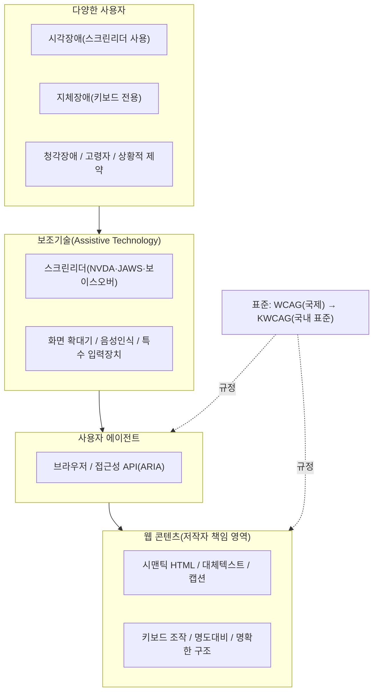
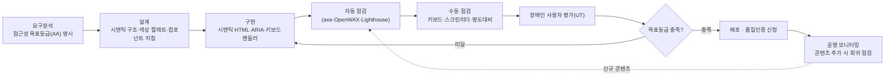

# 웹 접근성(Web Accessibility)과 WCAG/KWCAG

## 1. 개요

> **정의**: 웹 접근성(Web Accessibility)이란 장애인·고령자를 포함한 모든 사용자가 신체적·기술적 여건에 관계없이 웹 사이트에서 제공하는 정보와 기능을 동등하게 인식·이해·조작·이용할 수 있도록 보장하는 특성 및 이를 확보하기 위한 설계·개발 원칙을 말한다.

웹 접근성이 독립된 정보시스템 품질 속성으로 부상한 배경에는 세 가지 축이 있다. 첫째, **인구·사회구조의 변화**다. 고령화가 심화되면서 시력 저하·운동 능력 저하·인지 저하를 겪는 사용자층이 급증했고, 이들은 일시적 장애(팔 골절), 상황적 장애(밝은 야외에서의 화면 판독, 소음 환경에서의 음성 청취)까지 포함하면 사실상 전 국민에 해당한다. 접근성은 소수 장애인만을 위한 배려가 아니라 **보편적 사용성(Universal Usability)** 의 문제로 재정의되었다.

둘째, **법·제도적 강제**다. 우리나라는 「장애인차별금지 및 권리구제 등에 관한 법률」(장차법)에서 웹을 포함한 정보통신·의사소통에서의 정당한 편의 제공을 의무화하고, 미제공을 차별로 규정한다. 「지능정보화 기본법」은 국가·지자체·공공기관이 웹 접근성을 준수하도록 요구하며, 이를 위반한 공공서비스는 감사·평가에서 감점되거나 시정명령의 대상이 된다. 해외에서도 미국의 재활법 508조(Section 508)·ADA, 유럽의 EN 301 549와 유럽 접근성법(EAA, 2025년 시행)이 접근성을 사실상의 시장 진입 요건으로 만들었다.

셋째, **기술 표준의 성숙**이다. 초기의 자의적 지침을 넘어 W3C의 WCAG(Web Content Accessibility Guidelines)가 국제 표준으로 정착하고, 국내에서는 이를 반영한 KWCAG(한국형 웹 콘텐츠 접근성 지침)가 방송통신표준으로 제정되면서, 접근성은 "선의의 노력"이 아니라 **검증 가능한 정량 기준**으로 관리할 수 있게 되었다. 기술사 관점에서 웹 접근성은 비기능 요구사항(품질 속성) 중 사용성·규제준수(Compliance)·포용성이 교차하는 지점이며, 설계 초기부터 내재화(Accessibility by Design)해야 후행 비용을 최소화할 수 있는 대표적 영역이다.

## 2. 웹 접근성의 전체 구조와 원칙

웹 접근성은 콘텐츠(저작자), 사용자 에이전트(브라우저·미디어 플레이어), 보조기술(Assistive Technology)의 삼각 구조 위에서 성립한다. 아무리 콘텐츠가 표준을 지켜도 이를 해석하는 브라우저와 이를 사용자에게 전달하는 보조기술이 없으면 접근성은 완성되지 않으며, 반대로 보조기술이 우수해도 콘텐츠가 의미 구조(Semantic)를 담지 않으면 무력화된다. 아래 구조도는 이 생태계와 표준 체계를 함께 보여준다.

### 가. POUR — 웹 접근성 4대 원칙

WCAG와 KWCAG는 공통적으로 **POUR** 라 불리는 4대 원칙 위에 세워진다. 이 원칙은 개별 기술이 바뀌어도 유효한 상위 개념으로, 접근성 판단의 나침반 역할을 한다.

**인식의 용이성(Perceivable)** 은 정보와 UI 요소를 사용자가 인지할 수 있는 형태로 제공해야 한다는 원칙이다. 대표적으로 이미지에 대체 텍스트(alt)를 제공해 스크린리더가 읽어주도록 하고, 동영상에는 자막·수어·화면해설을 제공하며, 텍스트와 배경 간 명도 대비를 충분히(WCAG AA 기준 일반 텍스트 4.5:1 이상) 확보하는 것이 이에 해당한다. 색상만으로 정보를 전달하지 않는 것도 색각 이상 사용자를 위한 필수 요건이다. 예컨대 "필수 입력란은 빨간색"이라는 안내는 색을 구분하지 못하는 사용자에게 무의미하므로 별표·텍스트를 병기해야 한다.

**운용의 용이성(Operable)** 은 UI와 내비게이션을 조작할 수 있어야 한다는 원칙이다. 마우스를 쓸 수 없는 지체장애 사용자를 위해 모든 기능을 **키보드만으로** 수행할 수 있어야 하고, 초점(focus)이 논리적 순서로 이동해야 하며 특정 요소에 갇히는 초점 함정(Keyboard Trap)이 없어야 한다. 시간 제한이 있는 콘텐츠는 연장·해제할 수 있어야 하고, 초당 3회를 초과하는 깜빡임은 광과민성 발작을 유발할 수 있어 금지된다. 반복되는 메뉴를 건너뛰는 "본문 바로가기(Skip Navigation)" 링크 제공도 대표 사례다.

**이해의 용이성(Understandable)** 은 정보와 UI 동작을 이해할 수 있어야 한다는 원칙이다. 콘텐츠의 언어를 명시(lang 속성)해 스크린리더가 올바른 발음으로 읽게 하고, 페이지 구성 요소가 예측 가능하게 동작하도록 하며, 입력 오류가 발생하면 어디서 무엇이 잘못되었는지 명확히 알려주고 수정 방법을 안내해야 한다. 예를 들어 회원가입 폼에서 "형식 오류"만 표시하는 대신 "이메일에 @가 필요합니다"처럼 구체적 안내를 제공하는 것이 이 원칙의 실천이다.

**견고성(Robust)** 은 콘텐츠가 현재와 미래의 다양한 사용자 에이전트·보조기술에서 안정적으로 해석될 수 있어야 한다는 원칙이다. 문법에 맞는 마크업을 사용하고, 사용자 정의 컨트롤에는 WAI-ARIA로 이름(name)·역할(role)·상태(state)·속성(value)을 정확히 부여해야 스크린리더가 해당 요소의 의미를 전달할 수 있다. 자바스크립트로 만든 커스텀 드롭다운이 접근성 API에 아무 정보도 노출하지 않으면 보조기술 사용자에게는 존재하지 않는 요소가 된다.

### 나. WCAG의 준수 등급과 검사 항목 구조

WCAG(현행 안정 버전 2.2, W3C 권고안 2023.10.5)는 4대 원칙 아래 지침(Guidelines)과 검증 가능한 **성공 기준(Success Criteria)** 을 두는 위계 구조를 가진다. WCAG 2.2는 총 87개의 성공 기준을 담고 있으며, 이는 WCAG 2.1 대비 9개 기준이 신설(초점 가림 방지, 드래그 동작 대안, 최소 타깃 크기, 일관된 도움말, 중복 입력 최소화, 접근 가능한 인증 등)된 결과다. 각 성공 기준은 다음 세 등급으로 분류된다.

| 등급 | 의미 | 실무적 위상 |
|------|------|-------------|
| A(최소) | 기본적 접근성, 미준수 시 특정 사용자가 아예 이용 불가 | 필수 최저선 |
| AA(권장) | 대부분의 법·제도가 요구하는 실질적 목표 수준 | **공공·상용 서비스의 사실상 의무 기준** |
| AAA(최고) | 전문 콘텐츠·특수 목적에 적용, 전면 준수는 비현실적 | 선택적 상향 목표 |

대부분의 국가 법제와 조달 요건은 **AA 준수**를 목표로 삼는다. AAA는 명도 대비 7:1, 수어 제공 등 매우 높은 기준을 포함해 사이트 전체에 일괄 적용하기는 어렵다는 점을 이해해야 한다. 이 등급 체계는 접근성을 "전부 아니면 전무"가 아니라 단계적으로 달성·측정할 수 있게 해준다는 데 의의가 있다.

### 다. KWCAG — 한국형 지침의 구조

국내에서는 WCAG를 기반으로 국립전파연구원이 방송통신표준(KCS)으로 제정한 **KWCAG(한국형 웹 콘텐츠 접근성 지침) 2.2** 가 적용된다. KWCAG 2.2는 WCAG 2.1을 기반으로 국내 환경을 반영해 재구성한 것으로, **4개 원칙 · 14개 지침 · 33개 검사 항목** 의 3계층 구조를 가진다. 아래 표는 원칙별 대표 검사 항목을 정리한 것이다.

| 원칙 | 대표 검사 항목(예시) | 핵심 요구 |
|------|----------------------|-----------|
| 인식의 용이성 | 대체 텍스트, 자막 제공, 색에 무관한 콘텐츠, 명도 대비(4.5:1) | 감각으로 인지 가능 |
| 운용의 용이성 | 키보드 사용 보장, 초점 이동, 반복영역 건너뛰기, 깜빡임 제한 | 조작 가능 |
| 이해의 용이성 | 기본 언어 표시, 오류 정정, 레이블 제공, 콘텐츠 선형 구조 | 내용 이해 가능 |
| 견고성 | 마크업 오류 방지, 웹 애플리케이션 접근성(ARIA) | 기술 호환 안정성 |

KWCAG 준수 여부는 「지능정보화 기본법」에 근거한 **웹 접근성 품질인증**(한국디지털접근성진흥원 등 지정 인증기관)을 통해 심사되며, 통과 시 인증마크를 부여받아 1년간 유효하다. 검사는 자동 점검 도구(예: OpenWAX·K-WAH)와 전문가·장애인 사용자 평가를 병행하는데, 자동 도구는 명도 대비·대체 텍스트 존재 여부 등 기계적으로 판단 가능한 항목만 잡아내고 "대체 텍스트가 의미 있게 작성되었는가" 같은 정성 항목은 사람의 판단이 필요하다는 점이 실무의 핵심이다.

## 3. 접근성 확보 프로세스와 구현 아키텍처

접근성은 완성된 사이트를 사후 점검하는 방식으로는 결코 저비용으로 달성되지 않는다. 요구사항 정의 단계에서 접근성을 비기능 요구로 명시하고, 설계·구현·테스트 전 과정에 걸쳐 반복적으로 검증하는 **접근성 by Design** 이 정착되어야 한다. 아래 프로세스도는 개발 생애주기에 접근성 활동을 내재화한 모습을 보여준다.

가장 흔한 실패 패턴은 접근성을 프로젝트 종료 직전의 "인증 통과용 작업"으로 취급하는 것이다. 이 경우 이미 확정된 화면 구조를 뜯어고쳐야 하므로 수정 비용이 폭증하고, 결국 표면적 대체 텍스트만 채워 넣는 형식적 준수에 그친다. 반대로 설계 단계에서 시맨틱 구조와 디자인 시스템(접근성을 내장한 공용 컴포넌트)을 확립하면, 개발자는 이미 접근성이 검증된 버튼·모달·탭 컴포넌트를 재사용하므로 개별 개발자의 접근성 지식 편차와 무관하게 일정 수준이 담보된다. 실제로 정부·대기업의 디자인 시스템(예: 대한민국 정부 디자인시스템, 여러 금융권 공용 UI 컴포넌트)은 접근성 준수를 컴포넌트 수준에서 보장해 조직 전체의 접근성 품질을 상향 평준화한 대표 사례다.

구현 측면의 핵심은 **시맨틱 우선, ARIA 최소** 원칙이다. `<button>`·`<nav>`·`<main>`·`<h1~h6>` 등 의미를 가진 표준 HTML 요소는 그 자체로 역할·상태를 접근성 트리에 노출하므로 별도 처리가 거의 필요 없다. 반면 `
`에 클릭 이벤트를 붙여 버튼처럼 쓰면 role·tabindex·키보드 핸들러·상태 관리를 모두 수동으로 구현해야 하고 결함 확률이 높아진다. "ARIA를 안 쓰는 것이 잘못된 ARIA를 쓰는 것보다 낫다(No ARIA is better than Bad ARIA)"는 W3C의 경구가 이 원칙을 압축한다.

### 라. 대표 위반 유형과 개선 사례

현장 점검에서 반복적으로 지적되는 결함은 몇 가지 유형으로 수렴한다. 이를 알아두면 설계 체크리스트로 활용할 수 있다. 첫째, **의미 없는 대체 텍스트** 다. `alt="이미지"`, `alt="사진1"`처럼 형식적으로만 채우거나, 반대로 순수 장식 이미지에 장황한 설명을 달아 스크린리더 사용자의 청취를 방해하는 경우다. 개선 원칙은 "정보성 이미지에는 그 이미지가 전달하는 정보를, 장식 이미지에는 빈 alt(`alt=""`)를" 부여해 보조기술이 건너뛰게 하는 것이다.

둘째, **키보드 접근 불가 컨트롤** 이다. 마우스 오버에서만 열리는 메뉴, 마우스 클릭으로만 닫히는 팝업이 대표적이다. 실제 국내 한 공공 예약 서비스는 달력 위젯이 마우스 전용으로 구현되어 지체장애 사용자가 날짜를 선택할 수 없었고, 이를 키보드 방향키로 날짜를 이동하고 Enter로 선택하는 방식으로 재구현해 접근성을 회복한 바 있다. 셋째, **초점 표시 제거** 다. 디자인상 미관을 이유로 CSS에서 `outline:none`을 적용해 키보드 사용자가 현재 초점 위치를 알 수 없게 만드는 흔한 실수로, 대비가 충분한 대체 초점 스타일을 반드시 제공해야 한다.

넷째, **폼 레이블 누락** 이다. 입력 필드에 `<label>`이 연결되지 않으면 스크린리더는 "편집창"이라고만 읽어 무엇을 입력해야 할지 알 수 없다. 시각적으로 레이블을 숨기더라도 프로그래밍적 연결(label의 for·id, 또는 aria-label)은 유지해야 한다. 이러한 위반들은 대체로 소수의 공용 컴포넌트에서 비롯되므로, 컴포넌트 단위로 한 번 바로잡으면 사이트 전역에서 동시에 해소된다는 점이 접근성 리팩터링의 경제성을 보여준다.

## 4. 비교 — 접근성 · 사용성 · 유니버설 디자인

웹 접근성은 사용성(Usability)·유니버설 디자인(Universal Design)과 자주 혼용되지만 대상과 관점이 다르다. 이 차이를 이해해야 접근성 투자가 어디까지를 목표로 하는지 명확해진다.

| 구분 | 웹 접근성 | 사용성 | 유니버설 디자인 |
|------|-----------|--------|-----------------|
| 주 대상 | 장애인·고령자 등 제약 사용자 | 일반 사용자 | 모든 사용자 |
| 핵심 질문 | "이용이 **가능한가**?" | "이용이 **효율적·만족스러운가**?" | "처음부터 **누구나** 쓸 수 있게 설계했는가?" |
| 판단 기준 | WCAG/KWCAG 성공기준(정량) | 과업 성공률·소요시간·오류율 | 7대 원칙(공평·유연·단순 등) |
| 관계 | 사용성의 전제조건 | 접근성 위에서 심화 | 접근성·사용성을 포괄하는 상위 철학 |

접근성과 사용성은 배타적이지 않고 위계적이다. 접근성이 "장벽 제거(이용 가능성)"라면 사용성은 "이용의 질" 문제로, 접근은 되지만 조작이 번거롭다면 접근성은 충족해도 사용성은 낮을 수 있다. 다만 실무에서 둘은 강하게 상관한다. 명확한 구조·논리적 초점 순서·명료한 오류 메시지는 장애인뿐 아니라 모든 사용자의 사용성을 함께 끌어올리기 때문이다. 이것이 접근성 투자가 "소수를 위한 비용"이 아니라 **전체 UX 개선과 SEO(검색엔진 최적화, 시맨틱 구조가 크롤러에도 유리)** 로 되돌아온다는 논거의 근거다.

구체적 사례로, 자막(Caption)은 원래 청각장애인을 위한 기능이지만 소음이 심한 지하철에서 영상을 보는 일반 사용자, 외국어 학습자에게도 유용하다. 이처럼 접근성 기능이 예상 밖의 광범위한 사용자에게 혜택을 주는 현상을 **커브컷 효과(Curb-Cut Effect)** 라 하며, 접근성이 특수 요구가 아니라 보편 가치임을 보여주는 대표 논거로 인용된다.

수치적으로도 접근성의 대상 규모는 결코 작지 않다. 세계보건기구(WHO)는 전 세계 인구의 약 15% 이상이 어떤 형태로든 장애를 가지고 살아간다고 추산하며, 국내 등록 장애인만 약 260만 명 규모다. 여기에 고령층과 일시적·상황적 제약까지 포함하면 접근성 개선의 수혜자는 특정 소수가 아니라 전체 이용자 기반의 상당 부분을 차지한다. 접근성 미준수로 인한 이탈 고객·법적 분쟁 비용과, 준수를 통한 시장 확대·브랜드 신뢰를 함께 계산하면 접근성 투자수익률(ROI)은 통상적 UX 개선 투자에 못지않다는 것이 여러 실증 연구의 공통된 결론이다.

## 5. 심화 — 최신 동향과 WCAG 3.0

접근성 표준은 콘텐츠 형태의 변화에 맞춰 진화하고 있다. 첫째, **차세대 표준 WCAG 3.0** 이 W3C에서 초안(Working Draft) 단계로 개발 중이다. WCAG 3.0은 기존 POUR 4원칙의 정신을 계승하되, 성공 기준의 "충족/미충족" 이분법과 A·AA·AAA 등급 체계에서 벗어나 **다차원 점수·보고 방식**(예: Bronze·Silver·Gold 등급, 결과 중심 평가)으로 전환하려는 방향을 논의하고 있다. 이는 HTML 문서뿐 아니라 모바일 앱·XR·웹 애플리케이션 등 다양한 산출물을 포괄하고, 인지 접근성 같은 정성 영역을 더 유연하게 반영하기 위한 시도다. 다만 정식 권고안까지는 상당한 시간이 필요해, 향후 수년간은 **WCAG 2.2/KWCAG 2.2 (AA)** 가 실질적 준수 기준으로 유지될 전망이다. 기술사 답안에서는 "WCAG 3.0은 아직 초안 단계이며 현행 실무 기준은 2.2"라는 시점 인식을 정확히 표현하는 것이 중요하다.

둘째, **모바일 접근성**의 비중이 커졌다. 반응형 웹과 네이티브 앱에서는 최소 터치 타깃 크기(WCAG 2.2 신설 기준), 화면 회전 지원, 확대 시 콘텐츠 잘림 방지 등이 핵심 쟁점이 되며, 국내에서도 모바일 애플리케이션 접근성 지침이 별도로 운영된다. 셋째, **AI를 활용한 접근성 자동화**가 확산되고 있다. 이미지 대체 텍스트를 생성형 AI로 자동 생성하거나, 자동 점검 도구가 머신러닝으로 결함을 탐지하는 방식이다. 그러나 AI가 생성한 대체 텍스트가 맥락을 오독하거나("장식용 이미지에 과잉 설명"), 자동 도구가 정성 항목을 놓치는 한계가 있어 **사람의 최종 검증은 여전히 필수** 라는 점이 강조된다. 넷째, 유럽 접근성법(EAA) 시행으로 접근성이 전자상거래·전자책·은행 서비스 등 민간 영역까지 법적 의무로 확대되면서, 글로벌 서비스 기업에게 접근성은 규제 리스크 관리 사안이 되었다.

## 6. 고려사항 및 시사점 (기술사 관점)

- **비기능 요구사항으로의 명문화와 조달 반영**: 접근성은 발주·계약 단계의 제안요청서(RFP)와 요구사항 정의서에 목표 등급(예: KWCAG 2.2 AA, 품질인증 취득)을 정량 명시해야 관리·검수의 근거가 확보된다. 막연히 "접근성 준수"라고만 적으면 검수 시점에 분쟁이 발생하므로, 검사 항목·인증 취득 여부·산출물 기준을 계약 요건으로 못 박는 전략이 필요하다.

- **후행 리모델링 대비 선제 내재화의 경제성**: 접근성 결함은 발견 시점이 늦을수록 수정 비용이 기하급수적으로 증가한다(설계 결함의 후행 발견 비용 증대 원리와 동일). 디자인 시스템·공용 컴포넌트에 접근성을 내장하고 CI 파이프라인에 자동 점검(axe-core 등)을 편입하는 **시프트 레프트(Shift-Left)** 전략이 총소유비용(TCO)을 최소화한다.

- **자동화와 수동 평가의 트레이드오프**: 자동 점검 도구는 전체 성공 기준의 30~40% 수준만 기계적으로 검증할 수 있다는 점을 인지해야 한다. 키보드 조작 흐름·스크린리더 낭독의 의미 전달·대체 텍스트의 적절성 등은 전문가 수동 점검과 실제 장애인 사용자 평가(UT)로 보완해야 하며, 자동 점수 100%를 접근성 완성으로 오인하지 않아야 한다.

- **규제 준수를 넘어 포용·ESG 가치로의 확장**: 접근성은 법적 리스크 회피(장차법 차별 구제·소송 대응)를 넘어, ESG의 사회(S) 성과 지표이자 잠재 고객층(장애인·고령자 시장) 확대, 브랜드 신뢰 제고로 연결된다. 커브컷 효과와 SEO·UX 개선 효과까지 고려하면 접근성 투자는 비용이 아니라 보편적 사용성 향상을 통한 가치 창출로 재해석되어야 한다.

- **연계 기술과의 통합 관리**: 접근성은 디자인 시스템, 프런트엔드 프레임워크(React·Vue의 접근성 지원), 시맨틱 마크업·SEO, 다국어(i18n) 처리와 밀접하게 얽혀 있다. 개별 기능이 아니라 프런트엔드 품질 아키텍처 전반의 관점에서 거버넌스(가이드라인·교육·점검 자동화·인증 갱신 주기 관리)를 수립하는 것이 지속 가능한 접근성 확보의 관건이다.

## 참고자료
- W3C, Web Content Accessibility Guidelines (WCAG) 2.2, https://www.w3.org/TR/WCAG22/
- W3C WAI, What's New in WCAG 2.2, https://www.w3.org/WAI/standards-guidelines/wcag/new-in-22/
- W3C, WCAG 3.0 Working Draft, https://w3c.github.io/wcag3/guidelines/
- 한국형 웹 콘텐츠 접근성 지침(KWCAG) 2.2, https://a11ykr.github.io/kwcag22/
- 한국디지털접근성진흥원(KWACC) 웹 접근성 품질인증, http://www.kwacc.or.kr/Accessibility/Certification

---
> **한 줄 요약**: 웹 접근성은 장애인·고령자를 포함한 모두가 웹 정보를 동등하게 이용하도록 보장하는 품질 속성으로, POUR 4원칙 위에 세워진 WCAG(국제, 현행 2.2·AA)와 KWCAG(국내 4원칙·14지침·33항목)를 기준으로 설계 단계부터 내재화하고 자동·수동·사용자 평가를 병행해 확보한다.
