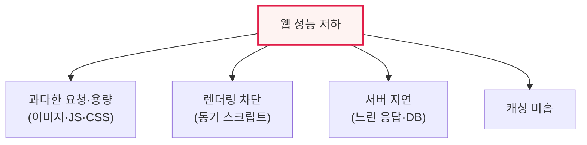

# 웹 성능 관리와 프론트엔드 최적화

## 1. 개요

### 가. 정의
> **웹 성능 관리**는 웹 기반 서비스의 **응답 속도·로딩 시간을 측정·개선**하여 사용자 경험과 비즈니스 성과를 높이는 활동이다. 모바일 퍼스트 시대에 웹 성능은 곧 사용자 만족·이탈·매출과 직결된다.

웹 성능이 중요한 근본 이유는 '**느린 웹은 곧 사용자 이탈과 매출 손실**'이기 때문이다. 여러 연구가 페이지 로딩이 1초 느려질 때마다 이탈률이 크게 오르고 전환율이 떨어짐을 보여준다. 특히 네트워크가 불안정하고 화면이 작은 모바일 환경에서 성능 저하는 더 치명적이다. 웹 성능은 서버(백엔드)와 브라우저(프론트엔드) 양쪽에서 결정되는데, 흥미롭게도 실제 사용자가 체감하는 로딩 시간의 상당 부분은 서버 응답 후 브라우저가 화면을 그리는 **프론트엔드 영역**에서 발생한다. 이미지·스크립트·CSS를 내려받아 렌더링하는 과정이 오래 걸리기 때문이다. 그래서 프론트엔드 최적화가 체감 성능 개선의 핵심이 된다.

### 나. 필요성
사용자 기대 수준 상승과 검색 순위(SEO)에 성능이 반영되면서, 웹 성능 관리는 선택이 아닌 필수 경쟁력이 되었다.

## 2. 웹 성능 저하 요인

| 요인 | 내용 |
|---|---|
| **과다한 리소스** | 큰 이미지·많은 파일 요청, 무거운 JS |
| **렌더링 차단** | 동기 스크립트·CSS가 화면 그리기 지연 |
| **서버·네트워크 지연** | 느린 응답, DB 병목, 먼 서버 |
| **캐싱 미흡** | 매번 재다운로드 |

## 3. 프론트엔드 관점의 웹 최적화 방안

| 방안 | 내용 |
|---|---|
| **리소스 최소화·압축** | JS·CSS 압축(Minify), Gzip/Brotli |
| **이미지 최적화** | 적절한 포맷(WebP)·크기, 지연 로딩(Lazy Loading) |
| **요청 수 감소** | 번들링, 스프라이트, HTTP/2 다중화 |
| **캐싱 활용** | 브라우저 캐시·CDN으로 재사용 |
| **렌더링 최적화** | 스크립트 async/defer, 중요 CSS 우선(Critical CSS) |
| **비동기·지연 로딩** | 필요할 때 로드(코드 스플리팅) |

핵심은 '**작게, 적게, 가까이, 나중에**'다. 리소스를 작게(압축) 만들고, 요청을 적게 하고, CDN으로 가까이 두고, 당장 필요 없는 것은 나중에(지연) 로드한다.

## 4. 고려사항 및 시사점

1. **측정이 개선의 출발점**이다. Core Web Vitals(LCP·FID/INP·CLS) 같은 사용자 중심 지표로 실제 체감 성능을 측정하고, 이를 기준으로 병목을 찾아 개선해야 한다.
2. **프론트엔드 최적화의 비중이 크다**. 체감 로딩 시간의 상당 부분이 프론트엔드에서 발생하므로, 서버 튜닝만큼 리소스·렌더링 최적화가 효과적이다.
3. **성능 예산·지속 관리**가 필요하다. 성능은 한 번 개선하고 끝이 아니라, 성능 예산(Performance Budget)을 정해 지속 모니터링하고 CI에 성능 점검을 통합해 회귀를 막아야 한다.

---

> **한 줄 요약**: 웹 성능은 사용자 만족·매출과 직결되며, 과다 리소스·렌더링 차단·캐싱 미흡이 저하 요인이므로, *리소스 압축·이미지 최적화·요청 감소·캐싱·렌더링 최적화·지연 로딩* 등 프론트엔드 최적화와 Core Web Vitals 측정으로 관리한다.
