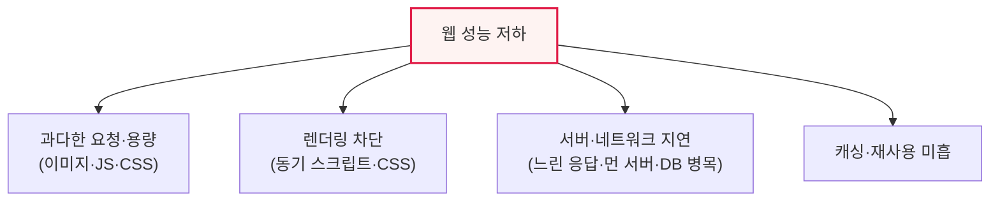
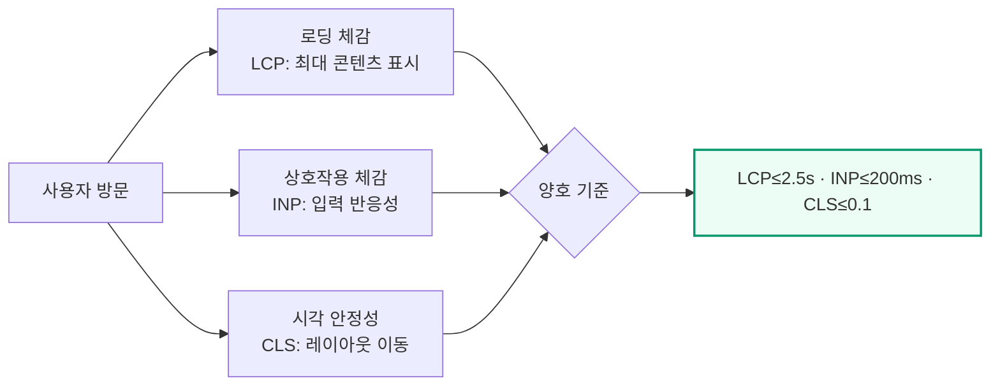

# 웹 성능 관리와 프론트엔드 최적화

## 1. 개요

### 가. 정의
> **웹 성능 관리(Web Performance Management)**는 웹 기반 서비스의 **응답 속도·로딩 시간·상호작용 반응성을 측정·분석·개선**하여 사용자 경험(UX)과 비즈니스 성과를 동시에 높이는 지속적 엔지니어링 활동이다. 모바일 퍼스트·SPA(Single Page Application) 시대에 웹 성능은 곧 사용자 만족·이탈·전환율·검색 순위와 직결된다.

웹 성능이 단순한 '기술적 완성도' 문제를 넘어 **비즈니스 지표**로 다뤄지는 근본 이유는 '**느린 웹은 곧 사용자 이탈과 매출 손실**'이기 때문이다. 다수의 산업 연구가 페이지 로딩이 1초 지연될 때마다 이탈률이 오르고 전환율이 유의미하게 떨어짐을 보고한다. Google이 공개한 사례에서는 로딩 시간이 1초에서 3초로 늘 때 이탈 확률이 약 32% 증가하고, 1초에서 5초로 늘면 약 90% 증가하는 것으로 보고되었으며, Amazon·Walmart 등도 100ms 단위의 지연이 매출·전환에 수 %의 영향을 준다고 발표한 바 있다(수치는 서비스·시점에 따라 다를 수 있어 절대치보다는 '지연이 곧 손실'이라는 경향으로 해석해야 한다).

특히 네트워크가 불안정하고 CPU·화면이 작은 모바일 환경에서는 성능 저하가 더 치명적이다. 웹 성능은 서버(백엔드)와 브라우저(프론트엔드) 양쪽에서 결정되는데, 흥미롭게도 실제 사용자가 체감하는 로딩 시간의 상당 부분(경험적으로 흔히 '대부분')은 서버 응답 이후 브라우저가 리소스를 내려받아 파싱·렌더링하는 **프론트엔드 영역**에서 발생한다. 즉 서버가 아무리 빠르게 HTML을 반환해도, 무거운 이미지·JavaScript·CSS를 받아 화면을 그리는 과정이 오래 걸리면 사용자는 '느린 사이트'로 인식한다. 그래서 프론트엔드 최적화가 체감 성능 개선의 핵심 지렛대가 된다.

### 나. 백엔드와 프론트엔드의 역할 분담
성능은 서버가 첫 바이트를 반환하기까지의 시간(TTFB)과, 그 이후 브라우저가 화면을 완성하기까지의 시간으로 나뉜다. 백엔드는 빠른 응답·효율적 쿼리·적절한 캐시 헤더로 TTFB를 낮추고, 프론트엔드는 받은 리소스를 얼마나 빠르게 그리고 상호작용 가능하게 만드느냐를 책임진다. 두 영역은 상호 의존적이어서, 서버가 느리면 아무리 프론트엔드를 최적화해도 첫 화면이 늦고, 서버가 빨라도 프론트엔드가 무거우면 사용자는 여전히 기다린다. 본 노트는 체감 성능의 지렛대가 큰 프론트엔드에 초점을 두되, 두 영역을 함께 관리해야 한다는 전제를 유지한다.

### 다. 등장 배경 및 필요성
과거에는 '서버 증설·회선 확충'이라는 인프라 관점의 성능 개선이 지배적이었다. 그러나 SPA·리치 미디어·서드파티 스크립트(광고·분석·챗봇)가 보편화되면서 브라우저에서 실행·렌더링해야 할 코드량이 폭증했고, 사용자 기대 수준도 함께 높아졌다. 여기에 **검색 엔진이 성능을 랭킹 신호로 반영**(Google의 Core Web Vitals 기반 페이지 경험 신호)하면서, 웹 성능 관리는 '있으면 좋은 것'에서 SEO·전환·브랜드 신뢰를 좌우하는 **필수 경쟁력**으로 격상되었다. 또한 저사양 단말·저대역 네트워크 사용자를 포함한 **포용적 접근성(Inclusive Performance)** 관점에서도, 무거운 웹은 특정 계층을 서비스에서 배제하는 결과를 낳는다는 점이 부각되었다.

## 2. 웹 성능을 결정하는 로딩 파이프라인과 저하 요인

웹 성능을 개선하려면 먼저 '왜 느린가'를 구조적으로 이해해야 한다. 사용자가 URL을 입력한 뒤 화면이 완성되기까지는 **DNS 조회 → TCP/TLS 연결 → 서버 처리 → 응답 전송 → 브라우저 파싱(HTML/CSS) → 리소스 다운로드 → 렌더링(레이아웃·페인트) → 스크립트 실행**이라는 파이프라인을 거친다. 이 각 단계가 병목이 될 수 있으며, 저하 요인은 대체로 아래 네 갈래로 수렴한다.

```mermaid
flowchart TB
  P["웹 성능 저하"] --> N["과다한 요청·용량<br/>(이미지·JS·CSS)"]
  P --> R["렌더링 차단<br/>(동기 스크립트·CSS)"]
  P --> S["서버·네트워크 지연<br/>(느린 응답·먼 서버·DB 병목)"]
  P --> C["캐싱·재사용 미흡"]
  style P fill:#fef3f2,stroke:#e11d48,stroke-width:2px
```

**첫째, 과다한 리소스**다. 최적화되지 않은 대용량 이미지, 사용하지 않는 코드까지 포함된 무거운 JavaScript 번들, 방대한 CSS는 다운로드·파싱 시간을 키운다. 특히 JavaScript는 단순히 '내려받는 시간'만이 아니라 '파싱·컴파일·실행'에 CPU를 소모하므로, 같은 용량이라도 이미지보다 저사양 단말에서 훨씬 큰 부담을 준다. 이것이 "이미지보다 자바스크립트가 더 비싸다"는 프론트엔드 격언의 배경이다.

**둘째, 렌더링 차단(Render-Blocking)**이다. 브라우저는 `<head>`의 동기 스크립트나 스타일시트를 만나면 화면 그리기를 멈추고 그것을 먼저 처리한다. CSSOM이 완성되어야 렌더 트리를 만들 수 있고, 파서 차단 스크립트는 DOM 구성을 멈추기 때문이다. 결과적으로 '내용은 이미 받았는데 화면은 하얀' 상태가 길어진다.

**셋째, 서버·네트워크 지연**이다. TTFB(Time To First Byte)를 좌우하는 서버 처리 시간, DB 쿼리 병목, 사용자와 물리적으로 먼 원본 서버, 반복적인 왕복(RTT)이 여기에 해당한다.

**넷째, 캐싱·재사용 미흡**이다. 변하지 않는 리소스를 매 방문마다 다시 내려받으면 대역폭과 시간이 낭비된다. 캐시 정책·CDN이 없으면 첫 방문과 재방문의 성능 차이가 사라진다.

여기에 로딩 중 요소가 밀려 화면이 튀는 **레이아웃 불안정**도 체감 품질을 크게 떨어뜨린다. 이미지·광고·폰트가 뒤늦게 로드되며 이미 그려진 콘텐츠를 밀어내면, 사용자가 누르려던 버튼이 갑자기 이동해 오작동 클릭을 유발한다. 이 요인들은 서로 얽혀 있어, 한 가지만 손봐서는 체감 개선이 제한적이다. 그래서 최적화는 개별 기법의 나열이 아니라 '어느 지표의 어느 병목을 먼저 칠 것인가'라는 우선순위 문제로 접근해야 한다.

| 저하 요인 | 대표 증상 | 관련 지표 |
|---|---|---|
| **과다한 리소스** | 큰 이미지·무거운 JS 번들, 긴 다운로드 | LCP, Total Blocking Time |
| **렌더링 차단** | 동기 스크립트·CSS가 첫 화면 지연(백지) | FCP, LCP |
| **서버·네트워크 지연** | 느린 첫 바이트, DB 병목, 먼 서버 | TTFB |
| **캐싱 미흡** | 재방문에도 매번 재다운로드 | 반복 방문 로딩시간 |
| **레이아웃 불안정** | 로딩 중 요소가 밀려 오작동 클릭 | CLS |

## 3. 사용자 중심 성능 지표: Core Web Vitals

'무엇을 측정하는가'는 '무엇을 개선하는가'를 결정한다. 과거의 `onload` 완료 시점 같은 기술 지표는 사용자 체감과 괴리가 컸다. 그래서 Google은 **실제 사용자 경험을 대변하는 지표**로 Core Web Vitals를 제시했고, 오늘날 성능 관리의 사실상 표준 언어가 되었다.

```mermaid
flowchart LR
  U["사용자 방문"] --> L["로딩 체감<br/>LCP: 최대 콘텐츠 표시"]
  U --> I["상호작용 체감<br/>INP: 입력 반응성"]
  U --> V["시각 안정성<br/>CLS: 레이아웃 이동"]
  L --> G{"양호 기준"}
  I --> G
  V --> G
  G --> R["LCP≤2.5s · INP≤200ms · CLS≤0.1"]
  style R fill:#ecfdf5,stroke:#059669,stroke-width:2px
```

**LCP(Largest Contentful Paint)**는 뷰포트 내 가장 큰 콘텐츠(대개 히어로 이미지·제목)가 그려지는 시점으로 '로딩이 얼마나 빠르게 체감되는가'를 나타낸다. 권장 기준은 2.5초 이하다. **INP(Interaction to Next Paint)**는 2024년 FID(First Input Delay)를 대체한 지표로, 페이지 수명 전체에서 사용자 입력에 대한 응답 지연을 종합해 '상호작용이 얼마나 매끄러운가'를 측정하며 200ms 이하가 권장된다. **CLS(Cumulative Layout Shift)**는 로딩 중 요소가 예기치 않게 밀리는 정도로 '시각적 안정성'을 나타내며 0.1 이하가 권장된다. 이 세 지표는 **필드 데이터(실제 사용자, RUM)**와 **랩 데이터(Lighthouse 등 합성 측정)** 두 가지로 수집하는데, 개선 판단은 반드시 실제 사용자 분포(특히 75 백분위수)를 기준으로 해야 한다. 랩에서 빨라도 저사양 사용자 필드에서 느리면 개선된 것이 아니기 때문이다.

## 4. 프론트엔드 관점의 웹 최적화 방안

최적화 전략의 핵심 원리는 '**작게, 적게, 가까이, 나중에, 미리**'로 요약할 수 있다. 리소스를 **작게**(압축) 만들고, 요청을 **적게** 하며, CDN으로 사용자에게 **가까이** 두고, 당장 필요 없는 것은 **나중에**(지연) 로드하고, 곧 쓸 것은 **미리**(프리로드·프리페치) 준비한다. 이 원리를 실제 기법으로 풀면 다음과 같다.

**가. 리소스 최소화·압축.** JS·CSS를 Minify(공백·주석 제거)하고, 전송 계층에서 Gzip 또는 Brotli로 압축한다. Brotli는 텍스트 리소스에서 Gzip 대비 통상 15~25% 더 높은 압축률을 보여, 같은 콘텐츠를 더 적은 바이트로 전송한다. 여기에 **Tree Shaking**으로 사용하지 않는 코드를 번들에서 제거하면 실행 비용까지 줄일 수 있다. 원리는 단순하다 — 전송·파싱해야 할 절대량을 줄이는 것이 가장 확실한 개선이다.

**나. 이미지·미디어 최적화.** 웹 트래픽의 다수를 차지하는 이미지는 최적화 효과가 가장 크다. WebP·AVIF 같은 차세대 포맷은 동일 화질에서 JPEG/PNG 대비 25~50% 이상 용량을 줄인다. 또한 `srcset`·`sizes`로 디바이스 해상도에 맞는 크기를 내려주고(반응형 이미지), 화면 밖 이미지는 `loading="lazy"`로 **지연 로딩**하여 초기 로드에서 제외한다. 동영상은 자동재생 대신 포스터 이미지+온디맨드 로딩을 적용한다.

**다. 요청 수 감소와 전송 효율화.** 과거 HTTP/1.1에서는 연결당 동시 요청 제약 때문에 번들링·스프라이트로 요청 수를 줄이는 것이 정석이었다. 그러나 **HTTP/2의 멀티플렉싱**은 하나의 연결로 다수 요청을 병렬 처리하므로, 지나친 번들링이 오히려 캐시 효율을 해칠 수 있다. 따라서 프로토콜에 맞춰 전략을 조정해야 한다 — 이것이 "요청을 무조건 줄여라"가 아니라 "맥락에 맞게 줄여라"인 이유다. HTTP/3(QUIC)는 UDP 기반으로 연결 수립·패킷 손실 복구를 개선해 모바일 환경 성능을 더 끌어올린다.

**라. 캐싱·CDN 활용.** `Cache-Control`·`ETag`로 브라우저 캐시를 활용해 재방문 시 재다운로드를 없애고, 정적 리소스는 파일명에 해시를 붙여(캐시 버스팅) 장기 캐시와 즉시 갱신을 양립시킨다. **CDN**은 콘텐츠를 사용자 지리적 인근의 엣지 서버에 복제해 물리적 거리(RTT)를 줄이며, 이는 원본 서버 성능과 무관하게 전 세계 사용자 체감을 균질화한다.

**마. 렌더링 최적화.** 스크립트에 `async`(순서 무관 독립 스크립트)·`defer`(DOM 파싱 후 순서대로 실행)를 적용해 파서 차단을 없애고, 첫 화면에 필요한 최소 스타일만 인라인하는 **Critical CSS**로 백지 시간을 줄인다. **코드 스플리팅**으로 라우트·컴포넌트 단위로 번들을 쪼개 초기 로드에는 지금 화면에 필요한 코드만 내려받는다.

| 방안 | 핵심 기법 | 주로 개선되는 지표 |
|---|---|---|
| **리소스 최소화·압축** | Minify, Brotli/Gzip, Tree Shaking | LCP, TBT |
| **이미지·미디어 최적화** | WebP/AVIF, 반응형(srcset), Lazy Loading | LCP |
| **요청 수 감소·전송 효율** | HTTP/2·3 멀티플렉싱, 조건부 번들링 | LCP, TTFB |
| **캐싱·CDN** | Cache-Control/ETag, 해시 버스팅, 엣지 캐시 | 재방문·TTFB |
| **렌더링 최적화** | async/defer, Critical CSS, 코드 스플리팅 | FCP, INP |
| **레이아웃 안정화** | width/height 명시, 폰트 스왑 예약 공간 | CLS |

## 5. 비교와 실무 사례: 기법 선택의 맥락

같은 목적이라도 상황에 따라 최적의 기법이 다르다. **번들링 vs. 다수 파일**이 대표적이다. HTTP/1.1 시대에는 파일을 합쳐 요청 수를 줄이는 것이 유리했지만, HTTP/2 이후에는 잘게 나눠 캐시 적중률과 병렬 다운로드를 높이는 편이 유리한 경우가 많다. 차이가 생기는 이유는 병목이 '연결 수 제약'에서 '전송·캐시 효율'로 이동했기 때문이다. 실무 함의는 "베스트 프랙티스는 프로토콜·CDN 구성에 종속된다"는 점이다.

**렌더링 전략 비교**도 중요하다. CSR(Client-Side Rendering)은 초기 로드가 무겁지만 이후 상호작용이 빠르고, SSR(Server-Side Rendering)은 첫 화면(FCP·LCP)이 빠르지만 서버 부하와 TTFB가 늘 수 있다. SSG(Static Site Generation)는 사전 생성으로 가장 빠른 초기 로드를 제공하지만 동적 데이터에 약하다. 근래에는 이를 절충한 **하이드레이션 지연·아일랜드 아키텍처·스트리밍 SSR**이 확산되어, "정적으로 빠르게 보여주고 필요한 부분만 상호작용을 붙이는" 방향으로 수렴하고 있다.

실무 개선 사례로, 한 커머스 서비스가 히어로 이미지를 WebP로 전환하고 지연 로딩·프리로드를 적용해 LCP를 4초대에서 2초대로 낮춰 전환율을 개선한 유형의 사례가 널리 보고된다. 또 대형 미디어 사이트가 서드파티 광고 스크립트를 `async`화하고 파사드(placeholder) 패턴으로 지연 로딩해 INP·TBT를 크게 낮춘 사례도 있다. 공통 교훈은 **가장 비싼 리소스(대형 이미지·서드파티 JS)를 먼저 겨냥**하라는 것으로, '측정 → 병목 식별 → 최대 효과 지점 우선 개선'이라는 순서가 성과를 좌우한다.

## 6. 심화: 성능 예산·성능 문화와 최신 동향

성능은 한 번 개선하고 끝나는 프로젝트가 아니라, 배포마다 회귀를 감시해야 하는 **지속적 품질 속성**이다. 이를 제도화하는 도구가 **성능 예산(Performance Budget)**이다. 예컨대 "JS 번들 ≤ 170KB(gzip), LCP ≤ 2.5s"처럼 정량 상한을 정하고, 이를 초과하는 변경은 CI 파이프라인에서 경고·차단한다. Lighthouse CI를 빌드에 통합하면 PR마다 성능 점수를 자동 측정해 성능 저하를 코드 리뷰 단계에서 잡을 수 있다. 이렇게 성능을 **조직 문화·프로세스**로 내재화하는 것이 일회성 튜닝보다 지속 가능한 성과를 낸다.

측정 방식은 **합성 모니터링(Synthetic, 랩)**과 **실사용자 모니터링(RUM, 필드)**을 병행해야 한다. 합성은 통제된 환경에서 회귀를 빠르게 잡고, RUM은 실제 사용자 단말·네트워크 분포의 체감을 반영한다. 두 데이터가 어긋날 때(랩은 빠른데 필드는 느림) 저사양·저대역 사용자 비중이 크다는 신호일 수 있어, 개선 우선순위 조정의 근거가 된다.

최신 동향으로는 (1) FID를 대체한 **INP의 정식 Core Web Vitals 편입(2024)**으로 상호작용 반응성 최적화가 부상했고, (2) **HTTP/3(QUIC)** 채택 확대로 모바일·고손실 네트워크 성능이 개선되고 있으며, (3) **엣지 컴퓨팅·엣지 렌더링**으로 로직 자체를 사용자 인근에서 실행하는 흐름, (4) 이미지 포맷의 **AVIF 채택 확대**와 브라우저의 네이티브 지연 로딩 표준화가 이어지고 있다. 이러한 흐름의 공통 방향은 "연산과 콘텐츠를 사용자에게 더 가깝게, 더 필요할 때만"이다.

## 7. 고려사항 및 시사점 (기술사 관점)

1. **측정이 개선의 출발점이다.** Core Web Vitals(LCP·INP·CLS)를 RUM으로 상시 측정하고 75 백분위수를 기준으로 병목을 식별해야 한다. '측정 없는 최적화'는 체감과 무관한 지엽적 튜닝에 그치기 쉬우며, 개선의 우선순위(가장 비싼 리소스 우선)를 데이터로 정해야 투자 대비 효과가 극대화된다.
2. **프론트엔드 최적화의 비중과 트레이드오프를 인식한다.** 체감 로딩 시간의 상당 부분이 프론트엔드에서 발생하므로 리소스·렌더링 최적화가 서버 튜닝만큼(때로는 그 이상) 효과적이다. 다만 번들링·SSR·프리로드 등은 상황에 따라 득실이 갈리므로, 프로토콜(HTTP/2·3)·CDN·사용자 단말 분포라는 맥락에 맞춰 기법을 선택해야 한다.
3. **성능을 프로세스로 내재화한다.** 성능 예산·Lighthouse CI로 회귀를 자동 감시하고, 성능을 배포 게이트로 삼아 '조직 문화'로 관리해야 지속 가능하다. 성능은 일회성 프로젝트가 아니라 유지·운영 단계까지 이어지는 품질 속성이다.
4. **접근성·포용성 관점을 포함한다.** 저사양 단말·저대역 사용자를 배제하지 않도록 '가장 느린 사용자 기준'의 최적화를 고려해야 하며, 이는 SEO·전환뿐 아니라 서비스의 사회적 책임·사용자 저변 확대와도 연결된다.
5. **보안·성능의 균형과 서드파티 관리.** 광고·분석 등 서드파티 스크립트는 성능·안정성·프라이버시의 주요 변수이므로, 파사드·지연 로딩·서브셋 로딩으로 영향을 통제하고 필요성 대비 비용을 주기적으로 재평가해야 한다.

## 참고자료
- web.dev, "Core Web Vitals" — https://web.dev/articles/vitals
- web.dev, "Interaction to Next Paint (INP)" — https://web.dev/articles/inp
- MDN Web Docs, "Web performance" — https://developer.mozilla.org/en-US/docs/Web/Performance
- Google Lighthouse — https://developer.chrome.com/docs/lighthouse/overview

---

> **한 줄 요약**: 웹 성능은 사용자 만족·전환·SEO와 직결되며, 체감 성능의 상당 부분이 프론트엔드에서 결정되므로 *리소스 압축·이미지 최적화·요청 감소·캐싱/CDN·렌더링 최적화·지연 로딩* 을 프로토콜·맥락에 맞게 적용하고, **Core Web Vitals(LCP·INP·CLS)** 측정과 **성능 예산 기반의 지속 관리**로 회귀 없이 운영해야 한다.
