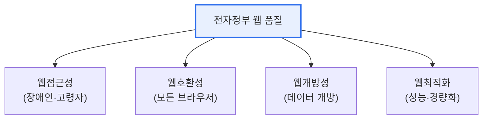

# 전자정부 웹사이트 품질 — 웹접근성·호환성·개방성·최적화

## 1. 개요

### 가. 개념
> 전자정부 웹사이트 품질은 **UI/UX 설계기준**과 함께 **웹접근성·웹호환성·웹개방성·웹최적화** 라는 네 가지 품질 요건을 충족해, 모든 국민이 어떤 환경에서도 차별 없이 전자정부 서비스를 이용하도록 보장하는 것이다.

공공 웹사이트에 이 품질 기준이 요구되는 근본 이유는 '**전자정부 서비스는 모든 국민이 예외 없이 이용할 수 있어야 한다**'는 공공성에 있다. 민간 서비스는 특정 이용자·환경을 겨냥할 수 있지만, 전자정부는 장애인·고령자를 포함한 전 국민이, 어떤 브라우저·기기를 쓰든 동등하게 접근할 수 있어야 한다. 그래서 네 가지 품질을 규정한다. 장애인도 이용할 수 있어야 하고(접근성), 어떤 브라우저에서도 똑같이 보여야 하며(호환성), 데이터를 개방해 재활용할 수 있어야 하고(개방성), 빠르게 로딩돼야 한다(최적화). 여기에 일관된 UI/UX 설계기준이 더해져 사용 편의를 높인다. 이 품질 기준은 권고가 아니라 「지능정보화 기본법」 등에 근거한 의무 사항으로, 공공 서비스의 보편적 접근권을 제도적으로 보장한다.

### 나. UI/UX 설계기준
전자정부 웹사이트는 사용자 중심·일관성·직관성·명확성·효율성·접근성·유연성 등의 설계 원칙에 따라 화면·내비게이션·콘텐츠를 일관되게 구성하도록 권고된다. [[gov-ui-ux-guideline]]

## 2. 4대 품질 요건

| 품질 | 내용 |
|---|---|
| **웹접근성** | 장애인·고령자 등 누구나 이용(대체텍스트·키보드 접근·명도대비), KWCAG 준수 |
| **웹호환성** | 특정 브라우저 종속 없이 모든 브라우저에서 동일 동작(웹표준 준수) |
| **웹개방성** | 검색엔진·기계가 데이터에 접근·수집 가능(개방형 포맷·robots 허용) |
| **웹최적화** | 페이지 경량화·캐싱으로 빠른 로딩·성능 확보 |

## 3. 웹접근성 상세

네 요건 중 핵심이 **웹접근성**이다. 시각·청각·지체 장애인과 고령자도 웹을 인식·운용·이해할 수 있도록 하는 것으로, 국내 지침 **KWCAG**(한국형 웹 콘텐츠 접근성 지침)를 따른다. 이미지에 대체텍스트를 제공하고, 마우스 없이 키보드만으로 조작 가능하며, 색만으로 정보를 전달하지 않고 충분한 명도 대비를 확보하는 것 등이 포함된다. 접근성은 장애인차별금지법상 의무이기도 하다.

## 4. 고려사항 및 시사점

1. **설계 초기부터 품질을 내재화**해야 한다. 접근성·호환성은 개발 후 덧붙이면 비용이 크므로, 웹표준 준수와 접근성 고려를 설계·개발 단계부터 반영해야 한다.
2. **품질 인증·평가로 관리**한다. 웹접근성 품질인증(마크), 정기 품질 진단으로 공공 웹사이트의 품질 수준을 지속 점검·개선한다.
3. **모바일·디지털 취약계층 포용**으로 확대된다. 모바일 접근성, 쉬운 언어, 다국어 지원 등 디지털 포용(digital inclusion) 관점으로 확장되어, 누구도 소외되지 않는 전자정부를 지향한다.

---

> **한 줄 요약**: 전자정부 웹사이트 품질은 *UI/UX 설계기준과 웹접근성·호환성·개방성·최적화* 로 구성되어, 모든 국민이 어떤 환경에서도 차별 없이 이용하도록 보장하며, 특히 KWCAG 기반 웹접근성은 법적 의무로 설계 초기부터 내재화해야 한다.
