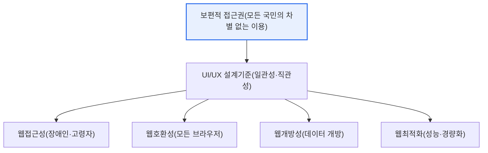
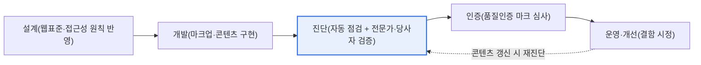

# 전자정부 웹사이트 품질 — 웹접근성·호환성·개방성·최적화

## 1. 개요

### 가. 개념
> 전자정부 웹사이트 품질은 **UI/UX 설계기준**과 함께 **웹접근성·웹호환성·웹개방성·웹최적화** 라는 네 가지 품질 요건을 충족해, 모든 국민이 어떤 환경에서도 차별 없이 전자정부 서비스를 이용하도록 보장하는 것이다.

공공 웹사이트에 이 품질 기준이 요구되는 근본 이유는 '**전자정부 서비스는 모든 국민이 예외 없이 이용할 수 있어야 한다**'는 공공성(publicness)에 있다. 민간 서비스는 수익성을 위해 특정 이용자층이나 특정 브라우저·기기 환경을 겨냥해 최적화할 자유가 있다. 그러나 전자정부는 성격이 다르다. 세금 신고, 민원 발급, 복지 신청 같은 서비스는 국민의 권리 행사와 직결되므로, 장애인·고령자를 포함한 전 국민이 어떤 브라우저·운영체제·기기를 쓰든 **동등한 수준으로 접근**할 수 있어야 한다. 특정 환경에서만 동작하는 공공 서비스는 그 환경을 갖추지 못한 국민의 권리를 사실상 배제하는 것이 되기 때문이다.

그래서 정부는 웹사이트가 갖춰야 할 품질을 네 축으로 규정한다. 장애인·고령자도 인식·조작할 수 있어야 하고(**접근성**), 어떤 브라우저에서도 동일하게 보이고 동작해야 하며(**호환성**), 데이터를 기계가 읽고 재활용할 수 있도록 열려 있어야 하고(**개방성**), 누구의 회선에서도 빠르게 로딩돼야 한다(**최적화**). 여기에 화면·내비게이션·용어를 일관되게 설계하는 UI/UX 기준이 더해져 사용 편의를 높인다. 중요한 점은 이 품질 기준이 단순 권고가 아니라 **「지능정보화 기본법」·「장애인차별금지법」 등 법령에 근거한 의무**라는 것이다. 즉 전자정부 웹 품질은 기술 지침을 넘어, 공공 서비스의 **보편적 접근권(universal access)** 을 제도적으로 보장하는 장치로 이해해야 한다.

### 나. 등장 배경 및 필요성
품질 기준이 제도화된 배경에는 세 가지 흐름이 있다. 첫째, **디지털 전환에 따른 서비스 이전**이다. 오프라인 창구에서 처리하던 행정이 대거 온라인으로 이동하면서, 웹에 접근하지 못하면 서비스 자체를 받지 못하는 상황이 생겼다. 웹 품질이 곧 국민의 서비스 접근권이 된 것이다. 둘째, **특정 기술 종속 문제의 반성**이다. 과거 국내 공공 웹은 특정 브라우저·플러그인(ActiveX 등)에 종속돼, 다른 브라우저 이용자나 신규 기기 이용자가 배제되는 문제가 반복됐다. 이는 웹표준·웹호환성 강제의 직접적 배경이 되었다. 셋째, **정보 격차(digital divide) 해소 요구**다. 장애인·고령자·저사양 기기 이용자가 소외되지 않도록, 접근성과 최적화를 의무화해 격차를 제도적으로 좁히려는 것이다. 결국 전자정부 웹 품질은 '보기 좋은 사이트'가 아니라 '누구도 배제하지 않는 사이트'를 만들기 위한 최소 요건이라 할 수 있다.

### 다. UI/UX 설계기준
전자정부 웹사이트는 사용자 중심·일관성·직관성·명확성·효율성·접근성·유연성 등의 설계 원칙에 따라 화면·내비게이션·콘텐츠를 일관되게 구성하도록 권고된다. [[gov-ui-ux-guideline]]

이 설계기준이 네 가지 품질 요건의 토대가 되는 이유는, 아무리 접근성·호환성을 개별적으로 지켜도 화면 구성과 용어·내비게이션이 사이트마다 제각각이면 국민이 서비스를 익히는 학습 비용이 커지기 때문이다. 특히 여러 부처·기관이 각기 다른 웹사이트를 운영하는 전자정부 특성상, **일관성**은 이용자가 한 사이트에서 익힌 사용법을 다른 사이트에도 그대로 적용할 수 있게 해 주는 핵심 가치다. 직관성·명확성은 행정 용어에 익숙하지 않은 일반 국민도 헤매지 않도록 하고, 유연성은 다양한 기기·화면 크기에 대응하는 반응형 설계로 이어진다. 즉 UI/UX 설계기준은 심미성의 문제가 아니라, 네 품질 요건이 실제 사용 편의로 통합되도록 묶어 주는 뼈대에 해당한다.

## 2. 4대 품질 요건 — 전체 구조

전자정부 웹 품질은 UI/UX 설계기준을 토대로 네 가지 품질 요건이 균형을 이루는 구조다. 아래 구조도는 품질 요건 간의 관계를 보여 준다. 네 요건은 독립적으로 존재하는 것이 아니라, '모든 국민의 차별 없는 이용'이라는 공통 목표를 각기 다른 각도에서 떠받친다.

```mermaid
flowchart TB
  G["보편적 접근권(모든 국민의 차별 없는 이용)"] --> UX["UI/UX 설계기준(일관성·직관성)"]
  UX --> A["웹접근성(장애인·고령자)"]
  UX --> C["웹호환성(모든 브라우저)"]
  UX --> O["웹개방성(데이터 개방)"]
  UX --> P["웹최적화(성능·경량화)"]
  style G fill:#e8f0fe,stroke:#2f6fed,stroke-width:2px
```

| 품질 | 내용 | 대표 준거·수단 |
|---|---|---|
| **웹접근성** | 장애인·고령자 등 누구나 인식·운용·이해 가능 | KWCAG(대체텍스트·키보드 접근·명도대비) |
| **웹호환성** | 특정 브라우저·플러그인 종속 없이 동일 동작 | W3C 웹표준(HTML/CSS 문법 준수) |
| **웹개방성** | 검색엔진·기계가 데이터에 접근·수집 가능 | robots 허용, 개방형 포맷, 메타데이터 |
| **웹최적화** | 페이지 경량화·캐싱으로 빠른 로딩·성능 확보 | 리소스 압축, 캐시, 렌더링 최적화 |

이 네 요건은 종종 상호 보완적이지만 때로 긴장 관계에 놓인다. 예컨대 화려한 시각 효과를 넣으면 심미성은 오르지만 접근성·최적화가 나빠질 수 있다. 따라서 품질 관리란 네 요건 중 하나를 극대화하는 것이 아니라, **네 요건이 최소 기준 이상에서 균형을 이루도록 설계·검증하는 것**이다. 이런 균형 감각이 전자정부 웹 품질 실무의 본질이다.

## 3. 각 품질 요건 상세

### 가. 웹접근성 — 네 요건의 핵심
네 요건 중에서도 법적 강제력과 파급력이 가장 큰 것이 **웹접근성**이다. 시각·청각·지체 등 장애를 가진 사람과 고령자도 웹 콘텐츠를 **인식(Perceivable)·운용(Operable)·이해(Understandable)** 하고 견고하게(Robust) 이용할 수 있도록 하는 것으로, 국내에서는 국가표준인 **KWCAG(한국형 웹 콘텐츠 접근성 지침)** 를 따른다. KWCAG는 국제표준 W3C WCAG를 국내 실정에 맞게 반영한 것으로, 최신 개정본인 KWCAG 2.2(2022년 개정)는 **4개 원칙 · 14개 지침 · 다수의 검사항목**으로 구성된다.

구체적으로는 이미지에 의미를 설명하는 **대체텍스트(alt)** 를 제공하고, 마우스 없이 **키보드만으로 모든 기능을 조작**할 수 있게 하며, 색만으로 정보를 전달하지 않고(색맹 배려), 텍스트와 배경 사이에 **충분한 명도 대비**를 확보하며, 동영상에 자막·수어를 제공하는 것 등이 포함된다. 이런 항목이 필요한 이유는 장애 유형별로 정보를 받아들이는 경로가 다르기 때문이다. 시각장애인은 화면낭독기(screen reader)로 대체텍스트를 음성으로 듣고, 지체장애인은 키보드·보조기기로 조작하며, 저시력·색약 이용자는 명도 대비에 의존한다. 접근성은 「장애인차별금지법」상 의무이기도 하여, 미준수 시 차별로 간주될 수 있다는 점에서 다른 요건보다 준수 압력이 강하다.

KWCAG의 뼈대는 국제표준 WCAG와 마찬가지로 **인식의 용이성·운용의 용이성·이해의 용이성·견고성** 이라는 네 원칙(POUR)이다. '인식'은 콘텐츠가 감각으로 지각 가능해야 함(대체텍스트·자막·명도대비), '운용'은 조작 수단이 다양해야 함(키보드 접근·충분한 시간·발작 유발 금지), '이해'는 내용과 조작이 예측 가능해야 함(가독성·일관성·오류 정정), '견고성'은 보조기술이 안정적으로 해석할 수 있어야 함(문법 준수·이름과 역할 제공)을 뜻한다. 이 네 원칙이 개별 검사항목의 근거가 되므로, 실무에서는 항목을 암기하기보다 '이 요소가 네 원칙 중 무엇을 위한 것인가'를 이해하는 편이 응용에 유리하다.

### 나. 웹호환성 — 표준 준수로 종속 탈피
**웹호환성**은 특정 브라우저나 플러그인에 종속되지 않고, 어떤 브라우저에서도 콘텐츠가 동일하게 보이고 동작하도록 하는 요건이다. 그 실현 수단은 **W3C 웹표준(HTML·CSS·ECMAScript) 준수**다. 표준을 지키면 브라우저마다 다르게 해석할 여지가 줄어, 크롬·엣지·사파리 등 어디서나 일관된 결과가 나온다. 과거 국내 공공 웹이 특정 브라우저 전용 기술(ActiveX 등)에 의존해 다른 브라우저 이용자를 배제했던 문제를 근본적으로 해소하려는 것이 이 요건의 취지다. 호환성은 접근성과도 맞물린다. 표준을 지킨 마크업이라야 화면낭독기·보조기술이 콘텐츠를 정확히 해석할 수 있기 때문이다.

### 다. 웹개방성 — 기계가 읽을 수 있는 공공데이터
**웹개방성**은 검색엔진 크롤러나 데이터 수집 기계가 웹사이트의 정보에 접근·수집할 수 있도록 열어 두는 요건이다. robots.txt로 정당한 크롤러의 접근을 부당하게 막지 않고, 데이터를 폐쇄형 포맷에 가두지 않으며(개방형 포맷·구조화 메타데이터 제공), 정보가 검색·재활용될 수 있게 하는 것이 핵심이다. 이는 공공데이터 개방 정책과 직결된다. 공공정보는 국민의 자산이므로, 특정 화면에만 갇혀 있지 않고 기계가 읽어 다른 서비스·연구·산업에서 재활용될 수 있어야 한다는 개방 철학이 바탕에 있다.

개방성이 실무에서 자주 훼손되는 지점은 '정보를 이미지·PDF·플래시 등에 가두는' 경우다. 예컨대 통계표를 이미지 한 장으로만 게시하면 사람 눈에는 보이지만 기계는 읽지 못하고, 화면낭독기도 해석하지 못해 접근성까지 함께 해친다. 반대로 같은 데이터를 텍스트·표·개방형 API로 제공하면 검색·재활용·접근성을 동시에 만족시킬 수 있다. 이처럼 개방성은 접근성과 원리적으로 맞닿아 있어, 둘을 함께 고려하는 것이 효율적이다.

### 라. 웹최적화 — 누구의 회선에서도 빠르게
**웹최적화**는 페이지를 경량화하고 캐싱·압축을 적용해 로딩 속도와 성능을 확보하는 요건이다. 이미지·스크립트 용량을 줄이고, 불필요한 리소스를 제거하며, 브라우저 캐시와 렌더링 최적화로 체감 속도를 높인다. 최적화가 품질 요건에 포함된 이유는 성능이 곧 접근성의 문제이기도 하기 때문이다. 저사양 기기나 느린 회선(농·산·어촌, 저소득층)을 쓰는 국민에게 무거운 페이지는 사실상 이용 불가와 같다. 따라서 최적화는 단순한 기술 효율이 아니라 **정보 격차 해소의 수단**으로 자리매김한다.

구체적으로는 이미지 포맷·해상도 최적화와 지연 로딩(lazy loading), 스크립트·스타일의 압축(minify)과 번들 축소, 정적 자원의 캐시·CDN 활용, 그리고 초기 렌더링을 앞당기는 기법 등이 동원된다. 재난·재해 공지나 민원 폭주 시점처럼 트래픽이 급증하는 순간에도 서비스가 느려지거나 멈추지 않아야 하므로, 최적화는 평상시 체감 속도뿐 아니라 **부하 상황의 가용성**까지 포괄하는 개념으로 넓게 이해하는 것이 바람직하다.

## 4. 비교 — 민간 웹 품질과의 차이, 그리고 적용 사례

전자정부 웹 품질과 일반 민간 웹 품질은 지향점에서 근본적으로 다르다. 민간은 전환율·체류시간 같은 **비즈니스 성과**를 최적화하고, 타깃 고객·환경에 집중할 자유가 있다. 반면 전자정부는 성과 지표보다 **보편적 접근권과 형평성**을 우선하며, '가장 불리한 환경의 이용자'를 기준으로 품질을 설정한다는 점이 결정적 차이다.

| 관점 | 민간 웹 품질 | 전자정부 웹 품질 |
|---|---|---|
| **최우선 가치** | 비즈니스 성과(전환·수익) | 보편적 접근권·형평성 |
| **대상 기준** | 핵심 타깃 이용자 | 전 국민(최약 환경 기준) |
| **접근성** | 선택·권장 | 법적 의무(장애인차별금지법) |
| **강제력** | 자율 | 법령·품질 진단·인증 |

이 차이는 구체적 사례에서 드러난다. 예컨대 정부 대표포털·민원 사이트는 화면낭독기 사용자를 위해 모든 이미지에 대체텍스트를 넣고 키보드 내비게이션을 보장하며, 웹표준 준수로 특정 브라우저 종속을 없애는 방식으로 품질을 관리한다. 또한 공공데이터포털은 웹개방성 원칙에 따라 데이터를 기계가 읽을 수 있는 개방형 포맷(예: OpenAPI·CSV·JSON)으로 제공해, 민간이 이를 활용한 앱·서비스를 만들 수 있게 한다. 이처럼 전자정부 웹 품질은 추상적 규범이 아니라 실제 서비스 설계·운영에 구체적으로 반영되는 실무 기준이다.

과거 사례는 이 기준의 필요성을 역설적으로 보여 준다. 한때 국내 공공·금융 웹은 특정 브라우저에서만 동작하는 플러그인(예: ActiveX) 기반 인증·결제에 의존해, 다른 브라우저나 새 기기를 쓰는 국민이 서비스를 받지 못하거나 다수의 프로그램을 강제 설치해야 하는 문제가 반복됐다. 이는 웹호환성의 부재가 곧 이용자 배제로 이어진 전형적 사례로, 이후 웹표준 전환과 플러그인 제거 정책의 직접적 동기가 되었다. 마찬가지로 접근성을 고려하지 않은 이미지 위주 페이지는 시각장애인이 화면낭독기로 전혀 이용할 수 없어, 사후에 막대한 재작업 비용을 치르는 경우가 많았다. 이런 실패 경험들이 '품질을 설계 초기에 내재화해야 한다'는 원칙을 뒷받침한다.

## 5. 심화 — 품질 인증·진단 제도와 최신 동향

전자정부 웹 품질은 선언에 그치지 않고 **인증·진단 제도**로 관리된다. 대표적으로 접근성이 우수한 웹사이트·모바일 앱에 부여하는 **웹 접근성 품질인증(인증 마크)** 제도가 있어, 지정된 인증기관이 KWCAG 준수 여부를 심사해 마크를 부여한다. 또한 정부 차원의 **정기 웹사이트 품질 진단**을 통해 공공 웹의 접근성·호환성 수준을 주기적으로 측정하고 개선 과제를 도출한다. 이런 제도는 품질을 '한 번 만들고 끝'이 아니라 지속적으로 점검·개선하는 관리 대상으로 만든다는 데 의미가 있다.

아래 프로세스 세부도는 품질이 설계–개발–진단–인증–개선으로 순환하며 관리되는 흐름(PDCA)을 보여 준다. 특히 콘텐츠가 갱신될 때마다 재진단으로 되돌아가는 순환 구조가 핵심이며, 이 고리가 끊기면 초기에 확보한 품질이 시간이 지나며 침식된다.

```mermaid
flowchart LR
  P["설계(웹표준·접근성 원칙 반영)"] --> D["개발(마크업·콘텐츠 구현)"]
  D --> C["진단(자동 점검 + 전문가·당사자 검증)"]
  C --> A["인증(품질인증 마크 심사)"]
  A --> IM["운영·개선(결함 시정)"]
  IM -.->|"콘텐츠 갱신 시 재진단"| C
  style C fill:#e8f0fe,stroke:#2f6fed,stroke-width:2px
```

이 순환에서 특히 중요한 단계는 **진단**이다. 진단은 자동 점검 도구로 광범위하게 위반을 스크리닝한 뒤, 대체텍스트의 의미 적절성처럼 자동화가 판단하기 어려운 부분은 전문가와 장애 당사자가 실사용으로 검증하는 이원 구조가 바람직하다. 인증은 이 진단 결과가 일정 수준 이상임을 공식 확인해 주는 장치이고, 운영·개선 단계는 발견된 결함을 시정해 다음 진단으로 되돌리는 되먹임 역할을 한다.

최근 동향은 세 방향으로 요약된다. 첫째, **모바일 접근성으로의 확장**이다. 서비스 이용이 모바일 중심으로 옮겨가면서, 웹 접근성 지침이 모바일 앱 접근성 지침으로 확장·정비되고 있다. 둘째, **디지털 포용(digital inclusion)으로의 관점 확대**다. 단순히 장애인 접근을 넘어, 고령자·저학력·다문화 이용자까지 아우르도록 '쉬운 언어(easy read)', 다국어 지원, 인지 접근성 등이 강조된다. 셋째, **AI·자동화 기반 품질 점검**이다. 접근성 위반을 자동 탐지하는 도구와, 대체텍스트 자동 생성 같은 AI 보조 기술이 발전하면서, 품질 검증을 상시화·자동화하려는 시도가 늘고 있다. 이는 개발 후 수작업 점검에 의존하던 관행의 한계를 보완한다.

## 6. 고려사항 및 시사점

1. **설계 초기부터 품질을 내재화(built-in)해야 한다.** 접근성·호환성은 개발이 끝난 뒤 덧붙이면 재작업 비용이 매우 커진다. 웹표준 준수와 접근성 고려를 기획·설계 단계부터 반영하는 '접근성 우선(accessibility-first)' 접근이 비용·품질 양면에서 유리하며, 이는 소프트웨어 공학에서 결함을 초기에 잡을수록 비용이 낮아진다는 원리와 일치한다.

2. **인증·정기 진단을 통한 지속적 품질 관리 체계를 갖춰야 한다.** 웹 접근성 품질인증과 정기 진단을 통해 품질 수준을 정량 측정하고, 발견된 결함을 개선하는 PDCA 순환을 제도화해야 한다. 품질은 일회성 산출물이 아니라 콘텐츠가 갱신될 때마다 재검증해야 하는 운영 대상임을 전제해야 한다.

3. **네 요건 간 균형과 트레이드오프를 관리해야 한다.** 심미성·기능성을 높이려다 접근성·최적화를 해치는 경우가 잦다. 요건 간 충돌 지점(예: 시각 효과 vs 명도 대비, 기능 추가 vs 성능)을 설계 원칙과 검증 체크리스트로 사전에 조정하여, 특정 요건의 극대화가 아니라 전체 균형을 지향해야 한다.

4. **모바일·디지털 취약계층 포용으로 범위를 확대해야 한다.** 웹을 넘어 모바일 앱 접근성, 쉬운 언어·다국어·인지 접근성까지 포괄하는 디지털 포용 관점으로 확장해, '누구도 소외되지 않는(no one left behind)' 전자정부를 지향해야 한다. 이는 UN 지속가능개발목표(SDGs)의 포용성 가치와도 맞닿는다.

5. **자동화·AI를 활용하되 사람 검증을 병행해야 한다.** 자동 접근성 점검 도구와 AI 보조 기술로 검증을 상시화하면 효율이 크게 오르지만, 문맥·의미의 적절성(예: 대체텍스트가 실제로 의미를 전달하는지)은 여전히 사람의 판단이 필요하다. 자동화는 광범위 스크리닝에, 전문가·당사자 검증은 실효성 확인에 배치하는 이원 검증 전략이 바람직하다.

6. **국제표준·법제 변화에 대한 지속적 정렬이 필요하다.** KWCAG는 국제표준 WCAG의 개정을 반영해 진화하고, 관련 법제도 디지털 환경 변화에 맞춰 개정된다. 따라서 한 시점의 인증에 안주하지 말고 표준·법령 개정 동향을 상시 추적해 사이트를 갱신해야 하며, 조달·계약 단계의 요구사항(제안요청서·감리 기준)에도 최신 품질 기준을 반영해 발주 단계에서부터 품질을 강제하는 것이 실효적이다.

## 참고자료
- 국립전파연구원, 한국형 웹 콘텐츠 접근성 지침(KWCAG) 관련 국가표준 — https://www.rra.go.kr/ko/reference/kcsList_view.do?nb_seq=5247&nb_type=6
- 한국형 웹 콘텐츠 접근성 지침(KWCAG) 2.2 — https://a11ykr.github.io/kwcag22/

---

> **한 줄 요약**: 전자정부 웹사이트 품질은 *UI/UX 설계기준과 웹접근성·호환성·개방성·최적화* 로 구성되어, 모든 국민이 어떤 환경에서도 차별 없이 이용하도록 보장하는 보편적 접근권 장치이며, 특히 KWCAG 기반 웹접근성은 법적 의무로 설계 초기부터 내재화하고 인증·정기 진단으로 지속 관리해야 한다.
