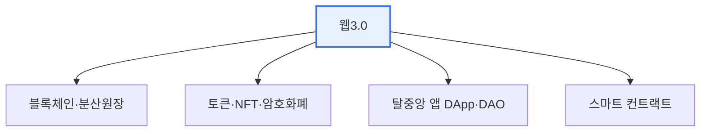

# 웹3.0(Web 3.0)

## 1. 개요

### 가. 도입 배경 및 개념
> 중앙 플랫폼이 데이터와 수익을 독점하는 웹2.0의 한계를 극복하기 위해, **블록체인 기반 탈중앙화로 데이터 소유권을 사용자에게 돌려주는** 차세대 웹. '읽기-쓰기-소유(Read-Write-Own)'의 웹으로 정의된다.

웹3.0의 핵심 발상은 '**데이터와 디지털 자산의 주인을 플랫폼에서 사용자에게로**' 되돌리는 것이다. 웹2.0에서는 사용자가 콘텐츠·데이터를 생산하지만, 그 가치는 거대 플랫폼(검색·SNS)이 가져갔다. 사용자는 자기 데이터에 대한 통제권도 수익도 갖지 못했다. 웹3.0은 블록체인과 토큰을 통해 사용자가 자신의 데이터·디지털 자산을 직접 소유·거래·이전할 수 있게 한다. 중앙 중개자 없이도 신뢰가 보장되므로, 특정 기업의 서버가 아니라 분산 네트워크가 서비스를 떠받친다. 다만 웹3.0은 이 '탈중앙 소유' 관점 외에, 데이터에 의미를 부여해 기계가 이해하는 '지능형 시맨틱 웹' 관점으로도 정의되어, 두 시각이 병존한다는 점을 유의해야 한다.

### 나. 필요성
플랫폼 독점의 심화로 데이터 주권·프라이버시·공정 분배 문제가 커지면서, 사용자가 자기 데이터를 통제하고 그 가치를 되찾을 수 있는 새로운 웹 패러다임에 대한 요구가 높아졌다.

## 2. 웹 진화 비교

| 구분 | 웹1.0 | 웹2.0 | 웹3.0 |
|---|---|---|---|
| **특징** | 읽기(Read) | 읽기·쓰기(참여) | 읽기·쓰기·소유 |
| **구조** | 정적·단방향 | 플랫폼 중앙집중 | 탈중앙(분산) |
| **데이터** | 제공자 소유 | 플랫폼 독점 | 사용자 소유 |

웹1.0이 정보를 읽기만 하는 정적 웹, 웹2.0이 사용자가 참여·생산하되 플랫폼이 통제하는 웹이었다면, 웹3.0은 사용자가 자신이 만든 가치를 소유하는 웹이다. 진화의 방향은 '연결→참여→소유'로 요약된다.

## 3. 주요 특징 및 기술 요소

웹3.0을 떠받치는 기술은 블록체인을 중심으로 엮인다. **블록체인** 이 탈중앙·불변 데이터의 기반을 제공하고, **스마트 컨트랙트** 가 중개자 없이 자동 실행되는 계약 코드로 신뢰를 코드화한다. **토큰·NFT** 는 디지털 자산의 소유·거래를 증명하고, **DApp·DAO** 는 중앙 서버 없는 탈중앙 애플리케이션과 자율 조직을 구현하며, **분산 신원(DID)** 은 플랫폼에 종속되지 않는 자기주권 신원을 제공한다.

| 기술 | 내용 |
|---|---|
| **블록체인** | 탈중앙·불변 데이터 기반 |
| **스마트 컨트랙트** | 자동 실행 계약 코드 |
| **토큰·NFT** | 디지털 자산 소유·거래 증명 |
| **DApp·DAO** | 탈중앙 애플리케이션·자율조직 |
| **분산 신원(DID)** | 자기주권 신원 |

## 4. 서비스 활용 방안

웹3.0은 여러 분야에서 활용된다. 중개자 없는 금융을 구현하는 DeFi, 창작물의 소유·수익화를 가능케 하는 NFT, 플랫폼에 종속되지 않는 자기주권 신원(DID), 아이템을 실제 소유하는 게임·메타버스 경제, 그리고 개인이 자기 데이터를 소유·보상받는 데이터 주권 서비스다.

| 분야 | 활용 |
|---|---|
| **금융(DeFi)** | 탈중앙 금융, 중개자 없는 거래 |
| **콘텐츠·창작** | NFT 기반 창작물 소유·수익화 |
| **신원·인증** | DID로 자기주권 신원 |
| **게임·메타버스** | 아이템 소유·경제(P2E) |
| **데이터 주권** | 개인 데이터 소유·보상 |

## 5. 고려사항 및 시사점

1. **이상과 현실의 간극**을 직시해야 한다. 데이터 소유권·탈중앙이라는 이상은 매력적이지만, 블록체인의 확장성·성능 한계, 규제 불확실성, 사용성 문제가 실용화의 걸림돌이다.
2. **투기·사기·에너지 소비 등 부작용을 경계**해야 한다. 토큰 투기, 러그풀 같은 사기, 작업증명의 에너지 소모 등 부정적 측면을 관리하지 못하면 신뢰를 잃는다.
3. **데이터 주권 흐름과 연계**된다. 마이데이터·DID 등 개인이 자기 데이터를 통제하는 정책·기술 흐름과 맞닿아 있어, 탈중앙 이상이 제도권과 접점을 넓히는 방향으로 발전하고 있다.

---

> **한 줄 요약**: 웹3.0은 *블록체인 기반 탈중앙화로 데이터·자산 소유권을 사용자에게 돌려주는* 차세대 웹으로, 스마트 컨트랙트·토큰·DApp·DID를 기술 요소로 DeFi·NFT·자기주권 신원에 활용되나 확장성·규제·부작용이 실용화 과제다.
