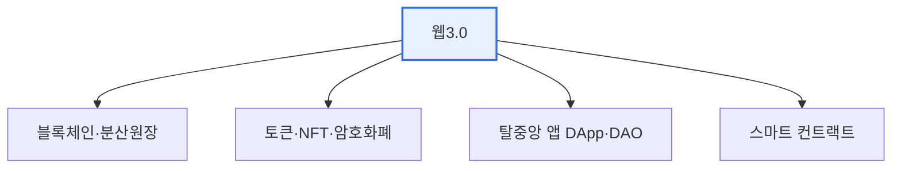

# 웹3.0(Web 3.0)

## 1. 개요

### 가. 도입 배경 및 개념 (1)
> 중앙 플랫폼이 데이터·수익을 독점하는 웹2.0의 한계를 극복하기 위해, **블록체인 기반 탈중앙화로 데이터 소유권을 사용자에게 돌려주는** 차세대 웹. '읽기-쓰기-소유(Read-Write-Own)'의 웹으로 정의된다.

웹3.0의 핵심 발상은 '**데이터·자산의 주인을 플랫폼에서 사용자로**' 되돌리는 것이다. 웹2.0에서 사용자가 만든 데이터·콘텐츠의 가치를 거대 플랫폼이 가져갔다면, 웹3.0은 블록체인·토큰으로 사용자가 자신의 데이터·디지털 자산을 소유·거래하게 한다. (한편 시맨틱 웹 관점의 '지능형 웹'으로 정의하는 시각도 병존한다.)

## 2. 웹 진화 비교

| 구분 | 웹1.0 | 웹2.0 | 웹3.0 |
|---|---|---|---|
| **특징** | 읽기(Read) | 읽기·쓰기(참여) | 읽기·쓰기·소유 |
| **구조** | 정적·단방향 | 플랫폼 중앙집중 | 탈중앙(분산) |
| **데이터** | 제공자 소유 | 플랫폼 독점 | **사용자 소유** |

## 3. 주요 특징 및 기술 요소 (2)

| 기술 | 내용 |
|---|---|
| **블록체인** | 탈중앙·불변 데이터 기반 |
| **스마트 컨트랙트** | 자동 실행 계약 코드 |
| **토큰·NFT** | 디지털 자산 소유·거래 증명 |
| **DApp·DAO** | 탈중앙 애플리케이션·자율조직 |
| **분산 신원(DID)** | 자기주권 신원 |

## 4. 서비스 활용 방안 (3)

| 분야 | 활용 |
|---|---|
| **금융(DeFi)** | 탈중앙 금융, 중개자 없는 거래 |
| **콘텐츠·창작** | NFT 기반 창작물 소유·수익화 |
| **신원·인증** | DID로 자기주권 신원 |
| **게임·메타버스** | 아이템 소유·경제(P2E) |
| **데이터 주권** | 개인 데이터 소유·보상 |

## 5. 시사점
- 데이터 소유권·탈중앙의 이상 ↔ 확장성·규제·사용성 과제
- 투기·사기·에너지 소비 등 부작용 경계
- 마이데이터·DID 등 **데이터 주권** 흐름과 연계

---

> **한 줄 요약**: 웹3.0은 *블록체인 기반 탈중앙화로 데이터·자산 소유권을 사용자에게 돌려주는* 차세대 웹으로, 스마트 컨트랙트·토큰·DApp·DID를 기술 요소로 DeFi·NFT·자기주권 신원에 활용된다.
