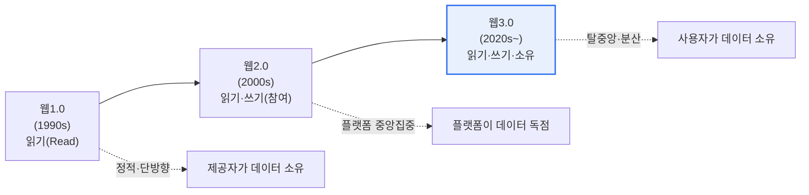
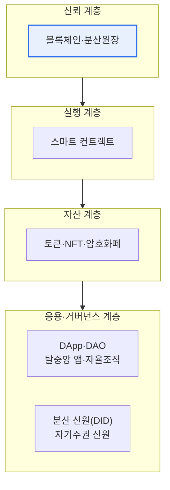

# 웹3.0(Web 3.0)

## 1. 개요

### 가. 도입 배경 및 개념
> 중앙 플랫폼이 데이터와 수익을 독점하는 웹2.0의 한계를 극복하기 위해, **블록체인 기반 탈중앙화로 데이터·디지털 자산의 소유권을 사용자에게 돌려주는** 차세대 웹. '읽기-쓰기-소유(Read-Write-Own)'의 웹으로 정의된다.

웹3.0의 핵심 발상은 '**데이터와 디지털 자산의 주인을 플랫폼에서 사용자에게로**' 되돌리는 것이다. 웹2.0에서는 사용자가 콘텐츠·데이터를 생산하지만, 그 가치는 거대 플랫폼(검색·SNS·전자상거래)이 대부분 가져갔다. 사용자는 자기 데이터에 대한 통제권도, 그로부터 발생하는 수익도 갖지 못했고, 플랫폼이 계정을 정지하면 그동안 쌓은 자산과 관계망을 한순간에 잃는 **종속(lock-in)** 상태에 놓였다. 웹3.0은 블록체인과 토큰을 통해 사용자가 자신의 데이터·디지털 자산을 직접 소유·거래·이전할 수 있게 하려는 시도다. 중앙 중개자 없이도 암호학과 합의 알고리즘으로 신뢰가 보장되므로, 특정 기업의 서버가 아니라 분산 네트워크가 서비스의 신뢰 기반을 떠받친다.

다만 웹3.0이라는 용어는 하나의 정의로 수렴하지 않고 **두 갈래의 관점이 병존**한다는 점을 유의해야 한다. 하나는 위에서 설명한 **블록체인 기반 '탈중앙 소유'** 관점으로, 현재 산업·미디어에서 가장 널리 통용되는 의미다. 다른 하나는 팀 버너스-리가 일찍이 제시한 **'시맨틱 웹(Semantic Web)'** 관점으로, 데이터에 의미(온톨로지·메타데이터)를 부여해 기계가 이해하고 추론하는 '지능형 웹'을 가리킨다. 최근에는 AI의 발전과 맞물려 '지능화'라는 세 번째 축까지 더해 논의되기도 한다. 답안에서는 이 다의성을 인지하되, 통상 블록체인 기반 탈중앙화 관점을 중심에 두고 서술하는 것이 안전하다.

### 나. 필요성
플랫폼 독점의 심화로 데이터 주권·프라이버시·공정 분배 문제가 커지면서, 사용자가 자기 데이터를 통제하고 그 가치를 되찾을 수 있는 새로운 웹 패러다임에 대한 요구가 높아졌다. 구체적으로는 ①소수 플랫폼에 데이터·권력이 집중되는 **중앙집중 리스크**(단일 장애점, 검열, 자의적 정책 변경), ②창작·기여의 가치가 창작자에게 돌아가지 않는 **분배 불공정**, ③플랫폼 종속으로 인한 **이동성·상호운용성 결핍**이 배경이 된다. 웹3.0은 이러한 구조적 문제에 대한 기술적 대안으로 제시되었다.

### 다. 두 관점의 병존
앞서 언급했듯 웹3.0은 하나의 정의로 수렴하지 않으므로, 두 관점의 차이를 명확히 구분해 두면 답안 구성이 안정적이다. '탈중앙 소유' 관점은 신뢰의 주체를 사람·기관에서 코드·합의로 옮기는 데 방점이 있고, '시맨틱 웹' 관점은 데이터를 사람이 아니라 기계가 이해하도록 구조화하는 데 방점이 있다. 두 관점은 대립하기보다 상호 보완적이며, 최근에는 AI를 매개로 수렴하는 흐름이 나타난다.

| 구분 | 탈중앙 소유(블록체인) 관점 | 시맨틱·지능형 웹 관점 |
|---|---|---|
| **핵심 가치** | 데이터·자산의 소유·이전 | 데이터의 의미 부여·기계 이해 |
| **신뢰 기반** | 분산원장·합의 알고리즘 | 온톨로지·메타데이터·표준 |
| **대표 기술** | 블록체인·스마트 컨트랙트·토큰 | RDF·OWL·시맨틱 태깅·AI |
| **주요 논의 시점** | 2020년대 이후 산업 담론 | 2000년대 W3C 표준 담론 |

## 2. 웹의 진화와 웹3.0의 위치

웹은 정보를 일방적으로 소비하던 단계에서, 사용자가 참여·생산하는 단계를 거쳐, 이제 자신이 만든 가치를 소유하는 단계로 진화해 왔다. 이 진화의 방향을 '연결 → 참여 → 소유'로 요약하면 웹3.0의 위치가 분명해진다.

```mermaid
flowchart LR
  W1["웹1.0<br/>(1990s)<br/>읽기(Read)"] --> W2["웹2.0<br/>(2000s)<br/>읽기·쓰기(참여)"]
  W2 --> W3["웹3.0<br/>(2020s~)<br/>읽기·쓰기·소유"]
  W1 -.정적·단방향.-> W1a["제공자가 데이터 소유"]
  W2 -.플랫폼 중앙집중.-> W2a["플랫폼이 데이터 독점"]
  W3 -.탈중앙·분산.-> W3a["사용자가 데이터 소유"]
  style W3 fill:#e8f0fe,stroke:#2f6fed,stroke-width:2px
```

웹1.0이 소수가 만든 정보를 다수가 읽기만 하던 정적·단방향 웹이었다면, 웹2.0은 블로그·SNS·오픈 API를 통해 누구나 참여·생산하되 그 데이터와 수익은 플랫폼이 통제하는 참여형 웹이었다. 웹2.0은 사용자 경험과 네트워크 효과를 폭발적으로 키웠지만, 바로 그 네트워크 효과가 승자독식과 플랫폼 독점으로 귀결되었다는 역설을 안고 있다. 웹3.0은 이 독점 구조를 블록체인으로 되돌려, 사용자가 자신이 만든 가치를 **소유**하는 웹을 지향한다.

| 구분 | 웹1.0 | 웹2.0 | 웹3.0 |
|---|---|---|---|
| **핵심 행위** | 읽기(Read) | 읽기·쓰기(참여) | 읽기·쓰기·소유(Own) |
| **구조** | 정적·단방향 | 플랫폼 중앙집중 | 탈중앙(분산) |
| **데이터 주체** | 제공자 소유 | 플랫폼 독점 | 사용자 소유 |
| **신뢰 기반** | 사이트 운영자 | 플랫폼 사업자 | 코드·합의 알고리즘 |
| **가치 분배** | 제한적 | 플랫폼 편중 | 기여자·소유자 중심 |

여기서 유의할 점은, 웹의 진화가 이전 단계를 완전히 대체하는 '단절적 교체'가 아니라 **누적적 확장**이라는 것이다. 오늘날에도 웹1.0적 정적 페이지와 웹2.0적 플랫폼은 여전히 지배적이며, 웹3.0은 그 위에 '소유'라는 새로운 층을 얹으려는 시도로 보는 것이 현실에 부합한다.

## 3. 주요 특징 및 기술 요소

웹3.0을 떠받치는 기술은 블록체인을 중심으로 계층적으로 엮인다. 최하부에 분산원장이 신뢰의 토대를 제공하고, 그 위에 자동 실행 계약과 자산 표현, 그리고 사용자가 직접 쓰는 애플리케이션·조직·신원 계층이 쌓인다.

```mermaid
flowchart TB
  subgraph L4["응용·거버넌스 계층"]
    D["DApp·DAO<br/>탈중앙 앱·자율조직"]
    ID["분산 신원(DID)<br/>자기주권 신원"]
  end
  subgraph L3["자산 계층"]
    T["토큰·NFT·암호화폐"]
  end
  subgraph L2["실행 계층"]
    S["스마트 컨트랙트"]
  end
  subgraph L1["신뢰 계층"]
    B["블록체인·분산원장"]
  end
  L1 --> L2 --> L3 --> L4
  style B fill:#e8f0fe,stroke:#2f6fed,stroke-width:2px
```

**블록체인·분산원장(신뢰 계층)** 은 데이터를 다수 노드에 복제·연결해 위·변조를 사실상 불가능하게 만들어, 중앙 관리자 없이도 '기록의 진실성'을 보장한다. 이 불변성과 투명성이 웹3.0 전체 신뢰의 뿌리다. 여기서 파생되는 실무적 특성이 **비검열성**(특정 주체가 임의로 기록을 지우거나 막을 수 없음)과 **가용성**(단일 장애점 부재)이다.

**스마트 컨트랙트(실행 계층)** 는 조건이 충족되면 코드가 스스로 실행되는 계약으로, "코드가 곧 법(Code is Law)"이라는 슬로건처럼 중개자 없이 약속을 자동 이행한다. 예컨대 결제가 확인되면 자동으로 소유권이 이전되도록 코드로 규정하면, 에스크로 같은 중개 기관이 필요 없어진다. 다만 코드에 결함이 있으면 그대로 실행되어 대규모 피해로 이어지므로(예: 재진입 공격), 감사(audit)와 검증이 필수다.

**토큰·NFT(자산 계층)** 는 디지털 자산의 소유와 거래를 증명한다. 대체가능토큰(FT)은 화폐·포인트처럼 동일 가치를 갖고, 대체불가토큰(NFT)은 예술품·수집품·회원권처럼 고유성을 표현한다. 토큰은 단순한 자산을 넘어 네트워크 참여자에게 인센티브를 배분하는 **토큰 이코노미(Token Economy)** 의 수단으로, 사용자를 서비스의 '이용자'에서 '이해관계자·소유자'로 전환시키는 장치가 된다.

**DApp·DAO·DID(응용·거버넌스 계층)** 는 사용자가 직접 접하는 층이다. DApp은 중앙 서버 대신 블록체인 위에서 동작하는 탈중앙 애플리케이션이고, DAO는 스마트 컨트랙트로 의사결정·자금 집행을 자동화한 탈중앙 자율조직이다. DID(분산 신원)는 플랫폼에 종속되지 않고 사용자가 자기 신원 정보를 직접 보관·제시하는 자기주권 신원(SSI) 기술로, 마이데이터와 결이 같다.

| 기술 요소 | 계층 | 역할 |
|---|---|---|
| **블록체인** | 신뢰 | 탈중앙·불변·투명 데이터 기반 |
| **스마트 컨트랙트** | 실행 | 조건부 자동 실행 계약 코드 |
| **토큰·NFT** | 자산 | 디지털 자산 소유·거래 증명, 토큰 이코노미 |
| **DApp·DAO** | 응용·거버넌스 | 탈중앙 앱·자율조직 운영 |
| **분산 신원(DID)** | 신원 | 자기주권 신원(SSI) |

## 4. 서비스 활용 방안과 사례

웹3.0은 특정 분야에 국한되지 않고 금융·콘텐츠·신원·게임 등으로 확장된다. 분야별 활용은 공통적으로 '중개자 제거'와 '사용자 소유'라는 두 원리로 설명된다.

**금융(DeFi, 탈중앙 금융)** 은 은행·증권사 같은 중개자 없이 스마트 컨트랙트로 예치·대출·교환을 수행한다. 예를 들어 이더리움 기반 대출 프로토콜에서는 사용자가 시가 1,000만 원어치 암호자산을 담보로 예치하면, 담보인정비율(예: 70%)에 따라 코드가 자동으로 700만 원 상당을 대출·이자 정산하고, 담보가치가 청산 임계치 아래로 떨어지면 사람의 개입 없이 즉시 청산까지 실행한다. 이렇게 심사·집행·청산이 코드로 자동화되어 중개 비용과 시간이 크게 줄지만, 반대로 코드 결함이나 급격한 시세 변동이 곧바로 손실로 직결되는 위험도 함께 커진다. **콘텐츠·창작** 영역에서는 NFT로 디지털 창작물의 원본성과 소유권을 증명하고, 스마트 컨트랙트에 로열티 조건을 심어 2차 거래마다 창작자에게 수익이 자동 분배되도록 설계할 수 있다. **신원·인증** 에서는 DID로 플랫폼에 종속되지 않는 자기주권 신원을 구현하며, **게임·메타버스** 에서는 아이템을 NFT로 실제 소유(P2E, Play to Earn)해 게임 밖으로도 자산을 이전할 수 있다.

전통 금융과 비교하면 DeFi의 차이가 선명하게 드러난다. 핵심은 '신뢰를 누가/무엇이 보증하는가'가 바뀐다는 점이며, 이 전환이 접근성·투명성이라는 이점과 규제 공백·기술 리스크라는 부담을 동시에 낳는다.

| 구분 | 전통 금융 | DeFi |
|---|---|---|
| **신뢰 보증** | 은행·감독기관 | 스마트 컨트랙트·합의 |
| **접근성** | 계좌·심사 필요 | 지갑만 있으면 누구나 |
| **투명성** | 내부 장부(비공개) | 온체인 공개·검증 가능 |
| **리스크** | 기관 신용·시스템 리스크 | 코드 취약점·청산·규제 공백 |

| 분야 | 활용 | 핵심 원리 |
|---|---|---|
| **금융(DeFi)** | 탈중앙 예치·대출·교환 | 중개자 없는 자동 정산 |
| **콘텐츠·창작** | NFT 기반 원본성·로열티 자동 분배 | 창작자 소유·수익화 |
| **신원·인증** | DID 자기주권 신원 | 플랫폼 비종속 |
| **게임·메타버스** | 아이템 NFT 소유·경제(P2E) | 자산의 게임 외 이전 |
| **데이터 주권** | 개인 데이터 소유·보상 | 마이데이터 연계 |

## 5. 심화: 한계와 최신 논쟁

웹3.0의 이상은 강력하지만, 실용화에는 구조적 한계가 뒤따른다는 점을 균형 있게 볼 필요가 있다. 첫째는 **확장성·성능의 한계**다. 모든 노드가 거래를 검증·복제하는 구조상 처리량(TPS)이 중앙집중 시스템에 비해 낮고 수수료(gas)가 높아, 대중적 서비스에는 부담이 된다. 이를 완화하기 위해 레이어2(롤업), 샤딩, 지분증명(PoS) 전환 등이 추진되고 있으며, 특히 대표적 플랫폼이 작업증명에서 지분증명으로 전환하면서 에너지 소비를 크게 줄인 것으로 알려져 있다(구체 수치는 출처에 따라 편차가 있어 단정은 피한다).

둘째는 '**탈중앙화의 역설**'이다. 표면적으로는 탈중앙을 표방하지만 실제로는 소수의 거래소·지갑·인프라 제공자에게 접점이 집중되거나, 토큰 대부분을 초기 참여자가 보유해 사실상 중앙집중과 다르지 않다는 비판이 제기된다. 일부에서는 이를 '웹2.5'라 부르기도 한다. 셋째는 **규제·소비자 보호의 공백**이다. 러그풀(투자금 회수 후 잠적), 시세 조종, 자금세탁 등 부작용이 반복되면서, 각국은 가상자산 이용자 보호와 시장 건전성을 위한 규제 체계를 정비하고 있다. 넷째는 **사용성(UX)** 문제로, 개인키 관리·지갑 연동·수수료 개념 등이 일반 사용자에게 여전히 높은 진입 장벽이다.

이러한 한계 때문에 웹3.0을 '차세대 웹의 확정된 미래'로 보기보다는, **데이터 주권·자기주권 신원(SSI)·마이데이터·토큰 이코노미** 같은 개별 요소가 제도권과 접점을 넓히며 선별적으로 정착해 가는 과정으로 이해하는 편이 정확하다. 기술사 관점에서는 '탈중앙이냐 중앙이냐'의 이분법보다, 어떤 영역에서 탈중앙이 실질적 가치를 주는지(비검열·투명성·자산 이동성이 중요한 영역)를 식별하는 선별적 적용 시각이 요구된다.

## 6. 고려사항 및 시사점

1. **이상과 현실의 간극을 직시한다.** 데이터 소유권·탈중앙이라는 이상은 매력적이지만, 확장성·성능 한계, 탈중앙화의 역설, 규제 불확실성, 사용성 문제가 실용화의 걸림돌이다. 이상을 그대로 신봉하기보다 영역별로 실익을 따지는 냉정한 적용 전략이 필요하다.
2. **부작용을 선제적으로 관리한다.** 토큰 투기, 러그풀·시세조종 같은 사기, 스마트 컨트랙트 취약점, 자금세탁 등 부정적 측면을 감사·규제·보안(코드 감사, KYC/AML)으로 통제하지 못하면 기술 자체가 신뢰를 잃는다.
3. **데이터 주권·마이데이터 흐름과 연계한다.** DID·SSI 등 개인이 자기 데이터를 통제하는 정책·기술 흐름과 맞닿아 있어, 탈중앙 이상이 제도권과 접점을 넓히는 방향으로 발전하고 있다. 마이데이터·전자서명·분산신원 표준(W3C DID/VC)과의 정합성 확보가 관건이다.
4. **상호운용성·표준화가 확산의 조건이다.** 체인 간 자산·데이터가 오가는 크로스체인·브리지의 안전성, 지갑·신원의 표준화가 확보되어야 파편화된 생태계가 실질적 네트워크로 통합된다. 브리지는 대형 해킹의 표적이 되어 왔으므로 보안 검증이 특히 중요하다.
5. **AI·시맨틱 관점과의 융합을 주시한다.** 최근에는 블록체인 기반 소유 관점과 시맨틱·AI 기반 지능화 관점이 결합하는 논의가 늘고 있어, 웹3.0을 단일 정의가 아닌 '소유+지능'의 복합 진화로 넓게 조망하는 시각이 유효하다.

## 참고자료
- W3C, "Decentralized Identifiers (DIDs) v1.0", https://www.w3.org/TR/did-core/
- Ethereum Foundation, "Web3 / Ethereum 개요", https://ethereum.org/en/web3/

---

> **한 줄 요약**: 웹3.0은 *블록체인 기반 탈중앙화로 데이터·자산 소유권을 사용자에게 돌려주는* 차세대 웹으로, 스마트 컨트랙트·토큰·DApp·DID를 기술 요소로 DeFi·NFT·자기주권 신원에 활용되나, 확장성·탈중앙화의 역설·규제·사용성 한계로 인해 데이터 주권 등 개별 요소가 제도권과 접점을 넓히며 선별적으로 정착해 가는 과정으로 보는 것이 정확하다.
