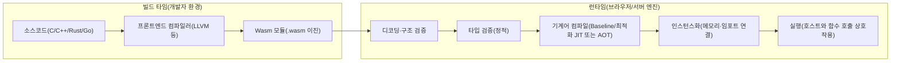
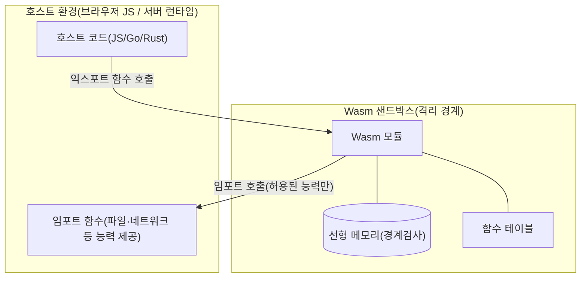

# 웹어셈블리(WebAssembly, Wasm)

## 1. 개요

### 가. 정의
> **WebAssembly(Wasm)** 는 스택 기반 가상머신을 위한 **이식 가능한 이진 명령어 포맷(portable binary instruction format)** 으로, C/C++·Rust·Go 등 다양한 언어를 컴파일해 **브라우저를 포함한 여러 실행 환경에서 네이티브에 가까운 속도로 안전하게 실행**하기 위한 W3C 표준 기술이다.

Wasm은 "웹에서 어셈블리처럼 빠른 코드를 돌린다"는 발상에서 출발했지만, 본질은 특정 언어나 브라우저에 종속되지 않은 **컴파일 타깃(compilation target)** 이라는 점이다. 즉 Wasm 자체는 사람이 직접 작성하는 언어라기보다, 상위 언어가 컴파일되어 도달하는 **저수준 중간 표현이자 배포 포맷**이다. 텍스트 포맷(WAT)과 이진 포맷(.wasm)이 1:1로 대응하며, 실제 배포·전송에는 파싱과 검증이 빠른 이진 포맷을 사용한다.

### 나. 등장 배경 및 필요성
웹에서 계산 집약적 작업(이미지·영상 처리, 게임, CAD, 암호 연산)을 수행하려면 JavaScript만으로는 성능과 예측 가능성이 부족했다. JavaScript는 동적 타입·JIT 최적화에 의존하므로 실행 성능이 런타임 상황에 따라 요동치고, 파싱·최적화 비용도 크다. 이를 보완하려던 asm.js(JavaScript의 최적화 가능한 부분집합)의 경험을 토대로, 브라우저 4사(구글·모질라·MS·애플)가 공동으로 **표준 이진 포맷**을 설계한 것이 WebAssembly다.

Wasm이 필요한 이유는 세 가지로 요약된다. 첫째, **성능 예측 가능성**이다. 이미 타입이 확정된 이진 코드이므로 파싱이 빠르고, 검증 후 곧바로 기계어로 컴파일되어 네이티브에 근접한 일관된 성능을 낸다. 둘째, **언어 다양성**이다. 기존 C/C++·Rust 자산을 웹으로 이식할 수 있어 "웹=JavaScript"라는 제약을 걷어낸다. 셋째, **강한 격리(sandbox)** 다. 선형 메모리와 자본화된(capability) 인터페이스로 인해 임의의 시스템 자원에 접근할 수 없어, 신뢰할 수 없는 코드를 안전하게 실행하는 기반이 된다. 이 세 번째 특성 덕분에 Wasm은 오늘날 브라우저를 넘어 서버리스·엣지·플러그인 런타임으로 확장되고 있다.

## 2. 실행 구조와 처리 흐름

Wasm의 실행은 크게 **컴파일(빌드) 단계**와 **런타임(적재·검증·실행) 단계**로 나뉜다. 아래 다이어그램은 상위 언어에서 Wasm 모듈이 만들어져 실행되기까지의 전체 파이프라인을 보여준다.

빌드 타임에서는 상위 언어가 LLVM 같은 컴파일러를 거쳐 Wasm 이진 모듈로 변환된다. 이 모듈은 함수·전역·메모리·테이블 등의 정의와, 호스트로부터 받아야 할 **임포트(import)**, 호스트에 노출할 **익스포트(export)** 를 선언한다. 런타임에서는 먼저 이진을 **디코딩**하고 구조적으로 올바른지 검사한 뒤, **정적 타입 검증**을 수행한다. 이 검증 단계는 Wasm 보안의 핵심으로, 실행 전에 스택 언더/오버플로, 타입 불일치, 범위를 벗어난 분기 등을 모두 배제한다. 검증을 통과한 모듈만이 기계어로 컴파일되며, 엔진에 따라 빠른 시작을 위한 **베이스라인 컴파일**과 최고 성능을 위한 **최적화 컴파일**을 병행(tiering)하거나 사전 컴파일(AOT)한다.

### 가. 스택 기반 가상머신과 선형 메모리
Wasm은 **스택 머신** 모델을 사용한다. 각 명령어는 피연산자 스택에서 값을 꺼내 연산하고 결과를 다시 스택에 넣는다. 값 타입은 i32·i64·f32·f64와 참조 타입 정도로 단순해 검증과 컴파일이 용이하다. 프로그램이 사용하는 힙 데이터는 **선형 메모리(linear memory)** 라 불리는 연속된 바이트 배열에 저장되며, 이 메모리는 호스트가 소유하고 경계 검사를 강제하므로 모듈이 자신에게 허용된 영역 밖을 읽거나 쓸 수 없다. 아래 그림은 Wasm 모듈과 호스트가 상호작용하는 격리 구조를 나타낸다.

이 구조의 핵심은 **모듈이 오직 호스트가 명시적으로 넘겨준 능력(capability)만 사용할 수 있다**는 점이다. 파일 접근·네트워크·시스템 호출은 모두 임포트로 주입되며, 주입되지 않으면 그 기능은 아예 존재하지 않는다. 이 "기본적으로 아무것도 못 함(deny-by-default)" 모델이 Wasm을 신뢰 경계로 삼는 근거다.

### 나. 호스트 상호작용과 WASI
브라우저에서는 JavaScript API(`WebAssembly.instantiate`)를 통해 모듈을 적재하고, DOM·fetch 등은 JS를 경유해 호출한다. 브라우저 밖(서버·엣지)에서는 표준 시스템 인터페이스가 필요한데, 이를 규정한 것이 **WASI(WebAssembly System Interface)** 다. WASI는 파일·시계·표준입출력 같은 OS 기능을 **능력 기반(capability-based)** 으로 노출해, 예컨대 특정 디렉터리 핸들만 넘겨주면 모듈은 그 하위 경로에만 접근할 수 있다. 이로써 컨테이너보다 가볍고 기동이 빠른 격리 실행 단위를 만들 수 있다.

## 3. 활용 유형과 사례

Wasm의 적용 영역은 빠르게 넓어지고 있다. 대표 유형을 원리와 함께 정리하면 다음과 같다.

| 활용 영역 | 내용 | 대표 사례·효과 |
|---|---|---|
| 브라우저 고성능 앱 | 계산 집약 로직을 Wasm으로 이식 | Figma(디자인 툴), AutoCAD Web, 게임 엔진(Unity/Unreal) |
| 서버리스·엣지 | 밀리초 단위 콜드스타트로 함수 실행 | Fastly Compute, Cloudflare 엣지 런타임 |
| 플러그인·확장 | 신뢰 불가 3rd-party 코드를 안전 격리 | Envoy 프록시 필터, DB/SaaS 확장 |
| 이식 가능 배포 | 한 번 빌드해 여러 아키텍처에서 실행 | 엣지-클라우드 공통 아티팩트 |

구체 사례로 **Figma**는 C++로 작성된 렌더링 엔진을 Wasm으로 컴파일해, 브라우저에서 데스크톱 앱에 근접한 편집 성능을 구현했고 초기 로딩 시간을 크게 단축했다고 알려져 있다. 서버 측에서는 컨테이너가 통상 수백 밀리초 이상 걸리는 콜드스타트를 Wasm 런타임이 **1밀리초 수준**으로 줄일 수 있어, 요청당 인스턴스를 새로 띄우는 엣지 컴퓨팅에 유리하다. 다만 구체 수치는 워크로드·엔진에 따라 달라질 수 있으므로 일반화해 이해하는 것이 안전하다.

### 가. 컨테이너·JavaScript와의 비교

Wasm은 종종 컨테이너·JavaScript의 대체재로 오해되지만, 실제로는 **격리 단위**와 **실행 타깃**의 성격이 다르다. 차이가 생기는 이유는 격리 수준과 시작 비용의 트레이드오프에 있다.

| 구분 | WebAssembly | 컨테이너(Docker) | JavaScript |
|---|---|---|---|
| 격리 방식 | VM 수준 언어 샌드박스 | OS 네임스페이스·cgroup | 언어 런타임 격리 |
| 콜드스타트 | 매우 빠름(μs~ms) | 상대적으로 느림(수백 ms) | 빠름 |
| 이미지 크기 | 수백 KB~수 MB | 수십~수백 MB | - |
| 언어 다양성 | 다수 언어 컴파일 | 임의 바이너리 | 단일 |
| 성숙도·생태계 | 발전 중(특히 GC·DOM 접근) | 매우 성숙 | 매우 성숙 |

컨테이너는 임의의 리눅스 바이너리와 완전한 파일시스템을 담을 수 있어 범용성이 크지만 이미지가 무겁고 기동이 느리다. 반면 Wasm은 담을 수 있는 것이 제한적인 대신 **가볍고 빠르며 아키텍처 독립적**이다. 따라서 둘은 대체 관계라기보다, "무거운 격리(컨테이너) 안에서 더 세밀한 다중 테넌트 격리(Wasm)"처럼 **계층적으로 조합**되는 경향이 있다. JavaScript 대비로는 성능 일관성과 언어 자유도가 강점이지만, DOM 직접 접근이 없고 가비지 컬렉션 언어 지원이 이제 성숙 단계에 들어서고 있다는 점을 고려해야 한다.

## 4. 심화 — 표준 진화와 컴포넌트 모델

Wasm은 초기(MVP) 이후 여러 확장을 표준화하며 적용 범위를 넓혀 왔다. **스레드·SIMD**는 병렬·벡터 연산 성능을 끌어올렸고, **참조 타입·GC 제안**은 Java·Kotlin·C# 등 관리 언어를 효율적으로 컴파일할 길을 열었다. 특히 주목할 것은 **컴포넌트 모델(Component Model)** 과 **WIT(WebAssembly Interface Types)** 다. 기존 Wasm 모듈은 i32·f64 같은 저수준 값만 주고받아, 문자열·구조체 같은 고수준 타입을 서로 다른 언어 모듈 간에 전달하기 번거로웠다. 컴포넌트 모델은 인터페이스를 언어 중립적으로 기술하고 서로 다른 언어로 만든 컴포넌트를 **레고처럼 조립**할 수 있게 하여, "언어에 관계없이 재사용 가능한 이식 컴포넌트"라는 장기 비전을 구체화한다.

이런 흐름 위에서 **WASI Preview 2** 는 능력 기반 인터페이스를 컴포넌트 모델 위에 재정의해 표준화의 축을 옮겼고, 서버 사이드 Wasm 생태계(예: 서버리스 함수, 확장 플러그인 런타임)의 토대가 되고 있다. 표준 세부는 계속 개정 중이므로, 실제 채택 시에는 사용하려는 엔진과 언어 툴체인이 어떤 제안(proposal) 단계를 지원하는지 확인하는 것이 중요하다.

## 5. 고려사항 및 시사점

기술사 관점에서 WebAssembly 도입은 단순한 성능 최적화를 넘어 아키텍처·보안 전략과 맞물린다.

- **적용 판단 기준**: 계산 집약적이고 언어 이식성이 필요한 워크로드에 Wasm이 유리하다. 반대로 I/O 위주이거나 기존 컨테이너 생태계 의존도가 높은 경우에는 이득이 제한적이므로, "빠른 격리·다중 테넌트·이식성" 요구가 뚜렷할 때 선택적으로 도입한다.
- **보안 트레이드오프**: 언어 샌드박스는 강력하지만, 임포트로 넘겨준 능력의 범위가 곧 공격 표면이 된다. **최소 권한(deny-by-default) 원칙**에 따라 필요한 능력만 주입하고, 공급망(모듈 출처·서명) 검증을 병행해야 한다. 선형 메모리 내부의 논리 버그(예: C 코드의 메모리 오류)는 여전히 존재할 수 있음도 인지해야 한다.
- **성숙도·생태계 전망**: DOM 직접 접근 부재, GC 언어 지원의 성숙 진행, 디버깅·툴링의 상대적 미비 등은 아직 과도기적 제약이다. 다만 컴포넌트 모델·WASI 표준화로 서버·엣지·플러그인 영역에서 채택이 가속되는 추세이므로, 중장기 로드맵에 **선택지로 반영**하는 것이 합리적이다.
- **연계 기술 관점**: Wasm은 서버리스·엣지 컴퓨팅, 서비스 메시(Envoy 필터), 제로 트러스트(신뢰 불가 코드 격리), 멀티클라우드 이식성 전략과 자연스럽게 결합된다. 따라서 개별 기술로 보기보다 **경량 격리 실행 계층**이라는 아키텍처 축으로 이해하고, 컨테이너·오케스트레이션과의 계층적 조합을 설계 대안으로 검토해야 한다.

## 참고자료
- WebAssembly 공식 사이트: https://webassembly.org/
- W3C WebAssembly Core Specification: https://www.w3.org/TR/wasm-core-2/
- WASI: https://wasi.dev/
- Bytecode Alliance(Component Model): https://bytecodealliance.org/

---
> **한 줄 요약**: WebAssembly는 다양한 언어를 컴파일해 브라우저·서버·엣지에서 네이티브에 가까운 속도로 안전하게 실행하는 이식형 이진 포맷으로, 능력 기반 격리와 컴포넌트 모델을 통해 경량 격리 실행 계층으로 확장되고 있다.
