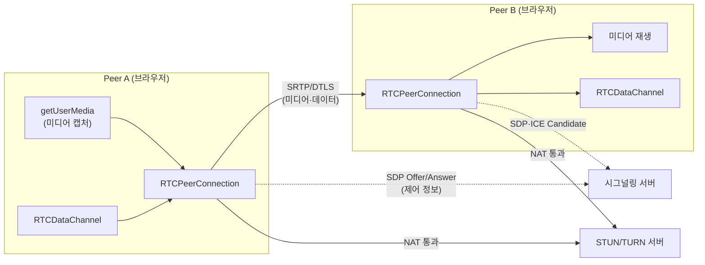
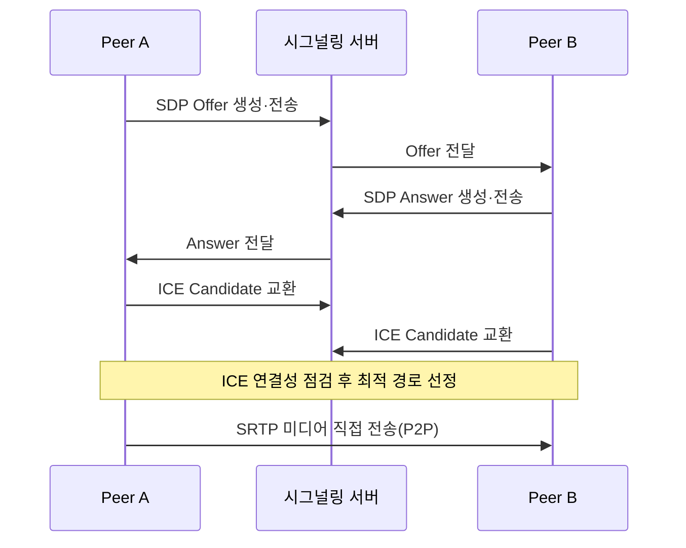

# WebRTC(Web Real-Time Communication)

## 1. 개요

> **WebRTC**는 별도의 플러그인이나 네이티브 애플리케이션 설치 없이 웹 브라우저와 모바일 앱 사이에서 오디오·비디오·임의 데이터를 **P2P(Peer-to-Peer)**로 실시간 전송할 수 있게 해 주는 개방형 표준 기술 집합이다. W3C가 자바스크립트 API를, IETF가 전송·미디어 프로토콜을 표준화하였다.

WebRTC가 등장하기 전 웹에서의 실시간 화상·음성 통신은 Flash나 별도 플러그인, 혹은 각 벤더의 독자 SDK에 의존해야 했다. 이는 설치 부담, 보안 취약성, 크로스 플랫폼 호환성 문제를 야기했다. 2011년 구글이 관련 코덱·엔진 기술을 오픈소스로 공개하고 표준화가 진행되면서, "브라우저에 내장된 표준 API만으로 실시간 통신을 구현한다"는 목표가 실현되었다. 특히 코로나19 이후 원격근무·원격교육·비대면 진료가 폭발적으로 늘면서 WebRTC는 화상회의(Google Meet, 대부분의 웹 기반 회의 솔루션), 실시간 고객상담, 클라우드 게임 스트리밍, IoT 영상 관제의 핵심 기반 기술로 자리 잡았다.

WebRTC의 본질적 가치는 **지연시간 최소화**에 있다. 일반적인 HTTP 기반 스트리밍이 수 초의 지연을 갖는 것과 달리, WebRTC는 UDP 기반 P2P 경로를 사용해 수백 밀리초 이하의 초저지연 통신을 지향한다. 이를 위해 브라우저는 미디어 캡처, 코덱 협상, NAT 통과, 암호화, 혼잡 제어를 모두 표준 스택 안에서 자동으로 처리한다.

## 2. 전체 구조

WebRTC는 크게 **시그널링(Signaling) 계층**과 **미디어/데이터 전송 계층**으로 나뉜다. 흥미로운 점은 시그널링 방식을 표준이 규정하지 않는다는 것으로, 개발자가 WebSocket·HTTP 등 임의의 채널로 자유롭게 구현하도록 위임하였다. 반면 실제 미디어를 주고받는 경로와 보안은 엄격히 표준화되어 있다.

핵심 자바스크립트 API는 세 가지다. 첫째 **`getUserMedia()`**는 카메라·마이크에 접근해 미디어 스트림을 획득한다. 둘째 **`RTCPeerConnection`**은 P2P 연결의 핵심 객체로, 코덱 협상·NAT 통과·암호화·혼잡 제어를 총괄한다. 셋째 **`RTCDataChannel`**은 오디오·비디오가 아닌 임의의 바이너리·텍스트 데이터를 저지연으로 교환하는 통로로, 실시간 채팅·파일 전송·게임 상태 동기화에 쓰인다. `RTCDataChannel`은 내부적으로 SCTP를 DTLS 위에서 사용하여, 신뢰성(재전송 여부)과 순서보장 여부를 채널별로 유연하게 설정할 수 있다는 특징이 있다.

## 3. 연결 수립 절차 — 시그널링과 NAT 통과

WebRTC 연결은 "제어 정보는 시그널링 서버를 경유해 교환하고, 실제 데이터는 P2P로 직접 흐른다"는 원칙으로 동작한다. 두 피어는 서로의 미디어 형식·코덱·네트워크 주소를 알아야 하는데, 이를 **SDP(Session Description Protocol)** 형식의 Offer/Answer로 교환한다.

가장 어려운 문제는 **NAT/방화벽 통과**다. 대부분의 단말은 사설 IP 뒤에 있어 상대방이 직접 접속할 공인 주소를 알 수 없다. 이를 해결하는 프레임워크가 **ICE(Interactive Connectivity Establishment)**이며, 두 종류의 보조 서버를 활용한다.

| 구분 | STUN | TURN |
|------|------|------|
| 역할 | 단말의 공인 IP·포트 확인 | 미디어를 중계(Relay) |
| 트래픽 경로 | P2P 직접 연결 | 서버 경유 |
| 서버 부하 | 낮음(주소만 알려줌) | 높음(트래픽 전달) |
| 사용 시점 | 대부분의 경우 | P2P가 불가능한 대칭형 NAT 등 |

STUN 서버는 단말에게 "너의 공인 주소는 이것"이라고 알려 주기만 하므로 부하가 거의 없고, 이 정보로 P2P 직접 연결을 시도한다. 그러나 **대칭형 NAT(Symmetric NAT)**나 엄격한 기업 방화벽 환경에서는 직접 연결이 불가능하며, 이때는 TURN 서버가 양 단말의 미디어를 대신 중계한다. TURN은 트래픽을 그대로 실어 나르므로 대역폭 비용이 크며, 실무에서는 전체 세션의 약 10~20% 정도가 TURN 경유로 떨어진다고 알려져 있어 TURN 서버 용량 산정이 서비스 품질과 비용의 핵심 변수가 된다.

## 4. 보안과 미디어 전송

WebRTC는 **보안이 선택이 아니라 필수**로 강제된 구조다. 모든 미디어는 **SRTP(Secure RTP)**로 암호화되고, 암호화 키 협상과 데이터 채널 보호는 **DTLS(Datagram TLS)**로 이루어진다. 즉 평문 전송이 원천적으로 불가능하다. 또한 브라우저는 카메라·마이크 접근 시 반드시 사용자 명시적 동의를 받고, HTTPS(보안 컨텍스트)에서만 API가 동작하도록 하여 도청·무단 캡처 위험을 줄인다.

미디어 코덱으로는 영상에 VP8·VP9·AV1·H.264, 음성에 Opus가 널리 쓰인다. 특히 **Opus**는 음성부터 음악까지 넓은 대역을 낮은 지연으로 처리해 사실상 표준 음성 코덱으로 자리 잡았다. 네트워크 상황이 나빠지면 브라우저의 혼잡 제어 알고리즘(예: GCC, Google Congestion Control)이 전송률·해상도·프레임률을 동적으로 낮춰 끊김을 최소화한다.

다만 다자간 회의처럼 참여자가 많아지면 순수 P2P(Mesh) 방식은 각 단말이 모든 상대에게 개별 스트림을 보내야 해 업로드 대역과 CPU가 급격히 증가한다. 이 때문에 실무에서는 중앙에 **SFU(Selective Forwarding Unit)** 또는 **MCU(Multipoint Control Unit)** 서버를 두어 스트림을 선택 전달하거나 합성한다. 예컨대 5명 회의에서 Mesh는 단말당 4개 업스트림이 필요하지만, SFU는 단말당 1개 업스트림만 서버로 보내면 되어 확장성이 크게 개선된다.

## 5. 유사 기술 비교

실시간 통신 후보 기술을 비교하면 WebRTC의 위치가 분명해진다. HLS/DASH 같은 HTTP 기반 스트리밍은 CDN 친화적이고 대규모 시청에 유리하지만 수 초의 지연이 있어 양방향 대화에는 부적합하다. WebSocket은 양방향이지만 TCP 기반이라 미디어 실시간성에는 한계가 있다. WebRTC는 UDP 기반 P2P로 초저지연 양방향 통신에 특화되지만, NAT 통과·서버 인프라(STUN/TURN/SFU) 구축 부담이 크다는 트레이드오프가 있다.

| 항목 | WebRTC | HLS/DASH | WebSocket |
|------|--------|----------|-----------|
| 지연 | 초저지연(<500ms) | 수 초 | 낮음 |
| 방향성 | 양방향 P2P | 단방향 | 양방향 |
| 전송 | UDP(SRTP) | TCP/HTTP | TCP |
| 대규모 시청 | 어려움(SFU 필요) | 우수 | 보통 |

## 6. 고려사항 및 시사점

**첫째, 인프라 설계가 서비스 품질을 좌우한다.** WebRTC 자체는 무료 표준이지만, 안정적 연결률을 위해서는 STUN·TURN·SFU 서버를 지역 분산 배치해야 한다. 특히 TURN 중계 트래픽 비용과 SFU의 CPU·대역폭 용량이 핵심 원가 요인이므로, 예상 동시 세션 수와 TURN 경유 비율을 근거로 사이징해야 한다.

**둘째, 확장성과 지연의 트레이드오프를 아키텍처로 풀어야 한다.** 소수 참여자·초저지연이 중요하면 Mesh/SFU를, 대규모 시청 위주면 WebRTC-SFU에 HLS를 병행하는 하이브리드 구조가 현실적이다. 최근에는 지연을 줄인 LL-HLS, 그리고 WebRTC 기반 대규모 송출(WHIP/WHEP) 표준화가 진행되어 선택지가 넓어지고 있다.

**셋째, 보안과 프라이버시를 설계 단계부터 내재화해야 한다.** SRTP·DTLS로 전송은 보호되나, SFU를 경유하는 순간 종단 간 암호화(E2EE)가 깨질 수 있다. 민감 회의에는 Insertable Streams 기반 E2EE 적용을, 그리고 STUN을 통한 IP 노출(프라이버시 이슈)에 대한 정책적 대응을 검토해야 한다.

**넷째, 표준·생태계 동향을 지속 추적해야 한다.** AV1 코덱 채택 확대, WebTransport·WebCodecs 등 인접 저지연 API의 부상, 브라우저별 구현 편차 등은 서비스 호환성에 직접 영향을 준다. 기술사 관점에서는 단순 기능 구현을 넘어, 연결 성공률(SLA)·비용·보안·확장성을 종합한 아키텍처 의사결정 역량이 요구된다.

---

> **한 줄 요약**: WebRTC는 브라우저 표준 API(`getUserMedia`·`RTCPeerConnection`·`RTCDataChannel`)와 ICE(STUN/TURN)·SRTP/DTLS를 결합해, 플러그인 없이 초저지연 P2P 실시간 오디오·비디오·데이터 통신을 구현하는 개방형 기술로, 인프라 사이징·확장성·보안 트레이드오프가 서비스 성패를 좌우한다.
