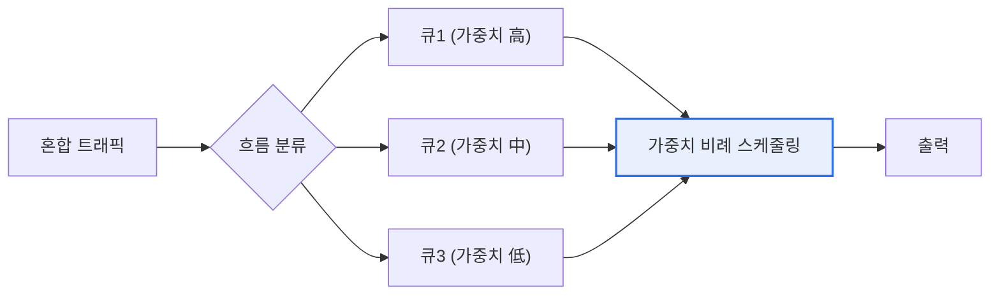

# WFQ(Weighted Fair Queuing)

## 1. 개요

### 가. 정의
> **WFQ**는 네트워크 큐잉(대기열) 기법으로, **여러 트래픽 흐름(flow)에 가중치를 부여해 대역폭을 공평하게 나눠 배분**하는 스케줄링 방식이다. 중요도가 높은 트래픽에 더 많은 대역폭을 주면서도 낮은 흐름이 굶주리지 않게 한다.

WFQ가 필요한 근본 이유는 '**한정된 대역폭을 어떻게 공정하고 효율적으로 나눌 것인가**'라는 QoS의 핵심 문제에 있다. 가장 단순한 큐잉인 FIFO(선입선출)는 도착 순서대로 처리하므로, 대용량 파일 전송 하나가 큐를 독차지하면 화상통화 같은 지연에 민감한 트래픽이 뒤에서 한없이 밀린다. 반대로 모든 흐름에 똑같이 나눠주는 단순 공정 큐잉은, 중요한 트래픽과 덜 중요한 트래픽을 구분하지 못한다. WFQ는 이 둘의 문제를 해결한다. 각 트래픽 흐름을 구분해 별도 큐에 넣고, 흐름마다 **가중치**를 두어 대역폭을 그 비율대로 배분한다. 그러면 우선순위가 높은(가중치가 큰) 트래픽은 더 많은 대역을 받아 빠르게 처리되면서도, 낮은 흐름도 최소한의 몫을 보장받아 굶주림(starvation)을 피한다. 즉 '차등화된 공정성'을 구현하는 것이 WFQ다. 이는 음성·영상·데이터가 뒤섞인 네트워크에서 각 서비스의 품질을 지키는 데 효과적이다.

### 나. 등장 배경
음성·영상 등 지연에 민감한 트래픽과 대용량 데이터가 공존하면서, 단순 FIFO로는 QoS를 보장할 수 없어 차등적·공정한 큐잉이 필요해졌다.

## 2. 동작 원리

WFQ는 트래픽을 흐름별로 분류해 각각의 큐에 담고, 각 큐에 할당된 가중치에 비례해 순서대로 패킷을 내보낸다. 가중치가 큰 큐는 더 자주·많이 서비스되어 대역폭을 더 받는다.

## 3. 다른 큐잉 기법과 비교

| 기법 | 특징 |
|---|---|
| **FIFO** | 단순 선입선출, QoS 미보장(독점 위험) |
| **PQ(우선순위 큐잉)** | 높은 우선순위 우선, 낮은 큐 굶주림 위험 |
| **WFQ** | 가중치 비례 공정 배분, 굶주림 방지 |
| **CBWFQ** | 클래스 기반 WFQ, 사용자 정의 클래스에 대역 보장 |

FIFO는 QoS를 못 지키고, 순수 우선순위 큐잉(PQ)은 높은 우선순위가 대역을 독점해 낮은 트래픽이 굶주릴 수 있다. WFQ는 가중치로 차등하되 모든 흐름에 최소 몫을 보장한다는 점에서 균형적이다. 실무에서는 클래스 기반으로 확장한 CBWFQ가 널리 쓰인다.

## 4. 고려사항 및 시사점

1. **차등화와 공정성의 균형**이 핵심 가치다. WFQ는 중요 트래픽 우대와 최소 대역 보장을 동시에 달성해, 순수 우선순위 방식의 굶주림 문제와 순수 공정 방식의 무차별 문제를 모두 극복한다.
2. **QoS 정책의 일부로 설계**한다. WFQ는 분류(classification)·표시(marking)·혼잡 회피와 결합해 전체 QoS 정책의 일부로 동작하므로, 트래픽 분류·가중치 설계가 전체 품질을 좌우한다.
3. **DiffServ 등과 연계**된다. 흐름별 세밀한 제어는 확장성 한계가 있어, 대규모 망에서는 트래픽을 클래스로 묶어 처리하는 DiffServ·CBWFQ와 결합해 확장성과 품질을 함께 확보한다. [[qos-diffserv-intserv]]

---

> **한 줄 요약**: WFQ는 *트래픽 흐름에 가중치를 부여해 대역폭을 차등적·공정하게 배분* 하는 큐잉 기법으로, FIFO의 독점과 우선순위 큐잉의 굶주림 문제를 해결하며, QoS 정책·CBWFQ·DiffServ와 연계해 서비스 품질을 보장한다.
