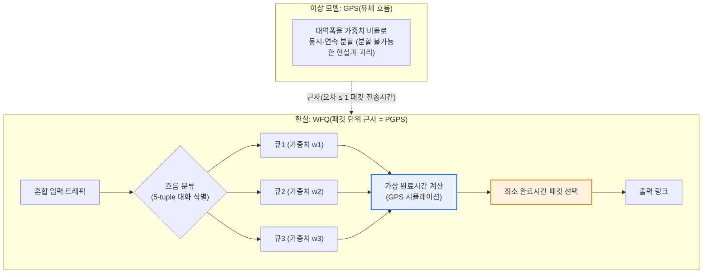
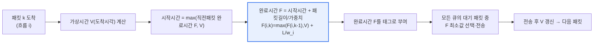

# WFQ(Weighted Fair Queuing)

## 1. 개요

### 가. 정의
> **WFQ**는 네트워크 큐잉(대기열) 기법으로, **여러 트래픽 흐름(flow)에 가중치를 부여해 대역폭을 공평하게 나눠 배분**하는 스케줄링 방식이다. 중요도가 높은 트래픽에 더 많은 대역폭을 주면서도, 낮은 흐름이 굶주리지(starvation) 않도록 최소 몫을 보장한다. 이론적으로는 이상적 유체 모델인 **GPS(Generalized Processor Sharing)를 패킷 단위로 근사(PGPS)** 한 것으로 정의된다.

WFQ가 필요한 근본 이유는 '**한정된 대역폭을 어떻게 공정하고 효율적으로 나눌 것인가**'라는 QoS의 핵심 문제에 있다. 가장 단순한 큐잉인 FIFO(선입선출)는 도착 순서대로 처리하므로, 대용량 파일 전송(예: 수백 MB 백업 트래픽) 하나가 큐를 독차지하면 화상통화나 VoIP 같은 지연에 민감한 트래픽이 뒤에서 한없이 밀린다. 이를 큐 독점(hogging)이라 하며, 특히 저속 WAN 링크에서 치명적이다. 반대로 모든 흐름에 똑같이 나눠주는 단순 공정 큐잉(Fair Queuing)은, 중요한 트래픽과 덜 중요한 트래픽을 구분하지 못하는 한계가 있다.

WFQ는 이 둘의 문제를 동시에 해결한다. 각 트래픽 흐름을 구분해 별도 큐에 넣고, 흐름마다 **가중치(weight)** 를 두어 대역폭을 그 비율대로 배분한다. 그러면 우선순위가 높은(가중치가 큰) 트래픽은 더 많은 대역을 받아 빠르게 처리되면서도, 낮은 흐름도 최소한의 몫을 보장받아 굶주림을 피한다. 즉 '**차등화된 공정성(differentiated fairness)**'을 구현하는 것이 WFQ의 본질이다. 이는 음성·영상·데이터가 뒤섞인 컨버지드 네트워크에서 각 서비스의 품질을 지키는 데 효과적이며, 오늘날 라우터·스위치 QoS의 사실상 표준 스케줄러로 자리 잡았다.

### 나. 등장 배경과 이론적 뿌리
1980년대 말 인터넷에서 음성·영상 등 실시간 트래픽과 대용량 데이터가 공존하기 시작하면서, 단순 FIFO로는 QoS를 보장할 수 없어 차등적·공정한 큐잉이 필요해졌다. WFQ는 1989년 Demers·Keshav·Shenker가 SIGCOMM 논문 "Analysis and Simulation of a Fair Queueing Algorithm"에서 제안했고, 이후 1993년 Parekh·Gallager가 이상적 유체 모델인 **GPS**와 그 패킷 근사인 **PGPS(Packet-by-Packet GPS)** 의 이론을 정립하며 수학적 지연 상한(delay bound)을 증명했다. 핵심 결론은 "**PGPS는 어떤 도착 패턴에서도 GPS와 최대 1개 패킷 전송시간 이내로만 차이가 난다**"는 것으로, WFQ가 이상적 공정 배분을 실용적으로 매우 근접하게 흉내 낼 수 있음을 보장한다. 이 이론적 기반 덕분에 WFQ는 단순한 휴리스틱이 아니라 **정량적 QoS 보증**이 가능한 기법으로 인정받는다.

### 다. 특징
WFQ는 **흐름 자동 분류**(별도 설정 없이 5-tuple 등으로 대화를 식별), **가중치 비례 배분**, **굶주림 방지**(모든 활성 흐름에 서비스 순환), **적응적 대역 재분배**(유휴 흐름의 몫을 활성 흐름이 나눠 씀)라는 네 가지 성질을 갖는다. 특히 마지막 성질(work-conserving) 덕분에 링크가 비는 순간이 없어 대역 이용률이 높다.

## 2. GPS 이상 모델과 WFQ의 관계 — 전체 구조

WFQ를 이해하려면 먼저 그 이상형인 GPS를 알아야 한다. GPS는 여러 흐름을 **동시에, 무한히 잘게 쪼개(유체처럼)** 가중치 비율대로 서비스하는 가상의 모델이다. 예컨대 흐름 A·B·C의 가중치가 3:2:1이면, GPS는 매 순간 대역폭을 정확히 3/6, 2/6, 1/6으로 나눠 흘려보낸다. 하지만 실제 패킷은 쪼갤 수 없으므로 한 번에 하나씩만 내보낼 수 있다. WFQ는 "**GPS라면 이 패킷이 언제 전송을 끝냈을까**"를 계산해(가상 완료시간), 그 순서대로 패킷을 실제로 내보내는 방식으로 GPS를 근사한다.

```mermaid
flowchart TB
  subgraph IDEAL["이상 모델: GPS(유체 흐름)"]
    G["대역폭을 가중치 비율로<br/>동시·연속 분할 (분할 불가능한 현실과 괴리)"]
  end
  subgraph REAL["현실: WFQ(패킷 단위 근사 = PGPS)"]
    direction LR
    IN["혼합 입력 트래픽"] --> CL{"흐름 분류<br/>(5-tuple 대화 식별)"}
    CL --> Q1["큐1 (가중치 w1)"]
    CL --> Q2["큐2 (가중치 w2)"]
    CL --> Q3["큐3 (가중치 w3)"]
    Q1 & Q2 & Q3 --> VT["가상 완료시간 계산<br/>(GPS 시뮬레이션)"]
    VT --> SEL["최소 완료시간 패킷 선택"]
    SEL --> OUT["출력 링크"]
  end
  IDEAL -. 근사(오차 ≤ 1 패킷 전송시간) .-> REAL
  style VT fill:#e8f0fe,stroke:#2f6fed,stroke-width:2px
  style SEL fill:#fff3e0,stroke:#e8890c,stroke-width:2px
```

위 구조도에서 핵심은 GPS(이상)와 WFQ(현실)를 잇는 점선이다. WFQ는 매 패킷마다 내부적으로 GPS를 시뮬레이션해 가상 완료시간이라는 타임스탬프를 붙이고, 그 값이 가장 작은 패킷을 먼저 보낸다. 이렇게 하면 실제 전송 순서가 이상적 유체 배분의 종료 순서와 거의 일치하게 되어, 공정성과 지연 보증을 동시에 얻는다.

## 3. 동작 원리 — 가상시간과 가상 완료시간

WFQ의 심장은 **가상시간(virtual time, V(t))** 과 **가상 완료시간(virtual finish time, F)** 이다. 가상시간은 GPS 서버가 얼마나 일을 진행했는지를 나타내는 내부 시계로, 활성 흐름 수와 가중치 합에 따라 진행 속도가 달라진다. 각 패킷이 도착하면 WFQ는 그 패킷이 GPS에서 언제 전송을 마칠지를 다음과 같이 계산한다.

```mermaid
flowchart LR
  A["패킷 k 도착<br/>(흐름 i)"] --> B["가상시간 V(도착시각) 계산"]
  B --> C["시작시간 = max(직전패킷 완료시간 F, V)"]
  C --> D["완료시간 F = 시작시간 + 패킷길이/가중치<br/>F(i,k)=max(F(i,k-1),V) + L/w_i"]
  D --> E["완료시간 F를 태그로 부여"]
  E --> F["모든 큐의 대기 패킷 중<br/>F 최소값 선택·전송"]
  F --> G["전송 후 V 갱신 → 다음 패킷"]
  style D fill:#e8f0fe,stroke:#2f6fed,stroke-width:2px
```

식 `F(i,k) = max(F(i,k-1), V(a)) + L(i,k)/w_i`에서 각 항의 의미를 풀어 보자. **`max(...)` 항**은 "이 흐름의 직전 패킷이 아직 끝나지 않았으면 그 뒤에 이어서, 이미 끝났으면 지금 시점(가상시간)부터 시작"이라는 뜻이다. 이 덕분에 오래 쉬던 흐름이 갑자기 폭주해 대역을 몰아 쓰는 것을 막는다. **`L/w_i` 항**은 패킷 길이 L을 가중치 w로 나눈 값으로, 가중치가 클수록 이 증가분이 작아져 완료시간이 앞당겨지고 결국 먼저 전송된다. 즉 **가중치가 큰 흐름의 패킷일수록 태그가 작아 우선 서비스**되는 구조다.

이 방식이 우수한 이유는 **패킷 크기에 무관하게 공정**하다는 데 있다. 단순 라운드로빈(WRR)은 큐를 한 바퀴 돌 때 패킷 '개수'로 나누므로, 큰 패킷만 보내는 흐름이 작은 패킷 흐름보다 실제로는 더 많은 바이트를 가져가는 불공정이 생긴다. 반면 WFQ는 완료시간 계산에 **바이트 단위 길이 L**을 반영하므로, 패킷 크기가 제각각이어도 바이트 기준으로 정확히 가중치 비율을 지킨다. 이것이 WFQ가 WRR보다 이론적으로 우월한 핵심 지점이다.

가중치는 실무에서 트래픽 표시값으로 정한다. 예를 들어 Cisco의 흐름 기반 WFQ는 **IP Precedence 값(0~7)** 이 높을수록 큰 가중치를 부여해, Precedence 5인 음성이 Precedence 0인 일반 데이터보다 여러 배 많은 대역을 받도록 자동 조정한다. 실제로 Precedence 값에 (Precedence+1)에 반비례하는 내부 가중치를 매기는 방식으로 구현되어, 우선순위가 한 단계 오를 때마다 상대적 대역 몫이 커진다(구체 상수는 IOS 버전에 따라 다르므로 일반화한다).

### 가. 완료시간 계산 — 단계별 수치 예제
개념을 구체화하기 위해 간단한 예를 보자. 흐름 A(가중치 2)와 흐름 B(가중치 1)가 있고, 편의상 가상시간을 실제 시각과 같게 두며 패킷 길이는 서비스 시간 단위로 표현한다고 가정한다. 다음 순서로 완료시간 태그가 매겨진다.

- **t=0**: A의 패킷 A1(길이 4) 도착. 직전 완료시간이 없으므로 `F(A1)=max(0,0)+4/2=2`.
- **t=0**: B의 패킷 B1(길이 3) 도착. `F(B1)=max(0,0)+3/1=3`.
- **선택**: 두 태그 중 최소는 A1(2)이므로 **A1을 먼저 전송**한다. 가중치가 큰 A가 같은 시점 경쟁에서 앞선다.
- **t 진행 후**: A의 A2(길이 4) 도착. `F(A2)=max(F(A1)=2, V)+4/2=2+2=4`.
- **선택**: 대기 중 태그는 B1(3), A2(4). 최소는 **B1(3) 전송** → 뒤이어 A2(4). 결과 전송순서는 A1→B1→A2다.

이 시퀀스에서 관찰할 점은, 가중치가 2배인 A가 같은 시간 창에서 B보다 대략 2배 많은 바이트(A1+A2=8 vs B1=3에 이어 계속)를 실어 보내면서도, B가 완전히 밀려나지 않고 중간에 반드시 서비스된다는 것이다. 이것이 '차등화된 공정성'이 실제 태그 산술로 구현되는 모습이며, 순수 우선순위 큐였다면 B1은 A 트래픽이 끊길 때까지 전송되지 못했을 것이다.

## 4. 유형 및 확장 — Flow-based WFQ, CBWFQ, LLQ, DRR

WFQ는 하나의 고정 알고리즘이 아니라 여러 파생·확장 형태로 발전했다. 원조인 **흐름 기반 WFQ(Flow-based / conversation-based)** 는 출발지·목적지 IP, 프로토콜, 포트 등 5-tuple로 대화를 자동 식별해 큐를 동적으로 생성한다. Cisco에서는 전통적으로 2.048 Mbps 이하 저속 직렬 인터페이스의 기본 스케줄러였으며, 별도 클래스 정의 없이도 소량 실시간 트래픽을 대량 벌크 트래픽으로부터 보호한다. 다만 흐름마다 상태를 유지하므로 수만 개 흐름이 지나는 대형 코어 라우터에서는 **확장성(scalability) 한계**가 있다.

이 확장성 문제를 풀기 위해 **CBWFQ(Class-Based WFQ)** 가 등장했다. CBWFQ는 개별 흐름이 아니라 **사용자가 정의한 클래스(예: 음성·화상·업무 트래픽·기타)** 단위로 큐를 만들고, 각 클래스에 대역폭을 절대값(kbps)이나 백분율로 보장한다. 흐름 수가 아무리 많아도 큐는 클래스 수(최대 64개 등)로 제한되므로 코어망에서도 예측 가능하고 관리가 쉽다. 실무 QoS 설계는 대부분 CBWFQ를 기반으로 한다.

그러나 CBWFQ만으로는 VoIP처럼 **지연·지터에 극도로 민감한 트래픽**을 완벽히 보호하기 어렵다. 가중치 배분만으로는 최악의 경우 음성 패킷이 다른 큐 뒤에서 잠깐 기다릴 수 있기 때문이다. 그래서 **LLQ(Low Latency Queuing)** 는 CBWFQ에 **엄격한 우선순위 큐(strict priority queue)** 를 하나 더 얹어, 음성 트래픽은 다른 어떤 큐보다 먼저 즉시 전송하되 정해진 대역 한도(policer)를 넘으면 잘라내 다른 클래스의 굶주림을 막는다. 오늘날 기업 음성망 QoS의 사실상 표준이 LLQ다.

한편 계산 복잡도 측면에서 WFQ의 완료시간 정렬은 흐름 수 N에 대해 O(log N)의 비용이 든다. 초고속 하드웨어에서는 이 정렬 비용조차 부담이 되어, 이를 O(1)로 단순화한 **DRR(Deficit Round Robin)** 이 널리 쓰인다. DRR은 각 큐에 '적자(deficit)' 카운터와 퀀텀(quantum)을 두어 바이트 단위 공정성을 근사하며, 라운드로빈의 낮은 구현 비용과 WFQ의 바이트 공정성을 절충한 형태다. 실제 고성능 스위치 ASIC의 스케줄러는 상당수가 DRR 또는 그 변형을 채택한다.

## 5. 다른 큐잉 기법과 비교

아래 표는 대표 큐잉 기법을 정리한 것이지만, 표만으로는 '왜' 그런 차이가 나는지 알기 어렵다. 표 뒤의 서술로 차이의 원인과 실무적 함의를 설명한다.

| 기법 | 핵심 방식 | 강점 | 약점 |
|---|---|---|---|
| **FIFO** | 단순 선입선출 | 구현 단순·오버헤드 최소 | QoS 미보장, 큐 독점 위험 |
| **PQ(우선순위 큐잉)** | 높은 우선순위 절대 우선 | 최우선 트래픽 지연 최소 | 낮은 큐 굶주림 |
| **WRR** | 가중 라운드로빈(패킷 수) | 구현 쉬움, 차등 가능 | 패킷 크기 불공정 |
| **WFQ** | 가중치 비례 + 바이트 공정 | 굶주림 방지·바이트 공정 | 흐름 상태 유지, 확장성 |
| **CBWFQ** | 클래스 기반 WFQ | 대역 보장·확장성 | 실시간 지연 보증 약함 |
| **LLQ** | CBWFQ + 엄격 우선순위 | 음성 지연·지터 최소 | 우선순위 대역 초과 시 폐기 |

FIFO는 QoS를 못 지키고, 순수 우선순위 큐잉(PQ)은 높은 우선순위가 대역을 독점해 낮은 트래픽이 굶주릴 수 있다. WRR은 차등은 가능하지만 앞서 설명했듯 패킷 '개수'로 나누기 때문에 큰 패킷 흐름이 부당하게 유리해진다. WFQ는 바이트 단위 가중 배분으로 이 세 문제를 모두 극복하지만, 흐름별 상태 유지 탓에 대규모 망에서는 CBWFQ로 확장하고, 음성처럼 지연 보증이 필요하면 LLQ로 보강하는 것이 실무 정석이다. 즉 이들은 경쟁 기술이 아니라 **요구 수준에 따라 겹쳐 쓰는 계층적 도구**로 이해해야 한다.

구체적 수치 예로, 155 Mbps 링크에서 음성(가중치 5)·화상(3)·데이터(1) 세 흐름이 모두 폭주하면 WFQ는 대역을 약 5/9(≈86 Mbps)·3/9(≈52 Mbps)·1/9(≈17 Mbps)로 나눈다. 만약 데이터 흐름이 잠시 쉬면 그 몫은 음성·화상이 5:3 비율로 나눠 가지므로 링크가 놀지 않는다(work-conserving). 이처럼 정량적 배분과 유휴 대역 재활용을 동시에 달성하는 것이 WFQ의 실질적 가치다.

## 6. 심화 — 실무 QoS 설계와 최신 동향

실무에서 WFQ 계열은 **DiffServ(Differentiated Services)** 아키텍처와 결합해 쓰인다. DiffServ는 망 경계에서 패킷의 DSCP 필드에 클래스를 표시(marking)하고, 코어 라우터는 그 표시에 따라 **PHB(Per-Hop Behavior)** 를 적용하는데, 이 PHB를 실제로 구현하는 스케줄러가 바로 CBWFQ·LLQ다. 예컨대 EF(Expedited Forwarding, 음성)는 LLQ의 우선순위 큐로, AF(Assured Forwarding, 업무)는 CBWFQ의 대역 보장 큐로 매핑한다. 따라서 WFQ는 QoS 정책의 '분류→표시→스케줄링→혼잡회피(WRED)' 파이프라인에서 **스케줄링 단계를 담당하는 핵심 엔진**이라 볼 수 있다.

한 산업 적용 사례로, 지사와 본사를 저속 WAN으로 연결하는 기업망에서 화상회의 끊김이 잦았던 경우, 본사 라우터 출력에 LLQ를 설정해 음성·화상(EF/AF41)을 우선 처리하고 파일공유·백업을 하위 클래스로 묶어 대역을 제한함으로써 회의 품질을 안정화하는 방식이 전형적이다. 이때 우선순위 큐에 과도한 대역을 배정하면 다른 업무 트래픽이 굶주리므로, 통상 우선순위 대역을 링크의 33% 이내로 제한하는 설계 관행이 통용된다.

최신 동향으로는, 데이터센터·5G 전송망에서 초저지연 요구가 커지면서 **PIFO(Push-In First-Out) 기반 프로그래머블 스케줄러**나 시간 민감 네트워킹(**TSN**)의 시간-인지 셰이퍼(Time-Aware Shaper) 등 WFQ의 아이디어를 하드웨어 라인레이트에서 일반화하려는 연구가 활발하다. 다만 이들 신기술도 "가중치 비례로 공정하게, 굶주림 없이 나눈다"는 WFQ의 근본 원리 위에 서 있어, WFQ는 여전히 큐잉 이론의 기준점(reference)으로서 유효하다. 기술사 관점에서는 WFQ를 개별 기법이 아니라 **GPS라는 이상형에서 출발해 CBWFQ·LLQ·DRR로 분화하고 DiffServ·TSN으로 확장되는 QoS 스케줄링 계보의 중심축**으로 서술하는 것이 고득점 전략이다.

## 7. 고려사항 및 시사점

1. **차등화와 공정성의 균형**이 WFQ의 핵심 가치다. WFQ는 중요 트래픽 우대와 최소 대역 보장을 동시에 달성해, 순수 우선순위 방식(PQ)의 굶주림 문제와 순수 공정 방식의 무차별 문제를 모두 극복한다. 설계 시에는 가중치 설정이 곧 서비스 SLA로 직결되므로, 트래픽 특성 분석에 기반한 가중치 산정이 성패를 좌우한다.
2. **확장성 트레이드오프를 고려**해야 한다. 흐름 기반 WFQ는 세밀하지만 흐름 상태 유지 비용이 크므로, 코어·대규모 망에서는 클래스로 집약한 CBWFQ, 초고속 하드웨어에서는 O(1) 복잡도의 DRR을 선택하는 것이 합리적이다. 규모와 정밀도 사이의 균형점을 조직 환경에 맞게 잡아야 한다.
3. **실시간 트래픽은 LLQ로 보강**한다. WFQ의 가중 배분만으로는 VoIP·화상의 지연·지터 상한을 보장하기 어렵다. 엄격 우선순위 큐를 더한 LLQ로 실시간 트래픽을 즉시 처리하되, policer로 대역을 제한해 다른 클래스의 굶주림을 방지하는 이중 안전장치가 필요하다.
4. **QoS 정책의 일부로 통합 설계**한다. WFQ는 분류(classification)·표시(marking)·혼잡회피(WRED)와 결합해 DiffServ 전체 정책의 스케줄링 단계로 동작한다. 단독 튜닝이 아니라 종단 간(end-to-end) 일관된 DSCP 표시와 PHB 매핑이 전제되어야 실제 품질이 보장된다.
5. **전망: 하드웨어 라인레이트·프로그래머블 스케줄링과 연계**된다. 데이터센터·5G·TSN 등 초저지연 영역에서 WFQ의 공정성 원리는 프로그래머블 스케줄러·시간-인지 셰이퍼로 진화하고 있으므로, WFQ를 정적 지식이 아니라 차세대 QoS의 이론적 토대로 이해·연계하는 시각이 요구된다.

## 참고자료
- Demers, Keshav, Shenker, "Analysis and Simulation of a Fair Queueing Algorithm" (SIGCOMM 1989): https://www.cs.emory.edu/~cheung/Courses/558/Syllabus/11-Fairness/WFQ.html
- Weighted fair queueing 개요: https://en.wikipedia.org/wiki/Weighted_fair_queueing
- Packet Scheduling(WFQ/Virtual Clock) 강의자료(UT Austin): https://www.cs.utexas.edu/~lam/396m/slides/Packet_scheduling.pdf
- Cisco, "Quality of Service — Congestion Management(WFQ/CBWFQ/LLQ)" 구성 가이드: https://www.cisco.com/c/en/us/support/docs/quality-of-service-qos/qos-congestion-management/index.html

---

> **한 줄 요약**: WFQ는 이상적 유체 모델 GPS를 패킷 단위로 근사(PGPS)해 *트래픽 흐름에 가중치를 부여하고 가상 완료시간 순서로 대역폭을 바이트 공정하게 배분* 하는 큐잉 기법으로, FIFO의 독점·PQ의 굶주림·WRR의 크기 불공정을 모두 해결하며, CBWFQ·LLQ·DRR로 확장되고 DiffServ·TSN과 연계해 종단 간 QoS를 구현한다.
