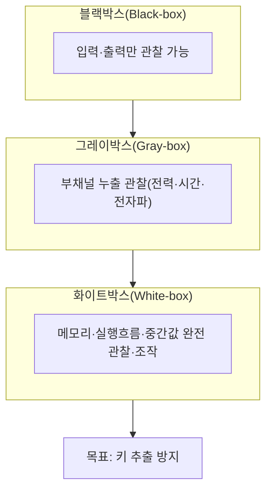
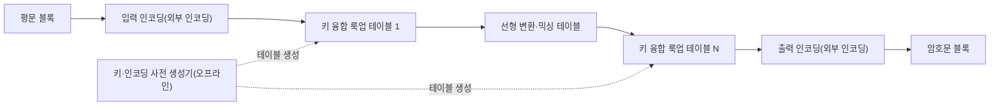

# 화이트박스 암호(White-box Cryptography)

## 1. 개요

> **화이트박스 암호(White-box Cryptography, WBC)**는 공격자가 암호가 실행되는 단말·메모리·실행흐름을 완전히 관찰·조작할 수 있는 환경(화이트박스 공격 모델)을 가정하고도, 비밀키가 노출되지 않도록 키를 알고리즘 구현 내부에 수학적으로 융합·은닉하는 소프트웨어 기반 키 보호 기술이다.

전통적 암호 분석은 공격자가 암호 알고리즘의 입력(평문)과 출력(암호문)만 볼 수 있는 **블랙박스 모델**을 전제로 발전했다. 이 관점에서 AES·RSA 같은 표준 알고리즘은 키를 모르는 한 안전하다고 증명되며, 실제로 키는 서버의 보호된 메모리나 HSM·스마트카드 같은 하드웨어 안전영역에 보관하는 것이 정석이었다. 문제는 스마트폰·셋톱박스·PC처럼 사용자가 전적으로 통제하는 단말에서 암호 연산이 수행되는 경우다. 이런 단말에서는 공격자가 곧 단말의 소유자이거나 단말을 탈취한 자여서, 디버거로 메모리를 덤프하고 실행을 중단시키며 명령어를 추적할 수 있다. 아무리 강한 알고리즘이라도 실행 중 메모리에 로드된 키가 그대로 읽히면 단 한 번의 덤프로 무력화된다.

화이트박스 암호는 바로 이 간극을 메우기 위해 등장했다. 2002년 Chow 등이 DRM 환경을 겨냥해 AES·DES의 화이트박스 구현을 제안한 것이 시초로, 핵심 아이디어는 "키를 메모리에 두지 않고 알고리즘 자체에 녹여버린다"는 것이다. 즉 특정 키에 대해 미리 계산된 거대한 룩업 테이블(lookup table) 형태로 암호를 구현하여, 실행 중 어디에서도 키 값이 원형 그대로 나타나지 않게 한다. 이를 통해 하드웨어 보안 모듈 없이 순수 소프트웨어만으로 적대적 단말에서 키를 보호하려는 것이 목표다.

화이트박스 암호의 핵심 특징은 세 가지로 압축할 수 있다. 첫째는 **키의 구현 내재화**로, 키가 독립적 데이터가 아니라 알고리즘 코드·테이블의 일부가 되어 분리 추출을 어렵게 한다. 둘째는 **소프트웨어 전용성**으로, 특정 하드웨어에 의존하지 않아 이식성과 배포·갱신이 자유롭다. 셋째는 **확률적·시간적 안전성**으로, 절대적 불가역이 아니라 공격 비용과 소요 시간을 높여 키 갱신 주기 내에는 사실상 추출이 어렵도록 만드는 상대적 방어라는 점이다. 이 세 특징이 곧 화이트박스가 어디에 강하고 어디에 취약한지를 규정한다.

필요성을 구체적 장면으로 그려보면 분명해진다. 유료 방송 앱이 콘텐츠를 재생하려면 복호화 키를 메모리에 올려 연산해야 하는데, 루팅된 스마트폰에서 공격자가 디버거를 붙여 키가 로드되는 순간의 메모리를 덤프하면 그 키로 콘텐츠를 무단 복제·재배포할 수 있다. 마찬가지로 모바일 카드 결제 앱이 카드 도메인 키를 소프트웨어로 처리한다면, 단말을 장악한 공격자가 그 키를 빼내 위·변조 거래를 시도할 수 있다. 이처럼 "실행 단말 자체가 적대적"인 상황에서 서버로 모든 연산을 보낼 수도 없고 하드웨어 안전영역도 못 쓸 때, 소프트웨어만으로 키를 지켜야 하는 요구가 화이트박스 암호를 탄생시켰다.

다만 화이트박스 암호는 만능이 아니며, 하드웨어 기반 보호를 완전히 대체하지 못한다. 소프트웨어로 구현되는 이상 충분한 시간과 자원을 투입한 공격자는 이론적으로 키를 추출할 수 있고, 실제로 다수의 상용 화이트박스 구현이 부채널 유사 공격으로 뚫린 사례가 보고되었다. 따라서 화이트박스 암호는 절대적 안전이 아니라 **공격 비용을 경제적으로 감당하기 어려운 수준까지 끌어올리는 "지연·상승" 통제**로 이해해야 하며, 키 갱신·서버 검증·난독화·무결성 검증 등과 결합하는 다층 방어(Defense in Depth)의 한 요소로 설계하는 것이 핵심이다.

이러한 위치 설정은 기술사 답안에서 특히 중요하다. 화이트박스를 "소프트웨어로 만든 HSM"처럼 서술하면 과장이 되고, 반대로 "어차피 뚫리니 무의미하다"고 하면 산업 현실을 놓친다. 정확한 관점은 화이트박스가 하드웨어 보안이 부재한 광범위한 단말에서 키 노출 위험을 실무적으로 낮추는 현실적 절충안이며, 그 한계를 운영·아키텍처 차원의 다른 통제로 메워야 완성된다는 것이다.

## 2. 공격 모델의 구분과 화이트박스의 위협 가정

화이트박스 암호의 필요성은 공격자가 무엇을 관찰·조작할 수 있는가에 대한 가정, 즉 공격 모델을 구분해야 명확히 드러난다. 동일한 AES라도 공격자가 접근할 수 있는 정보의 범위에 따라 요구되는 보호 수준이 완전히 달라지기 때문이다. 아래 개념도는 세 가지 공격 모델의 관찰 범위 차이를 보여준다.

**블랙박스 모델**은 공격자가 암호 모듈을 하나의 닫힌 상자로 보고 입출력만 다룰 수 있다고 가정한다. 전통 암호학의 안전성 증명이 서 있는 지반으로, 서버 측 암호처럼 실행 환경이 신뢰될 때 유효하다. 이 모델에서는 알고리즘의 수학적 강도가 곧 안전성이며, 키는 보호된 저장소에 있다고 전제한다. 화이트박스가 겨냥하는 문제는 정확히 이 전제, 즉 "실행 환경이 신뢰된다"는 가정이 무너진 상황이므로, 블랙박스 안전성 증명이 그대로 성립하지 않는다는 점을 인식하는 것이 출발점이다.

**그레이박스 모델**은 실행 자체는 직접 못 보지만 전력 소비·연산 시간·전자파 방사 같은 물리적 부채널(side-channel) 정보를 관찰할 수 있다고 본다. 스마트카드·IoT 단말 공격에서 현실화되며, DPA(차분 전력 분석) 같은 기법으로 키를 복원한다. 여기서는 마스킹·상수시간 구현 등 부채널 대응이 요구된다. 그레이박스는 블랙박스와 화이트박스의 중간 지대로, 관찰 정보가 부분적·간접적이라는 점이 핵심이다. 중요한 통찰은 이 부채널 분석의 통계 기법이 뒤에서 다룰 DCA를 통해 그대로 화이트박스로 이식되었다는 점이며, 이는 세 모델이 단절된 것이 아니라 공격 관찰 범위의 연속선 위에 있음을 보여준다.

**화이트박스 모델**은 가장 강한 공격 가정으로, 공격자가 실행 환경을 완전히 장악하여 메모리를 읽고 중간 계산값을 열람하며 실행을 원하는 시점에 멈추고 명령어를 변조할 수 있다고 본다. DRM 콘텐츠 보호, 모바일 결제 앱, 게임 클라이언트처럼 신뢰할 수 없는 단말에서 실행되는 소프트웨어가 이 모델의 대상이다. 이때 키를 지키려면 "키가 실행 중 어디에도 원형으로 존재하지 않게" 만들어야 하며, 이것이 화이트박스 암호의 본질적 요구다.

| 구분 | 관찰 범위 | 대표 위협 | 대응 기술 |
|------|-----------|-----------|-----------|
| 블랙박스 | 입력·출력 | 암호분석·무차별 대입 | 강한 알고리즘·충분한 키 길이 |
| 그레이박스 | 부채널 누출 | DPA·타이밍 공격 | 마스킹·상수시간·노이즈 |
| 화이트박스 | 메모리·실행 전체 | 메모리 덤프·키 추출·코드리프팅 | 키 융합·인코딩·난독화·무결성검증 |

## 3. 구현 원리와 구조

화이트박스 암호의 구현은 표준 알고리즘의 수학적 정의를 바꾸지 않으면서, 키가 개입된 연산을 미리 계산된 테이블의 형태로 치환하는 과정으로 요약된다. 공격자가 테이블을 들여다봐도 키를 역산할 수 없도록, 각 단계의 입출력에 비밀 인코딩(무작위 가역 변환)을 씌워 값 자체를 뒤섞는 것이 핵심이다. 아래는 화이트박스 AES 구현의 전형적 처리 구조다.

아래 네 가지 원리는 순서대로 쌓이는 방어층으로 이해하면 좋다. 앞선 층이 뚫릴 것에 대비해 다음 층이 공격 난도를 다시 올리는 구조다.

**첫째, 키의 테이블 융합(Key Embedding).** 표준 AES에서 라운드 키와의 XOR·S-box·MixColumns 같은 연산은 실행 시점에 키를 사용한다. 화이트박스 구현은 특정 키에 대해 이 연산들을 오프라인에서 미리 계산해, "입력 바이트 → 출력 바이트"를 매핑하는 룩업 테이블로 바꾼다. 실행 시에는 테이블을 참조만 하므로 키가 코드나 메모리에 별도로 존재하지 않는다. 예컨대 8비트 입력을 받는 테이블은 256개 항목을 가지며, 여러 테이블을 연쇄해 한 라운드를 구성한다.

테이블 크기와 성능의 관계도 이 단계에서 결정된다. 입력 비트 폭이 클수록 표현력은 높지만 테이블이 지수적으로 커지므로, 8비트 단위로 잘게 나눠 여러 테이블을 연쇄하는 절충이 일반적이다. 이 설계 선택이 곧 앱 용량과 연산량을 좌우한다.

**둘째, 내부·외부 인코딩(Encoding)에 의한 은닉.** 테이블만 그대로 두면 공격자가 표준 AES 구조와 대조해 키를 복원할 수 있다. 이를 막기 위해 각 테이블의 출력에 무작위 가역 함수(내부 인코딩)를 적용하고, 다음 테이블의 입력에서 그 역함수를 흡수시켜 상쇄한다. 그 결과 개별 테이블의 값은 무의미하게 뒤섞이지만, 전체를 연쇄하면 올바른 암호문이 나온다. 나아가 첫 입력과 마지막 출력에도 외부 인코딩을 적용하면, 이 구현은 표준 AES가 아니라 "인코딩이 합성된 변형 함수"가 되어 다른 시스템과의 상호운용을 위해서는 인코딩을 함께 관리해야 한다.

**셋째, 난독화·무결성 보호와의 결합.** 테이블 기반 은닉만으로는 코드리프팅(구현 전체를 복사해 오라클처럼 재사용하는 공격)이나 테이블 추출을 막기 어렵다. 따라서 실제 제품은 코드 난독화, 제어흐름 평탄화, 안티디버깅, 실행 무결성 검증, 단말 바인딩(디바이스 고정)을 함께 적용한다. 또한 서버가 주기적으로 새로운 테이블(새 키)을 내려보내 유출된 구현의 수명을 단축시키는 **키 갱신(rotation)** 전략을 병행한다.

**넷째, 부채널 대응 기법의 내장.** 초기 화이트박스는 인코딩만으로 값을 감추면 충분하다고 보았으나, 후술할 DCA 공격이 중간값의 통계적 편향을 그대로 이용하면서 이 가정이 깨졌다. 이에 현대 구현은 하드웨어 부채널 대응에서 빌려온 마스킹(중간값에 무작위 마스크를 곱·가산해 통계적 상관을 제거)과 셔플링(연산 순서를 무작위화), 더미 연산 삽입을 소프트웨어로 이식한다. 결국 화이트박스 설계는 "값 은닉(인코딩)"과 "통계 은닉(마스킹)"을 함께 갖춰야 실전 공격을 견딜 수 있다.

화이트박스 구현의 처리 원리를 단계로 요약하면 다음과 같다.

- **사전 생성(오프라인):** 특정 키·인코딩으로 라운드 연산을 미리 계산해 룩업 테이블 집합을 만든다.
- **키 융합:** 라운드 키를 테이블 값에 흡수시켜 실행 코드·메모리에 원형 키가 남지 않게 한다.
- **인코딩 합성:** 내부·외부 인코딩으로 테이블 값과 입출력을 뒤섞어 표준 구조와의 대조를 차단한다.
- **부채널 강화:** 마스킹·셔플링·노이즈로 중간값의 통계적 누출을 억제한다.
- **런타임 보호:** 난독화·안티디버깅·무결성 검증·단말 바인딩으로 구현 자체의 복제·추출을 방해한다.

## 4. 응용 사례와 공격 기법 비교

화이트박스 암호는 신뢰할 수 없는 단말에서 암호 연산이 불가피한 산업에서 널리 쓰인다. 공통 조건은 세 가지다. 암호 연산이 사용자가 통제하는 단말에서 일어나고, 그 단말에 기댈 만한 하드웨어 안전영역이 없거나 접근이 제한되며, 그럼에도 키를 지켜야 할 경제적 가치가 크다는 점이다. 이 조건을 모두 만족하는 대표 분야가 콘텐츠 보호와 모바일 결제다.

대표적으로 **DRM(디지털 저작권 관리)** 은 셋톱박스·스마트폰의 미디어 플레이어가 콘텐츠 복호화 키를 다뤄야 하는데, 하드웨어 보안영역이 없거나 이식성이 필요한 경우 화이트박스로 키를 보호한다. **모바일 결제**에서는 HCE(Host Card Emulation) 방식이 안전요소(SE) 칩 없이 앱 소프트웨어만으로 카드 자격증명을 처리하므로, EMV 토큰·도메인 키를 화이트박스로 감싸 메모리 덤프에 대비한다. 이 밖에 OTP 생성기, 게임 클라이언트의 치트 방지, 소프트웨어 라이선스 보호 등에도 적용된다.

이들 응용의 공통점은 "연산은 적대적 단말에서 하되 키의 실질적 통제권은 사업자가 쥐어야 한다"는 요구다. 예를 들어 HCE 결제에서는 실제 카드 마스터키를 단말에 두지 않고, 제한된 사용 범위·횟수의 도메인 키만 화이트박스로 내려보낸 뒤 짧은 주기로 교체한다. 유출되더라도 그 키로 할 수 있는 일이 시간·범위 면에서 제한되도록 설계하는 것으로, 화이트박스의 취약성을 키 수명주기 통제로 보완하는 전형적 패턴이다.

구체적 산업 적용 수치 감각도 중요하다. 룩업 테이블 방식의 화이트박스 AES는 키 하나당 수백 KB에서 수 MB에 이르는 테이블을 포함해, 앱 용량과 초기 로딩·연산 부담을 늘린다. 그럼에도 유료방송·모바일 결제 사업자들이 이를 감수하는 이유는, 하드웨어 보안영역이 없는 수억 대의 다양한 단말에 동일한 소프트웨어를 즉시 배포·갱신할 수 있다는 운영상 이점이 크기 때문이다. 이식성과 배포 민첩성이라는 편익이 자원 부담이라는 비용을 상쇄하는 셈이다.

그러나 화이트박스 구현은 다양한 화이트박스 특화 공격의 표적이 된다. 가장 기초적인 위협은 메모리 덤프로, 키가 융합되지 않은 허술한 구현이라면 실행 중 메모리에서 키 패턴을 스캔하는 것만으로 추출된다. 키 융합이 되어 있어도 구현 전체를 통째로 복사해 정상 오라클처럼 재사용하는 **코드리프팅**이 가능한데, 이는 키를 추출하지 않고도 보호를 우회하므로 단말 바인딩과 서버 측 검증으로 막아야 한다.

더 위협적인 것은 하드웨어 부채널 공격을 소프트웨어 계측으로 옮겨온 자동화 기법이다. **DCA(Differential Computation Analysis)** 는 실행 중 메모리 접근·중간값 트레이스를 대량 수집한 뒤, 전력 분석의 통계 기법(차분 분석)을 그대로 적용해 인코딩을 몰라도 키를 복원한다. 2016년 공개된 이 기법은 당시 여러 상용 화이트박스를 비교적 적은 트레이스로 무력화해, 인코딩만으로는 부채널 정보 누출을 막지 못함을 보여주었다. **DFA(Differential Fault Analysis)** 는 실행 도중 특정 중간값에 오류(fault)를 주입하고 정상·오류 출력의 차이로 키를 역산하는데, 이론적으로 소수의 오류 주입만으로도 AES 키를 복원할 수 있을 만큼 강력하다. 이에 대응해 최신 구현은 마스킹·셔플링, 중복 계산·오류 탐지, 트레이스 노이즈 삽입 등을 도입하지만, 공격과 방어가 계속 순환하는 양상이다.

| 공격 기법 | 원리 | 특징 | 대응 |
|-----------|------|------|------|
| 메모리 덤프·키 스캐닝 | 실행 중 메모리에서 키 패턴 탐색 | 가장 기초적 | 키 융합(원형 키 부재) |
| 코드리프팅 | 구현 전체 복사·오라클 재사용 | 키 추출 없이 우회 | 단말 바인딩·서버 검증 |
| DCA | 계산 트레이스 차분 분석 | 인코딩 무관, 자동화 | 마스킹·노이즈·셔플링 |
| DFA | 오류 주입 후 차분 분석 | 소수 오류로 복원 | 중복 계산·오류 탐지 |

이 공격들의 공통 교훈은 "값을 감추는 것"과 "정보 누출을 없애는 것"이 다르다는 점이다. 인코딩은 중간값의 외형을 바꿀 뿐 그 값이 키와 갖는 통계적 상관은 남겨두기 때문에, DCA 같은 분석이 상관을 그대로 걷어낸다. 따라서 견고한 화이트박스는 외형 은닉(인코딩)에 더해 상관 제거(마스킹)와 구현 복제 방지(단말 바인딩)를 반드시 병행해야 하며, 이 세 축이 각각 키 추출·부채널·코드리프팅이라는 서로 다른 공격 벡터에 대응한다.

## 5. 심화 — 표준화 동향과 하드웨어 보안과의 관계

화이트박스 암호는 공식 국제 알고리즘 표준이 존재하지 않는다는 점이 특징이자 약점이다. AES처럼 공개 검증을 거친 단일 표준이 없고, 각 벤더가 독자 방식을 비공개로 구현하는 경우가 많아 "숨김에 의한 보안(security by obscurity)" 논란이 있다. 암호학의 케르크호프스 원칙은 "알고리즘이 공개되어도 키만 지키면 안전해야 한다"고 요구하는데, 화이트박스는 키를 구현에 녹이는 특성상 구현이 공개되면 안전성이 흔들린다는 태생적 긴장을 안고 있다. 이 때문에 화이트박스의 강도를 객관적으로 평가·인증하는 체계가 미흡하다는 점이 산업적 과제로 지적된다. 이에 학계·산업계는 CHES(Cryptographic Hardware and Embedded Systems) 학회의 **WhibOx** 화이트박스 경진대회 같은 공개 검증의 장을 통해 구현의 강건성을 겨루어 왔는데, 다수 출품작이 대회 기간 내 파훼되며 소프트웨어만의 완전한 키 보호가 얼마나 어려운지를 반복적으로 확인시켰다. 결제 분야에서는 EMVCo의 SBMP(Software-Based Mobile Payment) 요구사항이 소프트웨어 기반 결제의 보안 기준을 제시하며 화이트박스·난독화·단말 무결성 검증을 사실상 요구한다.

WhibOx 대회의 반복된 결과가 주는 시사점은 명확하다. 공개된 단일 화이트박스 구현은 시간이 충분한 전문가 앞에서 대개 무너지므로, 안전성을 구현의 비밀성 한 곳에 의존해서는 안 된다는 것이다. 이는 앞서 강조한 키 갱신·다층 방어의 근거이기도 하다. 즉 개별 구현이 언젠가 뚫린다는 전제를 받아들이고, 뚫리기 전에 키를 바꾸고 뚫려도 피해가 확산되지 않도록 서버 검증과 이상탐지를 겹쳐 두는 운영이 실질적 안전을 만든다.

하드웨어 보안과의 관계도 중요한 논점이다. TEE(Trusted Execution Environment)·SE(Secure Element)·TPM 같은 하드웨어 신뢰기반이 있으면 키를 격리된 영역에서 다룰 수 있어 원칙적으로 더 강하다. 그러나 하드웨어 방식은 단말 종류마다 지원이 제각각이고, TEE API 접근이 제한되거나 구형·저가 단말에는 아예 없을 수 있어 이식성과 배포 범위에 한계가 있다. 화이트박스는 순수 소프트웨어여서 어떤 단말에도 배포 가능하고 업데이트가 쉽다는 장점이 있는 대신 안전성 상한이 낮다. 양자의 특성을 정리하면 선택 기준이 뚜렷해진다.

- **신뢰 기반:** TEE·SE는 하드웨어 격리에 뿌리를 두어 안전성 상한이 높은 반면, 화이트박스는 소프트웨어 난독화에 의존해 상한이 낮다.
- **이식성·배포:** TEE는 단말·OS·칩셋 지원이 제각각이고 API 접근이 제한되지만, 화이트박스는 어떤 단말에도 배포·갱신할 수 있다.
- **성능·용량:** TEE는 격리영역 연산으로 오버헤드가 작지만, 화이트박스는 대형 테이블로 용량·연산 부담이 크다.
- **침해 대응:** TEE는 키를 물리적으로 격리해 유출 자체가 어렵고, 화이트박스는 유출을 전제로 키 갱신 주기로 위험을 관리한다.

따라서 실무에서는 "TEE가 있으면 TEE, 없으면 화이트박스로 폴백"하는 하이브리드 전략과, 화이트박스로 1차 방어하되 서버 측 위험 기반 인증·이상거래탐지(FDS)로 잔여 위험을 흡수하는 다층 설계가 정착되고 있다. 예상 출제 방향으로는 ①블랙·그레이·화이트박스 공격 모델을 비교하고 ②화이트박스 구현 원리(키 융합·인코딩)를 설명하며 ③DCA 등 공격과 하드웨어(TEE) 대비 트레이드오프를 논하는 구성이 유력하다.

## 6. 고려사항 및 시사점

기술사 관점에서 화이트박스 암호는 단독 솔루션이 아니라 신뢰할 수 없는 실행환경 보호 전략의 한 축으로 다뤄야 한다. 도입 여부와 강도는 보호 자산의 가치, 단말의 신뢰 수준, 성능·용량 제약, 규제 요구를 종합해 결정하며, 다음을 균형 있게 고려한다.

- **적용 전략(위험 기반 선택):** 보호 대상 키의 가치와 단말 신뢰 수준을 평가해, 하드웨어 보안영역이 가용하면 TEE/SE를 우선하고 이식성·배포범위가 중요하면 화이트박스를 채택하되 둘을 폴백 구조로 결합한다. 화이트박스만으로 고가치 자산을 단독 방어하지 않는다.

- **연계 기술:** 화이트박스는 코드 서명·앱 무결성 검증, RASP(런타임 앱 자기보호), 단말 위·변조 탐지(루팅·탈옥 감지), 토큰화, 서버 측 FDS와 연계될 때 방어선이 완성된다. 이들은 각각 구현 보호·환경 검증·거래 검증의 서로 다른 계층을 담당한다.

- **트레이드오프(성능·크기 vs 안전성):** 룩업 테이블 방식은 키 하나에 수백 KB~수 MB의 테이블과 추가 연산을 요구해 앱 크기·메모리·성능 부담이 크다. 인코딩·마스킹을 강화할수록 안전성은 오르지만 자원 소모가 커지므로 균형점을 설계해야 한다. 저사양 IoT·모바일 단말에서는 이 부담이 사용성에 직접 영향을 주므로 대상 단말군의 자원 특성을 먼저 파악해야 한다.

- **키 수명주기·갱신:** 유출을 완전히 막을 수 없다는 전제하에, 서버가 주기적으로 새 화이트박스 테이블을 배포해 유출 구현의 수명을 단축하고, 침해 감지 시 즉시 키를 폐기·교체하는 운영 체계를 갖춘다. 이는 화이트박스의 안전성을 "시간"으로 보완하는 핵심 통제다.

- **다층 방어 연계:** 화이트박스는 코드 난독화·안티디버깅·무결성 검증·단말 바인딩·서버 검증·이상거래탐지(FDS)와 결합될 때 실효를 갖는다. 어느 한 계층이 뚫려도 다른 계층이 공격 비용을 높이도록 설계한다.

- **검증·컴플라이언스:** 자체 구현의 강도를 맹신하지 말고, 제3자 침투 평가와 공개 벤치마크(WhibOx 등)로 강건성을 주기적으로 점검한다. 결제 분야는 EMVCo·PCI 관련 요구사항과 정합되도록 화이트박스·무결성·단말검증을 설계하고, 침해 시 키 폐기·롤백 절차를 사전에 마련한다.

- **표준화·평가 체계:** 케르크호프스 원칙과 상충하는 구조적 한계를 감안해, 구현 비밀성에만 의존하지 않도록 공개 검증·제3자 평가를 제도화하고 강도 등급·인증 기준을 정립하는 노력이 필요하다.

- **전망:** 부채널형 자동 공격(DCA·DFA)의 고도화와 방어 기법이 계속 경쟁하는 가운데, 포스트 양자 알고리즘의 화이트박스 구현, AI 기반 공격 자동화 대응 등이 연구 과제로 부상하고 있다. 화이트박스는 하드웨어 보안이 닿지 않는 영역을 메우는 보완재로서의 역할이 지속될 전망이다.

## 참고자료
- Chow et al., White-Box Cryptography and an AES Implementation (2002) — https://link.springer.com/chapter/10.1007/3-540-36492-7_17
- Bos et al., Differential Computation Analysis: Hiding Your White-Box Designs is Not Enough (CHES 2016) — https://eprint.iacr.org/2015/753
- CHES WhibOx Contest — https://whibox.io/contests/
- EMVCo, Software-Based Mobile Payment Security Requirements — https://www.emvco.com

---
> **한 줄 요약**: 화이트박스 암호는 공격자가 실행환경을 완전히 장악한 화이트박스 모델에서도 키를 룩업 테이블·인코딩으로 알고리즘에 융합·은닉해 보호하는 소프트웨어 기법으로, DRM·모바일 결제 등에 쓰이나 DCA·DFA 공격에 취약해 난독화·키 갱신·하드웨어(TEE)·다층 방어와 결합해야 한다.
