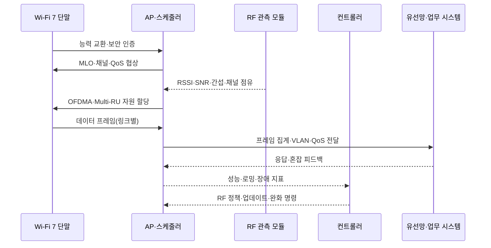

# Wi-Fi 7(IEEE 802.11be) 기반 고성능·저지연 무선랜 설계

## 1. 개요

> **정의**: Wi-Fi 7은 IEEE 802.11be-2024의 기술을 기반으로 하는 차세대 무선랜 세대로, 2.4GHz·5GHz·6GHz 대역에서 넓은 채널, 다중 링크, 고차 변조와 정교한 자원 할당을 활용해 높은 처리량·낮은 지연·높은 신뢰성을 지향한다.

Wi-Fi는 사무실의 인터넷 접속 수단을 넘어 제조 로봇, 영상회의, XR, 의료기기, 물류 단말과 같은 업무 시스템의 접속망이 되고 있다.
단말 수와 트래픽이 증가하면서 평균 속도만 높이는 방식으로는 사용자 경험과 업무 품질을 보장하기 어렵다.
무선 구간의 혼잡, 간섭, 단말 이동, 채널 점유 경쟁과 재전송이 지연의 꼬리를 길게 만들기 때문이다.

Wi-Fi 7의 핵심은 단일 링크의 최고 속도를 높이는 것에 그치지 않는다.
여러 주파수 링크를 상황에 맞게 사용하고, 넓은 채널과 고차 변조를 조합하며, 자원 단위를 세밀하게 나누어 무선 매체를 활용한다.
따라서 설계자는 AP와 단말의 사양만 비교할 것이 아니라 주파수 계획, 유선 백홀, 전원·열, 인증, 관측성, 애플리케이션의 지연 요구를 통합적으로 검토해야 한다.

IEEE 802.11be-2024는 IEEE SA가 2024년 9월 26일 보드 승인을 기록하고 2025년 7월 22일 발행한 활성 표준이다.
IEEE는 이 개정에서 PHY와 MAC을 수정하고, 적어도 하나의 운용 모드에서 MAC 서비스 접근점 기준 30Gbit/s 이상의 최대 처리량과 개선된 최악 지연·지터를 지원하도록 정의한다.
이는 실측 사용자 속도가 항상 30Gbit/s라는 뜻이 아니라 표준이 목표로 하는 조건과 측정 지점을 명시한 것이다.

Wi-Fi Alliance의 Wi-Fi CERTIFIED 7은 IEEE 표준 자체와 구별되는 상호운용성 인증 프로그램이다.
제품 상자에 Wi-Fi 7 기능이 적혀 있다는 사실과 공식 인증을 완료했다는 사실은 같지 않으므로, 공공·기업 조달에서는 지원 기능 목록과 인증 상태를 별도로 확인해야 한다.

본 답안은 Wi-Fi 7의 구조와 핵심 기술, 도입 절차, Wi-Fi 6·유선·5G와의 비교, 기업·제조 사례, 보안·운영 고려사항과 기술사 관점의 시사점을 논술형으로 정리한다.

## 2. 등장 배경과 목표

### 가. 기존 무선랜의 한계

Wi-Fi 6와 Wi-Fi 6E는 OFDMA, BSS Coloring, Target Wake Time과 같은 기능으로 다수 단말 환경을 개선했다.
그러나 여러 AP가 인접 채널에서 경쟁하고, 단말이 서로 다른 대역 중 하나만 선택하면 순간적인 간섭과 링크 품질 저하를 피하기 어렵다.
특히 4K·8K 영상, XR 렌더링, 협업 애플리케이션은 평균 대역폭뿐 아니라 일정한 지연과 손실 패턴을 요구한다.

기존 단일 링크 연결에서는 5GHz 채널에 간섭이 생겨도 단말이 다른 링크로 즉시 트래픽을 옮기기 어렵다.
채널을 다시 선택하고 인증·연결 상태를 조정하는 동안 패킷 지연이 커질 수 있다.
Wi-Fi 7은 MLO를 통해 여러 링크를 하나의 논리적 연결로 관리하여 링크 장애·혼잡에 대한 회복 여지를 넓힌다.

또한 셀 밀도가 높은 사무실과 공장에서는 넓은 채널을 무조건 사용하는 것이 이롭지 않다.
320MHz 채널은 한 링크의 잠재 처리량을 키우지만, 가용 주파수가 충분하지 않으면 인접 AP 간 재사용성이 낮아지고 일부 지역에서는 DFS·규제·간섭 제약이 생긴다.
따라서 고성능 기능은 주파수 자원과 단말 능력을 고려한 선택적 적용이어야 한다.

### 나. Wi-Fi 7의 설계 목표

첫째 목표는 높은 처리량이다.
320MHz 채널과 4096-QAM은 신호 품질이 충분한 근거리에서 한 번에 더 많은 데이터를 전송하도록 한다.
다만 변조 차수가 높아질수록 필요한 신호 대 잡음비가 커지므로, 벽·거리·사람의 이동·간섭이 많은 환경에서는 낮은 MCS로 떨어질 수 있다.

둘째 목표는 다중 링크를 이용한 지연·신뢰성 개선이다.
MLO는 2.4GHz·5GHz·6GHz의 링크를 단말과 AP가 조정해 동시에 사용하거나 한 링크를 대기·보조 링크로 활용한다.
응용 데이터가 어느 링크에 배치되는지는 구현 모드, 전력, 링크 품질, 규제 조건에 따라 달라지므로 “항상 두 배 속도”로 해석해서는 안 된다.

셋째 목표는 다수 단말의 자원 효율이다.
Multi-RU와 개선된 OFDMA 운용은 채널 자원의 작은 단위를 여러 사용자에게 나누어 배정할 수 있게 한다.
공장 센서처럼 소량의 짧은 패킷을 보내는 단말과 영상 단말을 동일한 방식으로 다루지 않고, 트래픽 특성에 맞추어 무선 자원을 배분할 수 있다.

넷째 목표는 확장된 서비스 품질이다.
표준이 낮은 최악 지연과 지터를 지향하더라도 무선망 전체의 품질은 AP, 스위치, 인증 서버, 애플리케이션 큐와 함께 결정된다.
따라서 Wi-Fi 7은 QoS, 유선 QoS, 관측성과 장애 대응이 결합될 때 비로소 업무 서비스의 지연 목표에 기여한다.

## 3. Wi-Fi 7 참조 구조와 동작 원리

### 가. 전체 구성

```mermaid
flowchart LR
    DEV1[Wi-Fi 7 단말<br/>MLO STA] -. 2.4 GHz .-> AP[Wi-Fi 7 AP<br/>MLO·OFDMA]
    DEV1 -. 5 GHz .-> AP
    DEV1 -. 6 GHz .-> AP
    DEV2[레거시 단말<br/>Wi-Fi 5/6] --> AP
    AP --> SW[멀티기가비트 스위치<br/>PoE·VLAN·QoS]
    SW --> CTRL[무선 LAN 컨트롤러<br/>정책·RF 관리]
    SW --> AUTH[AAA/RADIUS<br/>802.1X 인증]
    SW --> APP[업무 시스템·인터넷·엣지]
    MON[관측성·로그·무선 분석] --> CTRL
    MON --> SW
```

Wi-Fi 7 단말(STA)은 지원하는 대역과 링크 수, 공간 스트림 수, 채널 폭과 변조 방식을 AP와 협상한다.
단말이 세 대역을 모두 지원한다고 해서 모든 대역을 항상 동시에 송수신하는 것은 아니다.
배터리, 안테나 구성, 국가별 주파수 규제, AP의 구현 정책에 따라 링크 수와 사용 방식이 달라진다.

AP는 여러 무선 링크를 관리하면서 스케줄링, 프레임 전송, 보안 암호화와 로밍 지원을 수행한다.
여러 링크의 상태를 합쳐 판단하므로 AP의 CPU·메모리·무선 칩셋 처리 능력과 펌웨어 성숙도가 중요하다.
고밀도 환경에서는 AP 한 대의 최고 속도보다 AP 간 채널 재사용과 동일 채널 간섭을 함께 평가해야 한다.

유선 백홀은 무선 성능의 상한을 결정한다.
다중 링크 단말이 높은 처리량을 발생시키면 2.5GbE·5GbE·10GbE 이상의 업링크, 충분한 PoE 전력, 스위치 버퍼와 VLAN 설계가 필요하다.
AP만 교체하고 1GbE 백홀을 그대로 두면 무선 PHY 속도와 실제 업무 처리량 사이에 병목이 생긴다.

무선 LAN 컨트롤러 또는 클라우드 관리 플랫폼은 채널·출력·SSID·정책·펌웨어를 중앙 관리한다.
중앙 관리가 중단되어도 기존 AP가 안전한 설정으로 서비스를 계속하도록 로컬 자율성과 구성 캐시를 설계해야 한다.
RADIUS, 인증서, 로그 수집과 시간 동기 또한 무선 연결의 운영 품질에 포함된다.

### 나. 핵심 기술의 데이터 흐름



연결 초기에 AP와 단말은 지원 대역, 공간 스트림, 채널 폭, MLO 능력, 보안 정책을 교환한다.
이 협상 결과가 낮은 수준으로 결정되면 AP가 최고급 제품이어도 단말의 실제 연결은 Wi-Fi 6 수준에 머물 수 있다.
운영자는 연결 능력과 실제 협상 결과를 구분해 대시보드에 표시해야 한다.

AP 스케줄러는 무선 채널 점유 상태와 큐를 보고 어느 단말에 어느 시간·주파수 자원을 줄지 결정한다.
OFDMA는 한 채널을 여러 Resource Unit으로 나누어 여러 단말을 동시에 서비스하는 방식이며, Multi-RU는 단말·프레임 요구에 맞게 자원 단위를 조합하는 방향으로 확장된다.
스케줄러는 공정성, 우선순위, 지연, 처리량과 배터리 절약 사이에서 정책을 선택한다.

측정 데이터는 RSSI 하나로 충분하지 않다.
SNR, MCS 변화, 재전송률, 채널 점유율, 패킷 지연 분포, 로밍 실패와 인증 시간까지 함께 봐야 원인을 구분할 수 있다.
예를 들어 RSSI는 높지만 인접 AP의 채널 점유율이 높으면 재전송이 증가할 수 있다.

## 4. 핵심 기술과 설계 포인트

### 가. 320MHz 채널과 6GHz

Wi-Fi CERTIFIED 7 기술 개요는 320MHz 채널을 Wi-Fi 7의 핵심 기능으로 제시한다.
넓은 연속 채널은 한 번에 전송할 수 있는 심볼과 데이터량을 늘리지만, 동일 지역에 배치할 수 있는 비중첩 채널 수를 줄일 수 있다.
결국 단일 AP의 피크 성능과 다수 AP의 공간 재사용 사이에서 설계 결정을 내려야 한다.

6GHz 대역은 넓은 채널과 비교적 새로운 주파수 자원을 제공하는 장점이 있다.
반면 국가별 사용 조건, 실내·실외 규제, 단말 지원 여부와 벽 투과 손실을 확인해야 한다.
6GHz만 사용하도록 설계하면 오래된 단말의 접근성이 낮아지므로 2.4GHz·5GHz와의 공존 정책이 필요하다.

사무실의 회의실처럼 AP 간 거리가 충분하고 단말이 고정된 영역에는 320MHz를 선택할 수 있다.
반대로 생산라인과 병동처럼 여러 AP가 촘촘히 배치되는 곳에서는 80MHz 또는 160MHz를 여러 셀에 재사용하는 편이 전체 용량과 안정성에 유리할 수 있다.

### 나. 4096-QAM과 물리계층

4096-QAM은 한 심볼에 더 많은 비트를 실어 전송 효율을 높이는 고차 변조 방식이다.
하지만 심볼 간 간격이 촘촘해져 잡음과 간섭에 민감하며, AP와 단말 사이의 신호 품질이 좋을 때만 높은 MCS가 유지된다.
따라서 제품 광고의 최고 PHY 속도를 모든 위치의 사용자 속도로 제시해서는 안 된다.

실제 설계에서는 셀 가장자리의 MCS, 최소 SNR, 재전송률과 95·99퍼센타일 지연을 측정한다.
신호를 강하게 만들기 위해 출력만 높이면 인접 셀 간섭과 단말 배터리 부담이 커질 수 있다.
출력·채널 폭·AP 간격·안테나 배치의 조합을 현장 측정으로 최적화해야 한다.

### 다. MLO(Multi-Link Operation)

MLO는 단말과 AP가 여러 링크를 하나의 논리적 연결로 관리하도록 하는 Wi-Fi 7의 대표 기능이다.
링크를 동시에 사용하는 STR 방식은 처리량과 지연 개선 여지가 있고, 링크를 교대·절전하는 방식은 전력과 간섭을 줄일 수 있다.
구체 동작은 칩셋·펌웨어·단말 전원 정책과 인증 프로파일에 따라 달라질 수 있다.

MLO 설계에서는 링크별 보안 상태와 재전송, 패킷 순서, 링크 전환 시간을 고려한다.
5GHz는 범위가 넓고 6GHz는 채널 여유가 있어도, 벽을 사이에 두면 링크 품질이 달라질 수 있다.
한 링크의 품질 저하를 감지해 다른 링크로 트래픽을 옮기는 기준이 너무 민감하면 핑퐁 전환이 발생하므로 히스테리시스와 최소 유지 시간을 둔다.

MLO가 모든 지연 문제를 해결하는 것은 아니다.
백홀 큐가 포화되거나 애플리케이션 서버가 느리면 무선 링크를 추가해도 종단 간 지연은 줄지 않는다.
따라서 무선·유선·서버 구간의 타임스탬프를 연결해 병목 위치를 확인해야 한다.

### 라. OFDMA와 Multi-RU

OFDMA는 채널 전체를 작은 자원 단위로 나누고 AP가 여러 단말에 동시에 할당하는 방식이다.
짧은 센서 패킷을 보내기 위해 큰 채널 전체를 독점하는 낭비를 줄일 수 있으며, 다수 단말의 접속 지연을 낮출 수 있다.
다만 단말별 자원 단위가 지나치게 작으면 제어 오버헤드가 커지고 대용량 단말의 처리량이 떨어질 수 있다.

Multi-RU는 단말의 능력과 트래픽에 맞춰 여러 자원 단위를 조합하는 유연성을 높인다.
스케줄러는 영상 단말의 연속 데이터와 센서 단말의 짧은 주기 메시지를 구분해 할당해야 한다.
공정성 알고리즘이 특정 종류의 단말만 계속 우선하면 다른 단말의 지연이 악화되므로 서비스별 SLA와 최대 대기시간을 함께 적용한다.

### 마. 512 compressed Block Ack와 신뢰성

Wi-Fi CERTIFIED 7 기술 개요는 최대 512개의 MPDU를 묶고 확인할 수 있는 compressed Block Ack 기능을 주요 기능으로 설명한다.
프레임을 효율적으로 확인하면 대규모 데이터 전송의 확인 오버헤드를 줄일 수 있지만, 손실이 묶음 전체의 재전송 지연으로 확대되지 않도록 재전송·버퍼 정책을 점검해야 한다.
영상과 파일 전송은 처리량, 제어 트래픽과 대화형 업무는 지연을 우선하는 식의 차등 정책이 필요하다.

| 기능 | 개선하려는 문제 | 기대 효과 | 주의할 점 |
|---|---|---|---|
| 320MHz | 채널당 전송량 부족 | 높은 피크 처리량 | 주파수 재사용·간섭 |
| MLO | 단일 링크 혼잡·단절 | 처리량·복원력·지연 개선 | 단말·AP 구현 차이 |
| 4096-QAM | 심볼당 비트 수 제한 | 좋은 신호 환경에서 효율 향상 | 높은 SNR 요구 |
| OFDMA | 다수 단말의 경쟁 | 세밀한 동시 자원 배분 | 스케줄러 공정성 |
| Multi-RU | 자원 단위의 경직성 | 트래픽별 자원 조합 | 제어 오버헤드 |
| Block Ack | 확인 프레임 오버헤드 | 대용량 전송 효율 | 손실·버퍼·재전송 |

표의 기능은 서로 독립적인 스위치가 아니다.
넓은 채널로 처리량을 높이고 고차 변조를 쓰더라도 간섭이 커지면 MCS가 낮아질 수 있다.
따라서 기능별 수치보다 서비스 수준에서 처리량·지연·손실·전력의 결과를 검증해야 한다.

## 5. 구축·운영 절차

### 가. 요구사항과 현장 조사

먼저 사용자·업무·단말·공간별 요구를 분류한다.
회의실의 영상회의는 지연과 업링크 품질이 중요하고, 물류 단말은 이동 중 로밍과 인증 성공률이 중요하며, 센서는 짧은 패킷과 배터리가 중요하다.
요구를 “Wi-Fi 7 도입”으로 표현하지 말고 서비스 KPI와 장애 영향으로 표현해야 한다.

현장 조사에서는 벽·금속 구조·기계 설비·전자파원·기존 AP·채널 점유를 측정한다.
공장에서는 모터와 용접 설비가 간섭을 만들 수 있고, 병원에서는 장비의 전파 적합성과 업무 중단 위험을 따로 검토한다.
측정 결과를 평면도와 시간대별 트래픽에 결합해야 AP 수와 채널 폭을 합리적으로 결정할 수 있다.

다음으로 단말 능력과 로밍 정책을 조사한다.
Wi-Fi 7 AP를 설치해도 기존 단말이 모두 MLO·6GHz·4096-QAM을 사용할 수 있는 것은 아니다.
혼합 세대 환경에서는 레거시 단말이 신규 단말의 자원을 과도하게 점유하지 않도록 SSID·대역·정책을 구분할 수 있다.

### 나. 설계·시험·점진 배포

설계 단계에서는 RF 계획, 유선 백홀, VLAN, QoS, 인증, 모니터링, 장애 우회 경로를 함께 만든다.
AP별 채널과 출력은 자동 최적화에 맡기더라도 업무상 중요한 영역의 최소 커버리지와 최대 셀 중첩 기준을 명시한다.
6GHz·5GHz·2.4GHz의 역할을 나누고, 특정 대역이 불가능할 때 기본 동작을 정의한다.

시험은 기능·성능·상호운용·보안·장애 시험으로 구분한다.
MLO 링크 한 개 단절, 6GHz 비가시 구간, AP 재부팅, 컨트롤러 단절, RADIUS 지연, 스위치 업링크 포화, 로밍 중 영상 통화와 같은 시나리오를 포함한다.
평균 속도만으로 합격시키지 말고 95·99퍼센타일 지연, 패킷 손실, 재전송, 인증 시간과 복구 시간을 기준으로 한다.

배포는 실험실, 제한된 층·라인, 업무 피크가 낮은 시간, 전체 확대의 순서로 진행한다.
각 단계의 진입 조건과 중단 조건을 정하고, 기존 AP로 돌아갈 수 있는 구성과 장비를 일정 기간 유지한다.
변경 후에는 같은 위치에서 전후 측정을 수행하여 무선 성능이 실제 업무 성과로 연결됐는지 확인한다.

### 다. 관측성과 서비스 수준 관리

관측 데이터는 AP·단말·컨트롤러·스위치·AAA·애플리케이션을 하나의 흐름으로 연결해야 한다.
연결 속도, MCS, 채널 폭, 링크 수, RSSI, SNR, 재전송률, 채널 점유율, 로밍, 인증과 애플리케이션 응답 시간을 함께 본다.
단말 이름만으로 분석하면 사용자·업무·위치별 영향 분석이 어려우므로 자산 식별자와 서비스 태그를 관리한다.

장애 분류도 계층화한다.
연결 자체가 안 되면 인증·주파수·전파·IP 할당을 먼저 보고, 연결은 되지만 느리면 RF 재전송·스케줄러·백홀·서버 큐를 구분한다.
이벤트와 성능 지표의 시간 동기를 맞추면 AP 교체나 채널 변경 같은 조치의 효과를 객관적으로 평가할 수 있다.

## 6. 기술 비교와 적용 판단

### 가. Wi-Fi 6·Wi-Fi 7 비교

Wi-Fi 6가 다수 단말 효율과 전력 절약을 크게 개선했다면, Wi-Fi 7은 그 위에 더 넓은 채널, MLO, 고차 변조와 세밀한 자원 운용을 결합한다.
그러나 Wi-Fi 7의 이점은 모든 환경에서 같은 비율로 나타나지 않는다.
단말이 Wi-Fi 6이고 1GbE 백홀만 사용한다면 AP만 Wi-Fi 7로 바꾸어도 투자 효과가 제한될 수 있다.

| 구분 | Wi-Fi 6/6E | Wi-Fi 7 |
|---|---|---|
| 대표 표준 | 802.11ax | 802.11be-2024 |
| 핵심 방향 | 고밀도 효율·전력 절감 | 처리량·다중 링크·저지연 |
| 채널 폭 | 환경에 따라 20~160MHz | 최대 320MHz 기능 |
| 링크 운용 | 주로 단일 링크 | MLO로 여러 링크 관리 |
| 변조 | 1024-QAM | 4096-QAM 지원 |
| 도입 판단 | 단말·AP 교체 범위 | 단말·RF·백홀·운영 통합 |

이 비교는 세대가 높을수록 항상 우수하다는 뜻이 아니다.
고밀도 사무실에서는 작은 채널을 여러 셀에 재사용하는 Wi-Fi 6 설계가 넓은 채널 하나보다 안정적일 수 있다.
반대로 XR·무선 백홀·고화질 영상처럼 높은 순간 처리량과 낮은 지연이 중요한 영역에서는 Wi-Fi 7 기능의 가치가 커진다.

### 나. Wi-Fi 7·5G·유선 비교

유선 이더넷은 예측 가능한 물리 경로와 높은 안정성을 제공하지만 이동성과 설치 유연성이 낮다.
5G 사설망은 광범위한 이동성·SIM 기반 관리·사업자 연계에 강점이 있고, Wi-Fi 7은 기존 IP망·단말 생태계·실내 구축 비용 측면에서 유리할 수 있다.
셋 중 하나를 일괄 선택하기보다 업무의 이동성, 전파 환경, 보안 도메인, 운영 역량과 TCO를 비교해야 한다.

| 판단 기준 | 유선 이더넷 | Wi-Fi 7 | 사설 5G |
|---|---|---|---|
| 이동성 | 낮음 | 실내·로컬 이동 | 넓은 영역 이동 |
| 설치 유연성 | 배선 필요 | AP 배치 필요 | 기지국·코어 필요 |
| 고정 지연 | 가장 예측 가능 | RF 환경 영향 | 무선·코어 영향 |
| 단말 생태계 | 성숙 | 매우 넓음 | 모듈·SIM 필요 |
| 적합 사례 | 서버·고정 장비 | 사무실·XR·실내 IoT | 공장 이동체·캠퍼스 |

예를 들어 생산라인의 고정 검사장비는 유선을 우선하고, 작업자 태블릿과 이동형 카메라는 Wi-Fi 7을 적용하며, 공장 전체를 이동하는 AGV는 사설 5G와 비교할 수 있다.
이때 동일 애플리케이션이 여러 접속망을 사용할 수 있도록 인증·주소·QoS·관측 모델을 공통화하면 전환 비용을 줄일 수 있다.

## 7. 사례: 제조 공장의 무선 영상검사와 AGV

제조기업이 고해상도 영상검사 카메라, AGV, 유지보수 태블릿을 하나의 무선 인프라로 연결한다고 가정한다.
영상검사는 순간 업링크 처리량이 크고, AGV는 로밍 지연과 연결 지속성이 중요하며, 태블릿은 사용자의 이동성과 인증 편의가 중요하다.
같은 SSID에 최고 속도만 제공하는 방식은 세 요구를 동시에 만족시키기 어렵다.

먼저 카메라 구역은 6GHz와 넓은 채널을 검토하되, AP 간 간섭과 백홀을 측정한다.
AGV 이동로에는 5GHz·6GHz 링크의 연속성을 확보하고, MLO 전환 시간과 로밍 실패를 시험한다.
태블릿과 기존 센서는 별도 정책으로 배치하여 낮은 우선순위 트래픽이 영상·제어 트래픽을 압박하지 않도록 한다.

스위치는 다중 기가비트 업링크와 VLAN·QoS를 제공하고, 컨트롤러는 생산 서비스별 정책을 AP에 배포한다.
인증은 802.1X와 단말별 자격증명을 사용하며, 임시 장비는 제한된 네트워크에만 접근시킨다.
컨트롤러나 AAA가 일시적으로 중단되어도 이미 인증된 단말의 안전한 동작과 장애 안내가 가능해야 한다.

파일럿의 합격 기준은 카메라 처리량만이 아니다.
AGV의 99퍼센타일 지연, 핸드오버 실패율, 영상 프레임 손실, 인증 성공 시간, AP 장애 복구 시간, 백홀 이용률과 운영자의 장애 처리 시간을 함께 측정한다.
피크 생산 시간에 기준을 넘으면 신규 기능을 자동으로 끄고 기존 프로파일로 회귀하도록 한다.

이 사례의 핵심은 Wi-Fi 7을 단독 장비 도입으로 보지 않는 데 있다.
RF 설계, 유선 네트워크, 업무 우선순위, 보안, 운영 자동화와 현장 안전 절차를 하나의 서비스 설계로 묶어야 한다.

## 8. 보안·개인정보·운영 고려사항

첫째, 인증과 암호화를 기본값으로 한다.
WPA3-Enterprise, 802.1X, RADIUS와 인증서 수명주기를 적용하고, 개인·업무·IoT 단말의 자격증명과 네트워크 권한을 분리한다.
공용 PSK 하나를 여러 장비가 공유하면 퇴직·분실·공급자 변경 시 회수와 추적이 어려워진다.

둘째, 관리 평면을 분리한다.
AP·컨트롤러·스위치 관리 인터페이스는 사용자 데이터망과 분리하고, 관리자 MFA·최소 권한·접속 허용목록·변경 승인·명령 로그를 적용한다.
클라우드 관리형 플랫폼을 사용하더라도 관리 API, 테넌트 분리, 데이터 보존과 공급자 장애 시 로컬 동작을 계약에 명시한다.

셋째, RF 보안과 가용성을 함께 본다.
재밍·비인가 AP·Evil Twin·인증서 위조·채널 고갈은 사용자 데이터 유출뿐 아니라 업무 중단을 일으킬 수 있다.
무선 침입 탐지, 채널 스캔, 비인가 장비 차단과 물리적 AP 보호를 운영 절차에 포함하되, 탐지 오탐으로 정상 업무를 차단하지 않도록 승인과 복구 절차를 둔다.

넷째, 위치와 접속 로그의 개인정보를 통제한다.
단말 MAC, 사용자 ID, AP 위치, 연결 시간은 업무 분석에 유용하지만 개인의 이동 경로를 추정할 수 있다.
목적·보존기간·접근권한·비식별화·삭제 절차를 정하고, 장애 분석에 필요한 최소 범위만 보관한다.

다섯째, 공급망과 펌웨어를 관리한다.
AP·칩셋·컨트롤러의 취약점 공지, 펌웨어 서명, 지원 기간, SBOM과 긴급 패치 절차를 계약과 조달 평가에 포함한다.
신규 기능을 활성화하기 전에 상호운용성·보안·성능 회귀 시험을 통과시키고, 문제가 생기면 이전 펌웨어와 RF 프로파일로 돌아갈 수 있어야 한다.

| 영역 | 대표 위험 | 기술사 관점 대응 |
|---|---|---|
| 인증 | 불법 단말·자격증명 탈취 | 802.1X·WPA3-Enterprise·MFA·인증서 회수 |
| RF | 재밍·Evil Twin·비인가 AP | WIDS/WIPS·채널 분석·현장 대응 |
| 관리 | 컨트롤러·API 권한 탈취 | 관리망 분리·최소 권한·감사 로그 |
| 백홀 | 업링크 포화·VLAN 오류 | 용량 계획·QoS·이중화·경보 |
| 개인정보 | 위치·접속 로그 과다수집 | 목적 제한·보존기간·접근통제 |
| 공급망 | 취약 펌웨어·업데이트 위조 | 서명·SBOM·패치 SLA·롤백 |

## 9. 심화: 표준·인증 동향과 출제 관점

IEEE 802.11be-2024가 활성 표준으로 발행되면서 Wi-Fi 7은 초안 기능을 단순히 나열하는 단계에서 표준 기반 설계와 제품 검증 단계로 이동했다.
다만 IEEE 표준의 기능 정의와 Wi-Fi Alliance 인증 제품의 지원 범위는 같지 않을 수 있다.
기술사 답안에서는 표준, 인증 프로그램, 제조사 옵션을 구분해 서술하는 것이 정확성의 핵심이다.

Wi-Fi Alliance는 2026년 1월 20MHz 전용 IoT 단말에도 Wi-Fi CERTIFIED 7 기능을 적용하는 인증을 발표했다.
이 변화는 Wi-Fi 7을 고성능 스마트폰·노트북에만 한정하지 않고 센서·웨어러블·산업기기로 확장하려는 방향을 보여준다.
20MHz 단말은 320MHz의 최고 처리량을 필요로 하지 않으므로, 기능을 선택적으로 적용해 전력·비용과 상호운용성의 균형을 맞추는 관점이 중요하다.

예상 논술에서는 “Wi-Fi 7의 기술과 도입 방안” 또는 “고밀도·저지연 무선랜 설계”로 출제될 수 있다.
답안은 정의와 등장 배경, 320MHz·MLO·4096-QAM·OFDMA의 원리, AP·백홀·컨트롤러 구조, Wi-Fi 6·5G·유선 비교, 현장 사례, 보안과 운영 지표 순서로 구성하면 기술적 원리와 적용 전략을 함께 보여줄 수 있다.

## 10. 고려사항 및 시사점

### 가. 속도보다 서비스 지표를 우선한다

최고 PHY 속도는 무선 링크의 잠재치일 뿐 업무 서비스의 처리량이 아니다.
기술사는 사용자 체감, 99퍼센타일 지연, 손실, 인증·로밍 성공률, 장애 복구 시간과 TCO를 목표 지표로 제시해야 한다.

### 나. RF·유선·애플리케이션을 종단 간 설계한다

MLO와 320MHz를 적용해도 백홀·방화벽·서버 큐가 병목이면 효과가 사라진다.
AP 교체 예산과 함께 다중 기가비트 스위치, PoE, VLAN, QoS, 관측 플랫폼과 서버 성능을 설계해야 한다.

### 다. 점진 도입과 혼합 세대 공존을 전제로 한다

모든 단말과 AP를 한 번에 교체하기보다 고가치 구역과 업무부터 파일럿을 시작한다.
레거시 단말을 안전하게 수용하고, 지원되지 않는 MLO·6GHz 기능의 기본 동작과 롤백 경로를 명확히 한다.

### 라. 보안과 개인정보를 운영 수명주기에 내장한다

무선 보안은 WPA 설정만으로 끝나지 않고 인증서·펌웨어·관리 API·로그·비인가 AP를 포함한다.
개인 이동정보와 접속 로그의 목적과 보존을 제한하고, 변경·사고·공급자 교체 시 증적을 남겨야 한다.

### 마. 표준 준수와 상호운용 시험을 조달 조건으로 만든다

IEEE 802.11be 기능을 지원한다는 문구와 Wi-Fi CERTIFIED 7 완료는 다르다.
조달 시 필수 기능, 지원 채널·대역, MLO 모드, 보안 버전, 시험 장비와 상호운용 대상, 펌웨어 지원 기간을 수치와 증빙으로 요구해야 한다.

### 바. 자동화의 실패를 안전하게 제한한다

RF 자동 최적화와 중앙 정책 배포는 운영 부담을 줄이지만 잘못된 채널·출력·펌웨어가 넓은 영역에 동시에 영향을 줄 수 있다.
카나리 배포, 변경 승인, 범위 제한, 자동 롤백, 로컬 자율성을 결합해 자동화의 폭발 반경을 줄여야 한다.

## 참고자료

- IEEE 802.11 Working Group, IEEE Std 802.11be-2024 발행 안내: https://www.ieee802.org/11/
- IEEE Standards Association, IEEE 802.11be-2024 표준 정보: https://standards.ieee.org/ieee/802.11be/7516/
- Wi-Fi Alliance, Wi-Fi CERTIFIED 7 Technology Overview: https://www.wi-fi.org/system/files/Wi-Fi_CERTIFIED_7_Technology_Overview_202401_0.pdf
- Wi-Fi Alliance, Wi-Fi CERTIFIED 프로그램과 표준·인증 구분: https://www.wi-fi.org/topic/certification
- Wi-Fi Alliance, 20MHz 전용 IoT 단말용 Wi-Fi CERTIFIED 7 확장: https://www.wi-fi.org/topic/iot

---

> **한 줄 요약**: Wi-Fi 7은 320MHz·MLO·4096-QAM·세밀한 자원 할당으로 무선랜의 처리량과 지연·신뢰성을 높이지만, 실제 가치는 RF·유선 백홀·단말·보안·운영을 종단 간 서비스 수준으로 설계하고 검증할 때 발생한다.
