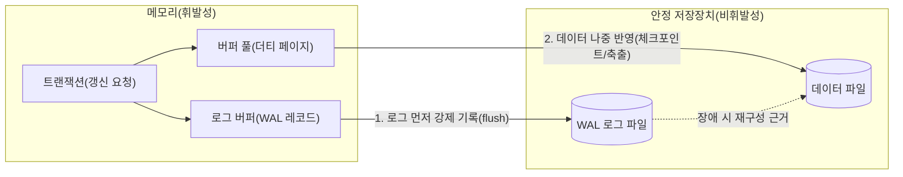
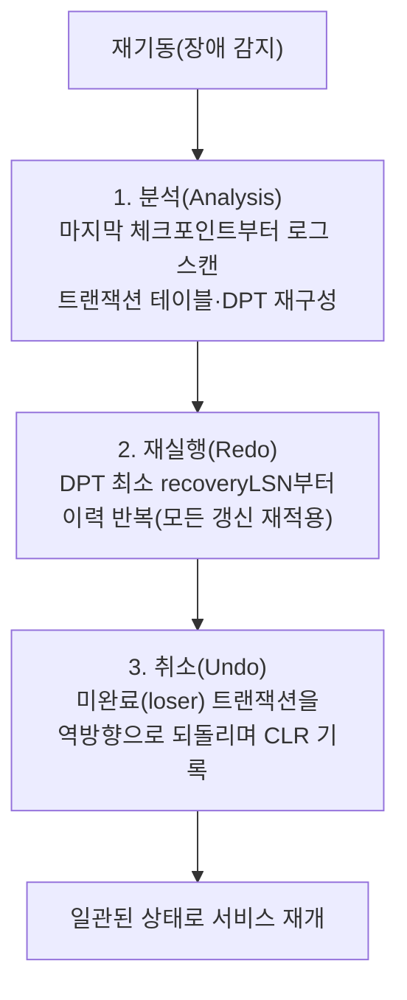

# 로그 선기록(WAL)과 데이터베이스 회복 기법(ARIES)

## 1. 개요

> **로그 선기록(WAL, Write-Ahead Logging)**은 데이터 페이지(블록)를 디스크에 반영하기 이전에 그 변경 사실을 기록한 로그를 먼저 안정 저장장치(stable storage)에 강제 기록(force)하도록 규정하는 트랜잭션 회복의 기본 프로토콜이다. 즉 "먼저 로그, 나중에 데이터"라는 순서 규칙을 통해 장애가 발생하더라도 로그만 있으면 데이터의 일관된 상태를 재구성할 수 있도록 보장한다.

데이터베이스는 성능을 위해 갱신된 페이지를 즉시 디스크에 쓰지 않고 버퍼 풀(buffer pool)에 잠시 캐싱한다. 이 지연은 처리량을 크게 높이지만, 정전·프로세스 강제 종료·디스크 오류 같은 장애가 발생하면 버퍼의 갱신 내용이 유실되어 트랜잭션의 원자성(Atomicity)과 지속성(Durability)이 깨질 위험을 낳는다. WAL은 바로 이 위험을 해소하기 위해 등장했다. 아직 완료(commit)되지 않은 트랜잭션의 갱신이 디스크에 먼저 반영되면 장애 시 이를 되돌릴(undo) 근거가 필요하고, 반대로 완료된 트랜잭션의 갱신이 아직 디스크에 반영되지 않았다면 이를 다시 실행(redo)할 근거가 필요하다. 두 근거를 모두 로그에 남기되, 그 로그가 데이터보다 먼저 안정 저장장치에 도달하도록 강제하는 것이 WAL의 본질이다.

WAL이 필요한 근본 이유는 버퍼 관리 정책의 자유도를 확보하면서도 ACID를 지키기 위해서다. 만약 완료 시점마다 모든 갱신 페이지를 디스크에 강제로 내려쓴다면(force 정책) redo는 필요 없어지지만 임의 I/O가 폭증해 성능이 붕괴한다. 반대로 미완료 트랜잭션의 더티 페이지를 버퍼에서 밀어내지 못하게 막는다면(no-steal 정책) 버퍼가 금세 고갈된다. 현대 DBMS는 성능이 가장 좋은 **steal/no-force** 정책(미완료 페이지도 축출 허용, 완료 시 데이터 강제 기록 안 함)을 택하는데, 이 정책은 undo와 redo를 **모두** 요구하며, 그 안전판이 곧 WAL이다. WAL은 오라클의 redo log, PostgreSQL의 WAL 세그먼트, MySQL InnoDB의 redo log와 undo log, SQLite의 WAL 모드 등 상용·오픈소스 엔진 전반에 공통으로 구현되어 있다. 표현과 세부 구조는 엔진마다 다르지만, "데이터보다 로그를 먼저 안정 저장장치에 남긴다"는 규칙만은 예외 없이 공유된다는 점에서 WAL은 트랜잭션 처리의 보편 원리라 할 수 있다.

## 2. WAL의 기본 원리와 로그 구조

WAL은 두 가지 하위 규칙으로 구성된다. 첫째는 **undo 규칙**으로, 어떤 페이지의 갱신을 디스크에 반영하기 전에 그 갱신을 되돌릴 수 있는 로그(변경 전 이미지, before-image)가 먼저 안정 저장장치에 기록되어야 한다. 둘째는 **redo 규칙**으로, 트랜잭션이 완료(commit)로 간주되기 전에 그 트랜잭션의 모든 갱신 로그(변경 후 이미지, after-image)가 안정 저장장치에 기록되어야 한다. 두 규칙이 동시에 지켜지면, 장애 시점이 언제이든 로그만으로 완료 트랜잭션은 재실행하고 미완료 트랜잭션은 취소하여 일관된 상태로 복구할 수 있다.

아래 다이어그램은 갱신 연산이 버퍼·로그·디스크를 거치는 전체 구조를 나타낸다.

로그에 무엇을 남기느냐에 따라 로깅 방식은 세 가지로 나뉜다. **물리 로깅(physical logging)**은 변경된 바이트/페이지 이미지를 그대로 남겨 재적용이 단순하지만 로그량이 크고, **논리 로깅(logical logging)**은 "A 계좌에서 100 차감" 같은 연산 자체를 남겨 로그량은 작지만 재적용 시 부수효과·순서 문제로 멱등 회복이 어렵다. ARIES가 채택한 **물리논리(physiological) 로깅**은 "페이지는 물리적으로 지정하되, 그 페이지 안에서의 변경은 논리적으로 기술"하는 절충안으로, 슬롯 배열 재정렬 같은 페이지 내부 이동에 영향을 받지 않으면서도 로그량을 절제한다. 실무 엔진 대부분이 이 물리논리 방식을 따른다.

로그는 순차 추가(append-only)되는 레코드의 열이며, 각 레코드는 고유한 **LSN(Log Sequence Number, 로그 순서 번호)**으로 식별된다. LSN은 단조 증가하므로 로그의 시간 순서와 인과 관계를 그대로 표현한다. 각 데이터 페이지 헤더에는 그 페이지에 마지막으로 반영된 로그의 LSN인 **pageLSN**이 기록된다. 회복 시 어떤 로그 레코드의 LSN이 해당 페이지의 pageLSN보다 크면 "아직 반영되지 않은 갱신"으로 판단해 redo하고, 작거나 같으면 "이미 반영됨"으로 판단해 건너뛴다. 이 LSN 비교가 회복의 멱등성(idempotency)을 보장하는 핵심 장치다. 예컨대 회복 중 다시 장애가 나 회복을 처음부터 반복해도 이미 반영된 갱신은 pageLSN 비교로 자동 제외되어 이중 적용이 발생하지 않는다.

로그 자체도 성능을 위해 메모리의 **로그 버퍼(log buffer)**에 먼저 모였다가 일정 조건(커밋, 버퍼 가득 참, 주기적 flush)에서 안정 저장장치로 내려간다. 이때 WAL 규칙을 지키려면 "데이터 페이지를 디스크에 쓰기 직전, 그 페이지의 pageLSN까지의 로그가 반드시 flush되어 있어야 한다"는 불변식이 성립해야 한다. 다수 트랜잭션의 커밋 로그를 한 번의 fsync로 묶어 내려보내는 **그룹 커밋(group commit)**은 이 불변식을 유지하면서도 디스크 동기화 횟수를 줄여 처리량을 끌어올리는 대표적 최적화다. 반대로 로그를 개별 커밋마다 즉시 fsync하면 지속성은 완벽해지지만 초당 커밋 수가 디스크의 fsync 성능에 묶여버린다. 이처럼 로그의 "언제 얼마나 강하게 내려쓰느냐"는 WAL 구현의 핵심 성능 변수다.

로그 레코드의 대표 유형은 다음과 같다. 표는 비교를 돕기 위한 보조이며, 각 유형이 왜 필요한지는 위 undo/redo 규칙의 관점에서 이해해야 한다.

| 로그 유형 | 기록 내용 | 회복 시 역할 |
|-----------|-----------|--------------|
| Update | LSN, 트랜잭션 ID, 페이지 ID, before-image, after-image | undo·redo 모두의 근거 |
| Commit | 트랜잭션 완료 표시 | 완료 판정(redo 대상 확정) |
| Abort/Rollback | 트랜잭션 취소 시작 | undo 대상 판정 |
| CLR(보상 로그) | undo 수행 사실과 다음 undo 대상(UndoNextLSN) | undo의 재장애 대비·진행 추적 |
| Checkpoint | 활성 트랜잭션·더티 페이지 상태 스냅샷 | 회복 시작점 축소 |

## 3. 체크포인트와 회복의 필요성

로그는 계속 쌓이므로, 장애가 났을 때 로그의 맨 처음부터 전부 재적용한다면 회복 시간이 무한정 길어진다. 이를 막는 장치가 **체크포인트(checkpoint)**다. 체크포인트는 특정 시점에 시스템 상태(활성 트랜잭션 목록과 더티 페이지 목록)를 로그에 스냅샷으로 남겨, 회복이 그 지점 이후만 살펴보면 되도록 시작점을 앞당긴다.

체크포인트에는 두 방식이 있다. **동기(sharp) 체크포인트**는 체크포인트 순간에 모든 더티 페이지를 디스크에 내려쓰고 그동안 트랜잭션 처리를 멈춘다. 회복 논리는 단순해지지만, 대량 강제 기록으로 인해 서비스가 순간적으로 정지(stall)되는 문제가 있다. 반면 **비동기(fuzzy) 체크포인트**는 처리를 멈추지 않고 현재의 더티 페이지 테이블·트랜잭션 테이블만 기록한 뒤, 실제 페이지 반영은 백그라운드에서 점진적으로 수행한다. ARIES를 포함한 현대 엔진은 가용성 확보를 위해 대부분 fuzzy 체크포인트를 사용한다. 예를 들어 InnoDB는 sharp checkpoint(종료·flush 시)와 fuzzy checkpoint(운영 중 백그라운드 flush)를 상황에 따라 병행한다.

체크포인트의 실효성은 그것이 "회복이 반드시 살펴봐야 할 로그의 하한선"을 어디까지 끌어올리느냐로 판가름난다. fuzzy 체크포인트가 남긴 더티 페이지 테이블의 최소 recoveryLSN이 곧 재실행의 시작점이 되므로, 백그라운드 flush가 원활히 진행되어 더티 페이지가 빠르게 정리될수록 회복 스캔 구간이 짧아진다. 반대로 대량 쓰기가 몰려 더티 페이지가 오래 남으면 체크포인트를 자주 해도 회복 구간이 잘 줄지 않는다. 따라서 체크포인트 주기와 버퍼 flush 속도(예: InnoDB의 adaptive flushing)는 함께 조율되어야 하는 한 쌍의 변수다.

갱신 반영 시점 정책도 회복 부담을 좌우한다. **즉시 갱신(immediate update)**은 트랜잭션 진행 중에도 더티 페이지를 디스크에 반영할 수 있어 undo가 반드시 필요하고, **지연 갱신(deferred update)**은 완료 전까지 디스크 반영을 미뤄 undo는 필요 없으나 버퍼 압박과 커밋 지연이 커진다. 성능을 중시하는 대부분의 상용 DBMS는 즉시 갱신 + steal/no-force + WAL 조합을 채택한다.

## 4. ARIES 회복 알고리즘

**ARIES(Algorithm for Recovery and Isolation Exploiting Semantics)**는 IBM의 C. Mohan 등이 제안한, WAL 기반 회복의 사실상 표준 알고리즘이다. ARIES는 세 가지 설계 원리 위에 서 있다. 첫째 **WAL 준수**, 둘째 **반복 이력(repeating history)** — 회복 시 장애 직전까지의 모든 갱신을 (미완료 트랜잭션 것까지 포함해) 일단 그대로 재현한 뒤 미완료 분을 되돌린다는 원칙, 셋째 **보상 로그(CLR)를 통한 undo의 로깅** — undo 자체도 로그로 남겨 회복 도중 재장애가 나도 이미 되돌린 작업을 다시 되돌리지 않도록 한다는 원칙이다.

ARIES는 두 개의 핵심 자료구조를 사용한다. **트랜잭션 테이블(Transaction Table)**은 활성 트랜잭션과 각각의 마지막 LSN(lastLSN)을 담고, **더티 페이지 테이블(DPT, Dirty Page Table)**은 버퍼에서 갱신되었으나 아직 디스크에 반영되지 않은 페이지와 각 페이지의 recoveryLSN(그 페이지를 더티로 만든 최초 갱신의 LSN)을 담는다. DPT의 recoveryLSN 중 최소값이 redo를 시작할 지점을 결정한다.

회복은 아래와 같이 **분석(Analysis) → 재실행(Redo) → 취소(Undo)**의 3단계로 진행된다.

**분석 단계**는 마지막으로 완료된 체크포인트 레코드에서 시작해 로그 끝까지 전진 스캔하면서, 장애 시점의 활성 트랜잭션 집합(완료되지 못한 loser 트랜잭션)과 더티 페이지 집합을 복원한다. 이 단계의 목적은 이어질 redo의 시작 LSN과 undo 대상 트랜잭션 목록을 확정하는 것이다. 예를 들어 커밋 로그가 있는 트랜잭션은 winner로, 없는 트랜잭션은 loser로 분류된다.

**재실행 단계**는 DPT의 최소 recoveryLSN 지점부터 로그를 다시 전진 스캔하며, winner·loser를 가리지 않고 모든 갱신을 재적용해 "장애 직전의 상태"를 그대로 재현한다. 다만 각 갱신에 대해 해당 페이지의 pageLSN과 로그 LSN을 비교해, 이미 디스크에 반영된 갱신은 건너뛴다. loser의 갱신까지 일단 재현하는 것이 비직관적으로 보이지만, 이는 다음 undo 단계가 "정상적으로 갱신된 상태"를 전제로 되돌릴 수 있게 하여 알고리즘을 단순·견고하게 만든다(반복 이력 원칙).

**취소 단계**는 loser 트랜잭션들의 갱신을 lastLSN에서부터 역방향으로 하나씩 되돌린다. 각 undo 연산은 되돌린 사실과 다음에 되돌릴 대상(UndoNextLSN)을 담은 **CLR(Compensation Log Record, 보상 로그)**로 기록된다. CLR 덕분에 undo 도중 다시 장애가 나 회복을 재수행하더라도 CLR의 UndoNextLSN을 따라가면 이미 되돌린 지점 이후만 이어서 처리하므로, undo가 이중 수행되지 않고 회복이 항상 유한 시간에 종료된다. 이 성질을 "undo는 결코 되돌려지지 않는다(CLR is never undone)"고 표현한다.

ARIES가 널리 채택된 또 다른 이유는 회복뿐 아니라 정상 운영 시의 정교한 제어까지 포괄하기 때문이다. 각 로그 레코드가 트랜잭션 단위로 prevLSN(같은 트랜잭션의 직전 로그)을 연결 리스트처럼 가리키므로, 특정 세이브포인트(savepoint)까지만 되돌리는 **부분 롤백(partial rollback)**이 자연스럽게 지원된다. 또한 페이지 단위가 아닌 레코드·튜플 단위의 세밀한 잠금(fine-granularity locking)과도 정합적으로 동작하여, 한 페이지에 여러 트랜잭션이 동시에 접근하는 고동시성 환경에서도 정확한 회복이 가능하다. 이러한 범용성 덕분에 ARIES의 핵심 아이디어(LSN, 반복 이력, CLR)는 상용 DBMS 회복 서브시스템의 공통 설계 언어가 되었다.

## 5. 회복 시나리오 예시(LSN 기반 추적)

ARIES의 3단계가 실제로 어떻게 맞물리는지는 구체적인 로그 시퀀스로 볼 때 가장 분명해진다. 아래는 두 트랜잭션 T1·T2가 진행되던 중 시스템이 붕괴한 상황을 단순화한 로그다. LSN은 10 단위로 증가한다고 가정한다.

| LSN | 트랜잭션 | 연산 | 비고 |
|-----|----------|------|------|
| 10 | T1 | begin | |
| 20 | T1 | update P5 (A: 100→150) | P5 더티, recoveryLSN=20 |
| 30 | — | checkpoint | 활성=T1, DPT={P5:20} |
| 40 | T2 | begin | |
| 50 | T2 | update P7 (B: 30→60) | P7 더티, recoveryLSN=50 |
| 60 | T1 | commit | T1은 winner |
| 70 | T2 | update P5 (A: 150→200) | |
| — | — | **CRASH** | T2는 미완료(loser) |

**분석 단계**는 LSN 30의 체크포인트에서 출발한다. 스캔 결과 T1은 LSN 60에서 commit되었으므로 winner, T2는 commit 로그가 없으므로 loser로 분류된다. DPT에는 P5(recoveryLSN=20)와 P7(recoveryLSN=50)이 오른다. **재실행 단계**는 DPT 최소 recoveryLSN인 20부터 전진 스캔하며 LSN 20·50·70의 갱신을 페이지의 pageLSN과 비교해 필요한 것만 재적용한다. 이때 loser인 T2의 LSN 50·70 갱신까지 일단 반영하여 장애 직전 상태를 그대로 재현한다(반복 이력). **취소 단계**는 loser T2를 lastLSN(70)에서 역방향으로 되돌린다. LSN 70의 갱신(A: 200→150)을 되돌리며 CLR을 남기고, 이어 LSN 50의 갱신(B: 60→30)을 되돌리며 CLR을 남긴 뒤 종료한다. 최종적으로 T1의 갱신(A=150)은 살아남고 T2의 갱신은 모두 사라져, 원자성과 지속성이 동시에 보장된 일관 상태가 된다.

이 예시에서 체크포인트(LSN 30)의 존재가 분석·재실행의 출발점을 로그 맨 앞이 아닌 중간으로 끌어올렸다는 점에 주목할 필요가 있다. 로그가 수천만 건 쌓인 실제 운영 환경이라면 체크포인트 주기가 회복 시간을 좌우하는 결정적 변수가 된다.

## 6. 갱신·회복 정책 비교

버퍼 관리 정책의 조합에 따라 필요한 회복 연산이 달라진다. 아래 비교는 단순 나열이 아니라, 각 조합이 성능과 회복 부담 사이에서 어떤 트레이드오프를 만드는지를 보여준다. steal은 미완료 페이지의 축출을 허용해 버퍼 효율을 높이는 대신 undo를 요구하고, no-force는 완료 시 강제 기록을 생략해 커밋 지연을 줄이는 대신 redo를 요구한다. 성능이 가장 좋은 steal/no-force가 undo·redo를 모두 요구하는 이유가 여기에 있으며, 그렇기에 WAL이 필수가 된다.

| 정책 조합 | Undo 필요 | Redo 필요 | 성능 특성 | 대표 채택 |
|-----------|-----------|-----------|-----------|-----------|
| no-steal / force | 불필요 | 불필요 | 커밋 시 대량 강제 I/O, 버퍼 압박 | 이론적·소규모 |
| steal / force | 필요 | 불필요 | 커밋 지연 큼 | 드묾 |
| no-steal / no-force | 불필요 | 필요 | 버퍼 고갈 위험 | 드묾 |
| **steal / no-force** | **필요** | **필요** | 최고 성능 | 대부분 상용 DBMS |

한 가지 구체적 사례로, MySQL InnoDB는 redo log(순환 파일 그룹)와 undo log(undo tablespace)를 분리 운용한다. `innodb_flush_log_at_trx_commit=1`이면 매 커밋마다 redo log를 디스크에 fsync하여 완전한 지속성을 보장하고(WAL redo 규칙의 엄격 적용), 값을 0이나 2로 낮추면 성능은 오르지만 최대 1초가량의 트랜잭션 유실 위험이 생긴다. 이는 WAL의 강제 기록 강도를 조절해 지속성과 처리량을 교환하는 실무적 튜닝 지점이다.

## 7. 심화: 최신 동향과 실무 적용

WAL은 단순한 회복 장치를 넘어 오늘날 데이터 플랫폼의 핵심 인프라로 재해석되고 있다. 첫째, **물리 복제(physical replication)의 기반**이다. PostgreSQL의 스트리밍 복제와 오라클 Data Guard는 프라이머리가 생성한 WAL/redo 스트림을 스탠바이에 실시간 전송·재적용하여 고가용성과 읽기 확장을 달성한다. 즉 회복을 위해 남기는 로그가 그대로 복제 채널이 된다.

둘째, **변경 데이터 캡처(CDC)와 이벤트 스트리밍의 원천**이다. Debezium 같은 도구는 MySQL binlog나 PostgreSQL 논리 디코딩(logical decoding)을 통해 WAL을 읽어 데이터 변경을 Kafka 이벤트로 흘려보낸다. 애플리케이션 코드를 건드리지 않고도 로그만으로 신뢰성 있는 변경 전파가 가능하다는 점에서, WAL은 마이크로서비스 간 데이터 동기화의 사실상 표준 원천이 되었다.

셋째, **저장 엔진 설계 철학의 확산**이다. LSM-Tree 기반 엔진(RocksDB, Cassandra 등)도 memtable 갱신 전에 WAL(commit log)을 먼저 기록해 내구성을 확보하며, 클라우드 네이티브 DB인 Amazon Aurora는 "로그가 곧 데이터베이스(the log is the database)"라는 원리로 redo 로그만 스토리지 계층에 전송하고 데이터 페이지는 스토리지 노드가 로그로부터 재구성하게 하여 네트워크 쓰기량을 획기적으로 줄였다. 이는 WAL 개념을 분산 스토리지 아키텍처로 확장한 대표 사례다.

넷째, **비휘발성 메모리(PMEM)와의 접점**이다. 영속 메모리 환경에서는 로그 강제 기록의 비용 구조가 달라져, 로그를 줄이거나 없애는 연구(예: 로그리스 회복)가 진행되지만, 원자성·지속성 보장이라는 WAL의 목적 자체는 여전히 유효하다.

다섯째, **이벤트 소싱·아웃박스 패턴과의 개념적 수렴**이다. 애플리케이션 계층에서 "상태 변화를 이벤트 로그로 먼저 남기고 상태는 그로부터 파생한다"는 이벤트 소싱(Event Sourcing)의 발상은 DBMS 내부의 WAL 원리를 서비스 아키텍처 수준으로 끌어올린 것과 다름없다. 트랜잭션 아웃박스 패턴 역시 비즈니스 데이터 변경과 이벤트 발행을 같은 로컬 트랜잭션으로 묶어 원자성을 확보한다는 점에서 WAL의 "먼저 기록하고 나중에 반영한다"는 철학을 공유한다. WAL을 저장 엔진의 국소 기법이 아니라 신뢰성 있는 상태 전파의 일반 원리로 이해하면, 데이터베이스와 분산 시스템 설계를 하나의 관점으로 꿰어 볼 수 있다.

## 8. 고려사항 및 시사점

기술사 관점에서 WAL과 ARIES를 실무에 적용할 때는 다음을 종합적으로 고려해야 한다.

- **지속성과 성능의 트레이드오프 튜닝**: 커밋 시 로그 fsync 강도(예: InnoDB `innodb_flush_log_at_trx_commit`, PostgreSQL `synchronous_commit`), 그룹 커밋(group commit)으로 다수 트랜잭션의 로그 flush를 묶는 최적화 등을 워크로드 특성(OLTP vs 대량 배치)에 맞춰 설정해야 한다. 무조건적인 완전 동기화는 처리량을, 무분별한 완화는 데이터 안전성을 해친다.

- **회복 시간 목표(RTO)와 체크포인트 주기의 균형**: 체크포인트를 자주 하면 회복 시 스캔 범위가 줄어 RTO는 짧아지지만 운영 중 flush I/O가 늘어난다. 반대로 드물게 하면 평시 성능은 좋아지나 장애 회복이 길어진다. 재해복구(RPO·RTO) 요구와 연계해 주기를 산정해야 한다.

- **로그 저장소의 안정성·용량 관리**: WAL은 반드시 안정 저장장치에 저장되어야 하므로 로그 볼륨의 I/O 성능과 이중화가 병목이자 단일 장애점이 될 수 있다. 로그 아카이빙(PITR, 특정 시점 복구)과 보관 주기, 순환 재사용 정책, 디스크 포화(로그가 데이터보다 먼저 가득 차는 상황)에 대한 모니터링이 필요하다.

- **분산·복제 환경으로의 확장 전략**: WAL을 복제·CDC·이벤트 소싱의 원천으로 삼을 경우, 동기/비동기 복제 선택에 따른 정합성과 지연의 트레이드오프, 스탠바이 재적용 지연(replication lag) 관리, 논리 복제 시 스키마 변경 전파 등을 함께 설계해야 한다. 회복 인프라가 곧 데이터 통합 인프라가 되는 현대 아키텍처에서 WAL 설계는 단일 DB를 넘어 데이터 플랫폼 전체의 신뢰성을 좌우한다.

- **운영 관측성과 장애 대응**: 회복 시간·체크포인트 빈도·복제 지연·로그 flush 지연을 상시 모니터링하고, 회복 리허설(주기적 강제 재기동 테스트)로 실제 RTO를 검증해야 한다. WAL 관련 지표는 장애가 나기 전까지 드러나지 않는 잠재 위험이므로, 관측 가능성(observability) 확보가 사후 대응이 아닌 사전 예방의 핵심이 된다.

- **연계 기술과의 정합**: 2단계 커밋(2PC)·사가 패턴 등 분산 트랜잭션, CDC·아웃박스 패턴, LSM-Tree·B+Tree 저장 구조와 함께 이해할 때 WAL의 역할이 명확해진다. 회복 정책은 격리 수준·잠금·MVCC와도 상호작용하므로 트랜잭션 관리 전반의 맥락에서 통합적으로 접근해야 한다.

## 참고자료

- C. Mohan et al., "ARIES: A Transaction Recovery Method Supporting Fine-Granularity Locking and Partial Rollbacks Using Write-Ahead Logging," ACM TODS, 1992. https://dl.acm.org/doi/10.1145/128765.128770
- PostgreSQL Documentation, "Reliability and the Write-Ahead Log." https://www.postgresql.org/docs/current/wal-intro.html
- MySQL Reference Manual, "InnoDB Redo Log." https://dev.mysql.com/doc/refman/8.0/en/innodb-redo-log.html
- Amazon Aurora, "Amazon Aurora: Design Considerations for High Throughput Cloud-Native Relational Databases," SIGMOD, 2017. https://dl.acm.org/doi/10.1145/3035918.3056101

---

> **한 줄 요약**: WAL은 "데이터보다 로그를 먼저"라는 순서 규칙으로 원자성·지속성을 보장하는 회복의 기반이며, ARIES는 이를 분석·재실행·취소 3단계와 LSN·DPT·CLR로 구현한 사실상 표준 알고리즘으로 오늘날 복제·CDC·클라우드 DB의 핵심 인프라로 확장되고 있다.
