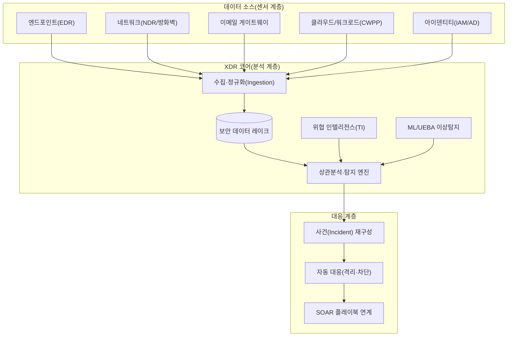
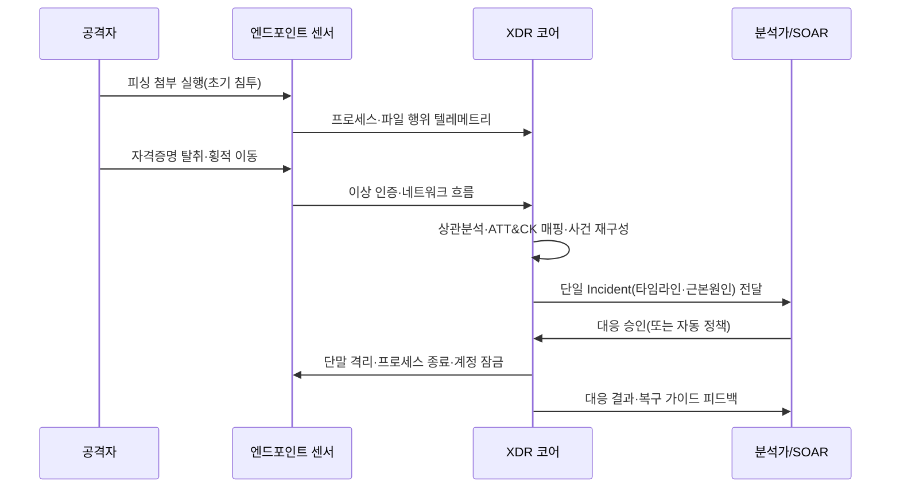

# 확장 탐지·대응(XDR, eXtended Detection and Response)

## 1. 개요

> **정의**: XDR(eXtended Detection and Response)은 엔드포인트(EDR)·네트워크(NDR)·이메일·클라우드·서버·아이덴티티 등 이질적인 보안 도메인에서 발생하는 원격측정(Telemetry)을 단일 플랫폼으로 수집·정규화·상관분석하여, 개별 경보를 하나의 공격 스토리(Incident)로 자동 재구성하고 대응까지 연계하는 통합 위협 탐지·대응 체계를 말한다.

XDR이 등장한 배경은 "경보의 홍수(Alert Fatigue)"와 "사일로(Silo)화된 탐지"라는 두 가지 실무적 고통에서 출발한다. 기존의 보안 운영은 EDR은 단말만, 방화벽·IPS는 네트워크만, 메일 게이트웨이는 메일만 각각 독립적으로 탐지했고, 이들 경보를 SIEM으로 모아 사람이 눈으로 꿰어 맞추는 구조였다. 그러나 오늘날의 공격은 피싱 메일로 침투해(이메일) 단말에서 악성코드를 실행하고(엔드포인트) 계정을 탈취해(아이덴티티) 내부망을 횡적 이동한 뒤(네트워크) 클라우드 저장소의 데이터를 외부로 유출하는(클라우드) 식으로 **여러 도메인을 넘나든다.** 각 도메인의 경보를 따로 보면 모두 "중간 위험" 정도의 잡음이지만, 시간 순서로 이어 붙이면 명백한 침해 시나리오가 된다. 이 "이어 붙이기"를 사람이 수작업으로 하기에는 하루 수만 건의 경보가 쏟아지므로, 상관분석과 재구성을 플랫폼이 자동으로 수행하도록 만든 것이 XDR의 본질이다.

XDR의 본질적 특징은 다음 네 가지로 요약된다. 첫째, **교차 도메인 통합(Cross-domain)** — 엔드포인트·네트워크·클라우드·아이덴티티를 하나의 분석 평면에서 다룬다. 둘째, **경보의 사건화(Correlation)** — 낱개 경보가 아니라 인과 관계로 묶인 사건 단위로 결과를 제시한다. 셋째, **탐지-대응의 폐루프(Closed-loop)** — 탐지에서 봉쇄까지가 한 플랫폼 안에서 연결된다. 넷째, **자동화·지능화(AI-driven)** — ML·UEBA·생성형 AI로 분석가의 판단을 증강한다. 이 네 특징은 개별 도구의 합이 아니라 "운영 흐름의 통합"이라는 XDR의 정체성을 함께 규정한다.

또 하나의 배경은 보안 인력 부족과 평균 탐지·대응 시간(MTTD/MTTR)의 압박이다. 침해가 발생한 뒤 이를 인지하고 봉쇄하기까지 걸리는 시간이 길수록 피해가 기하급수적으로 커지므로, 조직은 경보의 "수"가 아니라 "결론이 난 사건(Incident)"의 형태로 분석가에게 전달되고, 나아가 봉쇄까지 자동 연계되는 운영 모델을 요구하게 되었다. 특히 다수 조직에서 침해가 몇 주에서 수개월간 탐지되지 않은 채 잠복(Dwell Time)하는 현실은, 단일 도메인 관점의 탐지만으로는 은밀한 공격을 놓친다는 방증이었다.

XDR은 SIEM의 광범위한 로그 수집·규정준수 기능과 EDR의 심층 단말 가시성·대응 능력의 장점을 결합하되, "탐지-조사-대응"이라는 운영 흐름 자체를 하나의 제품 경험으로 통합한다는 점에서 차별화된다. 즉 XDR은 새로운 탐지 알고리즘 하나를 추가한 것이 아니라, 흩어져 있던 보안 운영의 데이터·분석·대응을 수직 통합하여 SOC의 운영 모델 자체를 재설계하려는 접근으로 이해해야 한다.

## 2. XDR 전체 구조와 구성요소

XDR은 다양한 보안 센서로부터 데이터를 끌어와 하나의 분석 계층에서 통합 처리하고, 그 결과를 대응 계층으로 흘려보내는 계층형 아키텍처를 갖는다. 아래 개념도는 데이터 소스에서 대응까지의 전체 구조를 나타낸다.

이 구조에서 데이터는 아래에서 위로(센서 → 코어 → 대응) 흐르지만, 위협 인텔리전스와 대응 결과는 다시 아래로 환류되어 탐지 규칙을 지속적으로 정교화한다. 각 계층을 구체적으로 살펴보면 다음과 같다.

**가. 센서(데이터 소스) 계층.** XDR의 탐지 품질은 근본적으로 "얼마나 넓고 깊은 원격측정을 확보하는가"에 달려 있다. 엔드포인트 센서는 프로세스 생성·파일 변경·레지스트리·API 호출 같은 저수준 행위를, 네트워크 센서는 세션·프로토콜·DNS 질의 흐름을, 아이덴티티 소스는 로그인·권한상승·비정상 인증을 제공한다. 여기서 중요한 원리는 **각 도메인의 데이터가 서로의 맥락을 보완한다**는 점이다. 예컨대 단말에서 정체불명의 프로세스가 외부로 통신할 때, 그 목적지가 위협 인텔리전스상 C2(명령제어) 서버라는 네트워크·TI 정보가 결합되면 단독으로는 애매했던 경보가 확정적 침해로 승격된다.

**나. 수집·정규화와 보안 데이터 레이크.** 이질적 소스의 로그는 필드명·시간형식·심각도 척도가 제각각이므로, 공통 스키마(예: OCSF, Open Cybersecurity Schema Framework)로 정규화해야 상관분석이 가능해진다. 예를 들어 어떤 소스는 출발지 주소를 `src_ip`, 다른 소스는 `source.address`로 표기하는데, 정규화 없이는 "동일 IP가 여러 도메인에 걸쳐 활동했다"는 사실 자체를 기계가 인식하지 못한다. 정규화된 데이터는 대용량 보안 데이터 레이크에 적재되어 실시간 스트리밍 분석과 사후 위협 헌팅(과거 데이터 소급 조회)에 함께 활용된다. 데이터의 보존기간·비용·질의 성능은 트레이드오프 관계이므로, 최근 30~90일 데이터는 고속 저장소(Hot), 그 이전 데이터는 저비용 저장소(Cold)로 계층화하고, 침해 조사에 필요한 최소 보존기간(통상 6개월~1년)을 컴플라이언스 요건과 맞추어 설계하는 것이 일반적이다.

또한 수집은 단순 전달이 아니라 "무엇을 보낼지"를 선별하는 단계이기도 하다. 모든 원시 로그를 무차별 전송하면 저장·질의 비용이 폭증하므로, 탐지에 기여하는 보안 관련 이벤트를 우선 수집하고 저가치 로그는 요약·표본화(sampling)하는 데이터 파이프라인 최적화가 실무의 핵심 과제가 된다.

**다. 상관분석·탐지 엔진.** XDR의 심장부로, 규칙 기반 탐지와 행위·통계 기반 탐지를 결합한다. 규칙 기반은 MITRE ATT&CK 전술·기법 매핑을 통해 "권한상승 → 자격증명 접근 → 횡적이동"처럼 공격 단계의 인과 사슬을 탐지하고, UEBA(사용자·개체 행위분석)와 ML 이상탐지는 평소 기준선(Baseline)에서 벗어난 행위를 잡아낸다. 두 방식은 상호 보완적인데, 규칙은 알려진 기법에 강하지만 신종·변종에 약하고, ML은 미지의 이상은 잡되 오탐(False Positive)이 많다. 그래서 실무에서는 ML 점수를 규칙의 위험도 가중치로 활용하는 하이브리드 스코어링을 쓴다.

상관분석의 차별점은 "시간·개체·기법의 3축 결합"에 있다. 단순 SIEM 규칙이 "A 조건이면 경보"라는 단발 조건 매칭에 머무르는 데 비해, XDR은 동일 개체(단말·계정·IP)를 축으로 시간창(예: 30분) 안에서 여러 도메인의 이벤트가 ATT&CK 사슬을 형성하는지를 본다. 예컨대 "동일 계정이 비정상 시간대에 새 지역에서 로그인 → 5분 내 관리자 그룹 편입 → 원격 실행"이 이어지면, 각각은 저위험이라도 결합 위험도가 임계치를 넘어 사건으로 승격된다. 이 결합 논리가 오탐을 줄이는 동시에 은밀한 다단계 공격의 탐지율을 끌어올리는 핵심 기전이다.

**라. 사건 재구성과 대응 계층.** 상관분석 결과 연관된 경보들은 하나의 사건(Incident)으로 묶여 타임라인·영향 자산·공격 기법과 함께 분석가에게 제시된다. 사건 재구성의 원리는 단순 그룹핑을 넘어 "인과 그래프(Causal Graph)" 구성에 있다. 즉 어떤 프로세스가 어떤 파일을 만들고 어떤 계정으로 어디에 접속했는지를 노드-엣지로 이어 공격의 전개도를 만들며, 이 그래프의 뿌리가 곧 근본원인(최초 침투점)이 된다. 이후 단말 격리, 계정 잠금, IP 차단 같은 대응은 XDR 자체 기능으로 즉시 수행하거나, 더 복잡한 다단계 조치(방화벽 정책 변경, 티켓 발행, 관계 부서 통보 등)는 SOAR 플레이북으로 위임한다. 대응의 자동화 수준은 조직 성숙도에 따라 반자동(권고 제시)에서 완전자동(정책 기반 즉시 조치)으로 점진 확대하는 것이 안전하다.

## 3. 탐지·대응 프로세스(운영 흐름)

XDR의 가치는 "경보를 얼마나 잘 하나의 결론으로 수렴시키고, 얼마나 빠르게 봉쇄하는가"에서 나온다. 아래는 침투부터 대응·복구까지의 처리 흐름이다.

운영 흐름은 통상 **탐지(Detect) → 분류·우선순위화(Triage) → 조사(Investigate) → 봉쇄·대응(Respond) → 복구·개선(Recover)**의 순환으로 정리된다. 탐지 단계에서 개별 경보가 발생하면, XDR은 이를 즉시 사람에게 던지지 않고 관련 경보들을 그룹핑하여 위험도를 산정한다. 이 과정에서 하루 수만 건의 원시 경보가 수십 건의 사건으로 압축되는데, 실제 벤더 사례에서 경보 대비 사건 비율이 수십~수백 대 1까지 줄어드는 것으로 보고되며, 이는 분석가의 인지 부하를 획기적으로 낮춘다.

조사 단계에서 분석가는 사건에 첨부된 타임라인과 근본원인(Root Cause) 분석을 통해 "무엇이 최초 진입점이었고, 어디까지 확산되었는가"를 빠르게 파악한다. 여기서 XDR의 강점은 **교차 도메인 피벗(pivot)**이다. 하나의 사건 화면에서 단말 → 계정 → 네트워크 목적지로 즉시 이동하며 조사할 수 있어, 예전처럼 여러 콘솔을 오가는 컨텍스트 스위칭 비용이 사라진다. 대응 단계에서는 위험도에 따라 단계적으로 조치하며, 명백한 악성은 자동 격리하고 애매한 경우는 분석가 승인 후 조치하는 "휴먼 인 더 루프(Human-in-the-loop)" 정책이 권장된다.

**구체 사례 — 랜섬웨어 전개의 조기 차단.** 어느 제조 기업의 SOC를 가정하자. 재무팀 직원이 위장 청구서 메일을 열어 매크로가 실행되면서(초기 침투), 엔드포인트 센서는 오피스 프로세스가 파워셸을 생성하는 비정상 부모-자식 관계를 포착한다. 단독으로는 흔한 저위험 경보다. 그러나 몇 분 뒤 같은 단말에서 도메인 관리자 계정으로의 이례적 인증(아이덴티티)이 발생하고, 곧이어 내부 파일서버로의 대량 SMB 연결(네트워크)이 이어진다. 세 도메인의 경보가 각각 떨어지면 Tier 1 분석가는 우선순위에서 밀어냈을 것이다. XDR은 이 세 신호를 ATT&CK의 "초기 침투 → 자격증명 접근 → 횡적 이동" 사슬로 자동 연결해 하나의 고위험 사건으로 승격하고, 파일 대량 암호화가 시작되기 전에 해당 단말을 자동 격리하고 탈취된 계정을 잠근다. 이처럼 개별로는 묻혔을 약한 신호들의 결합이 곧 조기 차단의 열쇠이며, 이것이 단일 도메인 EDR이나 사후 로그 분석형 SIEM 대비 XDR이 갖는 실질적 차별점이다.

대응 정책은 위험도 등급에 따라 계층화하는 것이 바람직하다. 예컨대 위험도 90점 이상의 확정적 침해는 무인 자동 격리, 60~90점의 의심 사건은 분석가 승인 후 격리, 60점 미만은 관찰·모니터링으로 남기는 식의 3단계 게이트를 두면, 자동화의 속도와 오작동 시 업무중단 위험을 동시에 관리할 수 있다.

복구·개선 단계는 흔히 간과되지만 운영 성숙의 척도다. 사건 종결 후에는 동일 유형의 공격이 재현되지 않도록 탐지 규칙을 보강하고, 미탐(놓친 신호)·오탐(불필요한 경보)의 원인을 사후분석(Post-mortem)하여 상관규칙과 기준선에 환류한다. 이때 핵심 지표로 평균 탐지시간(MTTD)과 평균 대응시간(MTTR)을 지속 추적하는데, XDR 도입 조직은 수작업 SIEM 운영 대비 MTTD·MTTR을 유의미하게 단축한 것으로 보고된다. 다만 개선 없는 방치는 규칙 노후화로 이어져 시간이 지날수록 탐지력이 저하되므로, 위협 인텔리전스 갱신과 규칙 재검토를 정례화해야 한다.

## 4. 유형 비교 — Native XDR vs Open(Hybrid) XDR

XDR은 데이터 소스를 어떻게 확보하느냐에 따라 크게 두 유형으로 나뉜다. 이 구분은 단순한 제품 분류가 아니라 조직의 기존 보안 투자·종속성(Lock-in)·통합 난이도와 직결되는 전략적 선택이다.

| 구분 | Native XDR | Open(Hybrid) XDR |
|------|-----------|------------------|
| 데이터 소스 | 동일 벤더 제품군 중심 | 이기종 서드파티 포함 |
| 통합 깊이 | 깊고 즉시 동작(사전 튜닝) | 커넥터 개발·정규화 필요 |
| 장점 | 빠른 도입·높은 상관정확도 | 기존 투자 보호·유연성 |
| 단점 | 벤더 종속(Lock-in) | 통합 복잡·품질 편차 |
| 적합 조직 | 신규·단일 벤더 지향 | 이미 다양한 도구 보유 |

Native XDR은 한 벤더가 EDR·NDR·메일·클라우드 센서를 모두 제공하므로, 필드 매핑과 상관규칙이 사전에 최적화되어 도입 즉시 높은 탐지 정확도를 낸다. 반면 이미 다른 벤더의 방화벽·EDR에 상당한 투자를 한 조직에게는 기존 자산을 버리게 만드는 종속성이 부담이다. Open XDR은 이기종 도구의 데이터를 커넥터로 받아들여 기존 투자를 보호하지만, 소스마다 로그 품질·필드 정합성이 달라 정규화와 튜닝 부담이 크고 상관 정확도가 소스 품질에 좌우된다. 따라서 "완전 신규 구축 조직은 Native, 다도구 보유 조직은 Open"이라는 것이 일반적 실무 지침이며, 최근에는 표준 스키마(OCSF)를 채택해 두 방식의 경계를 낮추려는 흐름이 강하다.

두 유형의 선택은 조직의 성숙도 곡선과도 맞물린다. 보안 조직 초기 단계에서는 즉효성이 큰 Native XDR로 빠르게 기본기를 다지고, 조직이 성장해 다양한 도구를 도입한 뒤에는 Open XDR·표준 스키마로 유연성을 확보하는 진화 경로가 현실적이다. 어느 경우든 "탐지 커버리지의 넓이(도메인 수)"와 "각 도메인의 탐지 깊이"를 함께 확보하는 것이 관건이며, 넓기만 하고 얕으면 정탐을 놓치고 깊기만 하고 좁으면 교차도메인 공격을 놓친다.

또한 XDR은 인접 개념과 자주 혼동되므로 경계를 명확히 할 필요가 있다. SIEM은 광범위한 로그 수집과 규정준수 보고에 강하지만 대응 연계가 약하고 튜닝 부담이 크며, SOAR는 대응 자동화(플레이북)에 특화되어 있으나 탐지 자체는 하지 않는다. EDR은 단말 도메인에 국한된 심층 탐지·대응이다. XDR은 이들을 대체한다기보다 **탐지의 범위를 여러 도메인으로 넓히고(EDR 확장), 탐지-대응을 한 흐름으로 묶어(SIEM+SOAR의 운영 통합)** 제공한다는 점에서 위치가 다르다. 실제 성숙한 SOC는 SIEM(장기 로그·컴플라이언스) + XDR(실시간 교차도메인 탐지·대응) + SOAR(광범위 오케스트레이션)를 상호 보완적으로 운영하는 경우가 많다.

## 5. 심화 — 최신 동향과 실무 적용

**가. AI·생성형 AI의 결합.** 최근 XDR 플랫폼은 생성형 AI 기반 "보안 코파일럿(Copilot)"을 탑재하여, 복잡한 사건의 자연어 요약·조사 질의·대응 권고를 제공하는 방향으로 진화하고 있다. 분석가가 "이 사건에서 최초 침투 경로와 영향받은 계정을 알려줘"라고 자연어로 물으면 타임라인과 다음 조치를 제안하는 식이다. 이는 초급 분석가(Tier 1)의 진입장벽을 낮추고 조사 속도를 높이지만, LLM의 환각(Hallucination)과 오판 위험이 있어 최종 봉쇄 결정에는 여전히 사람의 검증이 필요하다는 점이 실무 합의다.

**나. SASE/SSE·클라우드로의 확장.** 재택·클라우드 확산으로 보호 대상이 데이터센터 밖으로 이동하면서, XDR은 SASE(Secure Access Service Edge)·SSE의 원격측정과 결합해 사용자가 어디에 있든 동일한 탐지·대응을 적용하는 방향으로 넓어지고 있다. 클라우드 워크로드 보호(CWPP)·클라우드 보안 형상관리(CSPM) 신호를 XDR로 흡수하는 통합도 활발하다. 경계가 사라진 환경에서는 "네트워크 위치"가 아니라 "아이덴티티·행위"가 새로운 통제점이 되므로, 아이덴티티 도메인의 원격측정이 XDR 탐지에서 차지하는 비중이 갈수록 커지고 있다.

**다. MDR 서비스형 소비.** 자체 SOC를 갖추기 어려운 중견·중소 조직은 XDR 기술을 관리형 탐지·대응(MDR, Managed Detection and Response) 서비스로 위탁 소비하는 추세다. 즉 XDR을 "제품"이 아니라 24/7 전문 운영이 결합된 "서비스"로 구매하는 것으로, 인력 부족 문제를 우회하는 현실적 해법으로 자리 잡고 있다. 다만 서비스 위탁 시에도 데이터 주권·로그 보관 위치·대응 권한 범위(어디까지 위탁사가 자동 격리할 수 있는가)를 계약과 SLA로 명확히 규정해야 책임소재 분쟁을 예방할 수 있다.

한편 XDR은 위협 헌팅(Threat Hunting)의 기반 플랫폼으로도 활용된다. 수동적으로 경보를 기다리는 것을 넘어, 분석가가 "이런 기법이 우리 환경에 이미 잠복해 있지 않은가"라는 가설을 세우고 데이터 레이크를 소급 조회해 미탐 침해를 능동적으로 찾아내는 활동으로, 성숙한 SOC일수록 이 능동 방어 역량의 비중이 높아진다.

**라. 표준화(OCSF)와 상호운용성.** 벤더 종속과 통합 부담을 낮추기 위해 개방형 보안 스키마(OCSF) 채택이 확산되고 있으며, 이는 Open XDR의 통합 품질을 끌어올리고 데이터 레이크 재사용성을 높이는 기반이 된다.

**마. 도입 절차(실무 관점).** XDR 도입은 "제품 설치"가 아니라 운영 체계 전환이므로 단계적 접근이 요구된다. 통상 ① 자산·데이터 소스 인벤토리 수립과 커버리지 공백 식별 → ② 우선순위 도메인(엔드포인트·아이덴티티부터)의 센서 연동과 스키마 정규화 → ③ 기준선 학습 및 상관규칙 튜닝(3~6개월) → ④ 대응 플레이북 정의와 단계적 자동화 확대 → ⑤ 위협 헌팅·지표(MTTD/MTTR) 기반 지속 개선의 순서를 밟는다. 초기에 모든 도메인을 한꺼번에 연동하려다 정규화 부담과 오탐 폭증으로 실패하는 사례가 흔하므로, 가치가 높은 도메인부터 점증적으로 확대하는 전략이 안전하다.

예상 출제 방향으로는 "XDR과 SIEM/SOAR/EDR의 비교", "XDR 도입 시 데이터 정규화·프라이버시 고려사항", "제로 트러스트와 XDR의 연계"가 유력하며, 답안 구성 시 개념도 → 유형·비교 → 도입 절차 → 기술사 관점 고려사항의 흐름으로 전개하면 논리적 완결성을 확보할 수 있다.

## 6. 고려사항 및 시사점(기술사 관점)

**첫째, 데이터 품질과 정규화가 성패를 좌우한다.** XDR의 상관분석은 입력 데이터의 정합성에 전적으로 의존하므로, "쓰레기가 들어가면 쓰레기가 나온다(GIGO)"는 원리가 그대로 적용된다. 도입 초기부터 로그 소스의 커버리지(어떤 도메인이 빠졌는가)와 시간 동기화(NTP), 공통 스키마 매핑을 확보해야 하며, 커버리지 공백은 곧 탐지 사각지대가 된다. 표준 스키마(OCSF) 채택으로 향후 소스 교체·확장 시의 비용을 낮추는 전략이 바람직하다.

**둘째, 오탐·미탐의 트레이드오프를 조직 리스크에 맞춰 튜닝해야 한다.** 탐지 민감도를 높이면 미탐은 줄지만 오탐이 늘어 분석가 피로가 커지고, 낮추면 반대가 된다. 자산 중요도(왕관 보석, Crown Jewels)에 따라 차등 정책을 적용하고, 초기 3~6개월의 학습·기준선 확립 기간(Baselining)을 두어 점진적으로 정밀도를 끌어올리는 운영 성숙도 관점이 필요하다.

**셋째, 벤더 종속성과 통합 유연성 사이의 전략적 균형이 요구된다.** Native XDR의 즉효성과 Open XDR의 유연성은 상충하므로, 조직의 기존 투자·향후 클라우드 전략·인력 역량을 종합해 선택해야 한다. 단일 벤더 종속의 위험을 낮추려면 표준 인터페이스·데이터 이식성(export)을 도입 계약 단계에서 요구사항으로 명시하는 것이 실무적으로 유효하다.

**넷째, 프라이버시·컴플라이언스와의 조화가 필수다.** XDR은 사용자 행위·인증·네트워크 흐름 등 민감 정보를 광범위하게 수집하므로, 개인정보보호법상 최소수집·목적제한 원칙, 로그 보존기간, 접근통제·감사추적을 설계 단계에서 반영해야 한다. UEBA의 행위 프로파일링은 근로자 감시 논란을 부를 수 있어 사전 고지·목적 한정 등 절차적 정당성을 확보할 필요가 있다.

**다섯째, 제로 트러스트·자동화의 확장 축으로 연계해야 한다.** XDR은 "지속적 검증·최소권한"을 지향하는 제로 트러스트 아키텍처의 탐지·대응 실행 엔진으로 기능할 수 있으며, SOAR·IAM·SASE와 결합할 때 실시간 신뢰 재평가(로그인 이상 시 즉시 세션 차단)가 가능해진다. 다만 자동 대응의 범위는 오작동 시 업무 중단 위험이 있으므로, 영향도가 큰 조치는 단계적 승인 게이트를 두는 것이 안전하다.

**여섯째, 조직·프로세스 성숙도가 기술 도입에 선행해야 한다.** XDR은 강력한 도구이지만, 이를 운영할 분석 인력·플레이북·에스컬레이션 체계가 갖춰지지 않으면 "값비싼 경보 발생기"로 전락한다. 자체 SOC 운영이 어렵다면 MDR(관리형 탐지·대응) 서비스로 전문 운영을 결합하는 소싱 전략을 함께 검토해야 하며, 도입 성과는 도구 기능이 아니라 MTTD·MTTR 단축, 사건 처리량, 오탐률 같은 운영 지표로 측정·관리하는 것이 기술사 관점의 균형 잡힌 접근이다.

## 참고자료
- MITRE ATT&CK, https://attack.mitre.org/
- Open Cybersecurity Schema Framework(OCSF), https://schema.ocsf.io/
- Gartner, "Market Guide for Extended Detection and Response", https://www.gartner.com/

---
> **한 줄 요약**: XDR은 엔드포인트·네트워크·이메일·클라우드·아이덴티티의 원격측정을 단일 플랫폼으로 정규화·상관분석하여 흩어진 경보를 하나의 공격 스토리로 재구성하고 탐지-조사-대응을 한 흐름으로 자동화하는 통합 위협 대응 체계로, 데이터 품질·오탐 튜닝·벤더 종속·프라이버시·제로 트러스트 연계가 도입의 핵심 고려사항이다.
