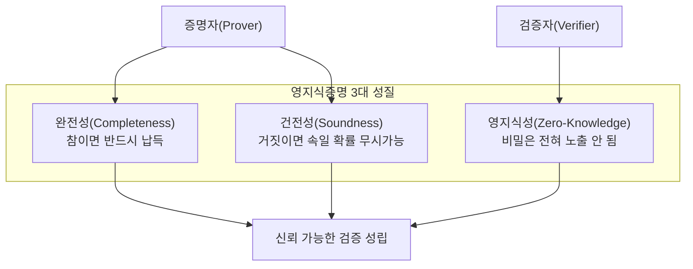
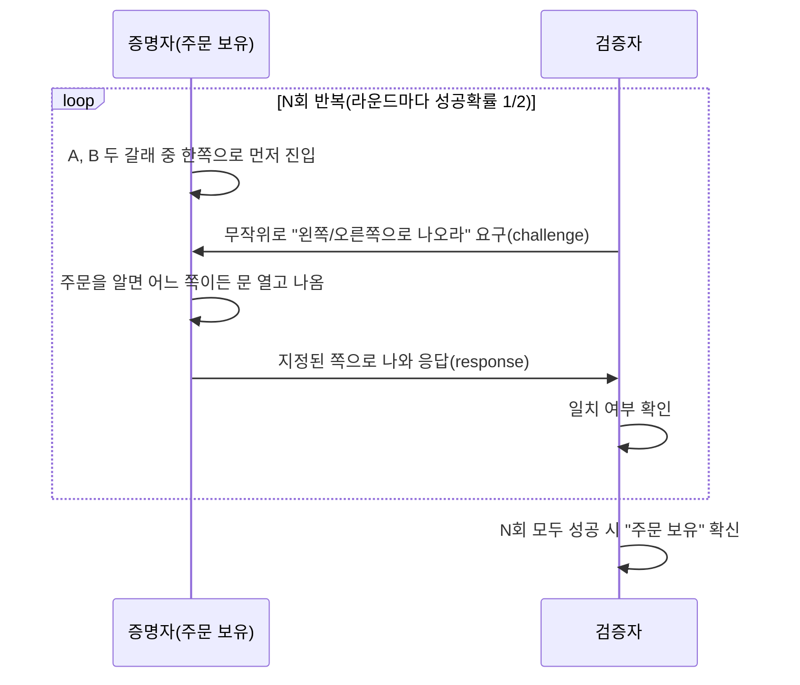

# 영지식증명(Zero-Knowledge Proof, ZKP)

## 1. 개요

> **영지식증명(Zero-Knowledge Proof)**이란 증명자(Prover)가 검증자(Verifier)에게 어떤 명제(비밀 지식의 보유 사실)가 **참임을 확신시키되, 그 비밀 자체에 대해서는 어떠한 정보도 노출하지 않는** 암호학적 프로토콜이다. 1985년 골드바서(Goldwasser)·미칼리(Micali)·라코프(Rackoff)가 상호작용 증명 시스템을 정의하며 처음 정식화하였다.

전통적인 인증·검증은 "비밀을 보여줌으로써 비밀을 안다는 것을 증명"하는 구조였다. 비밀번호를 서버에 전송해야 로그인이 되고, 잔고를 공개해야 지불 능력을 입증할 수 있었다. 그러나 이 방식은 **증명 과정 자체가 정보 유출 통로**가 된다는 근본적 한계를 지닌다. 서버가 침해되면 전송·저장된 비밀이 그대로 탈취되고, 신원 확인을 위해 주민등록번호·생년월일 같은 과도한 개인정보를 매번 넘겨야 한다. 데이터 최소수집 원칙(Privacy by Design)과 정면으로 충돌하는 것이다.

영지식증명은 "**안다는 사실**"과 "**아는 내용**"을 분리한다. 즉 비밀(예: 비밀번호, 나이, 잔고, 신원)을 드러내지 않고도 "나는 그 비밀을 알고 있다" 또는 "그 명제는 참이다"라는 사실만을 수학적으로 확신시킨다. 동형암호가 '암호문 상태의 연산'으로, 다자간 계산(MPC)이 '분산된 비밀 공유'로 프라이버시를 지킨다면, ZKP는 '**검증 가능한 무지(無知)**'라는 독특한 위치에서 이들과 상호보완한다. 최근 블록체인 확장성(zk-Rollup)과 자기주권신원(SSI, DID)의 핵심 인프라로 부상하면서 실무적 중요성이 급격히 커지고 있다.

## 2. 성립 조건과 상호작용 구조

영지식증명이 성립하려면 세 가지 성질이 동시에 충족되어야 한다. 이 세 조건은 서로 다른 이해당사자(정직한 검증자, 정직한 증명자, 부정직한 증명자, 부정직한 검증자)를 각각 방어하도록 설계되어 있어, 하나라도 빠지면 프로토콜이 무력화된다.

첫째, **완전성(Completeness)**은 명제가 실제로 참이고 양측이 정직하게 프로토콜을 따르면, 검증자가 반드시 납득한다는 성질이다. 둘째, **건전성(Soundness)**은 명제가 거짓이라면, 부정직한 증명자가 아무리 속이려 해도 검증자를 납득시킬 확률이 무시할 수준(negligible)에 그친다는 성질이다. 셋째, **영지식성(Zero-Knowledge)**은 검증자가 증명 과정에서 "명제가 참"이라는 사실 외에는 비밀에 대해 아무것도 학습할 수 없다는 성질로, 이는 검증자가 본 모든 메시지를 비밀 없이도 스스로 재현(시뮬레이션)할 수 있음을 보여 증명한다. 검증자가 어떤 부가 정보도 얻지 못했으므로 유출이 없다는 논리다.

고전적 ZKP는 검증자가 무작위 질문(challenge)을 던지고 증명자가 응답하는 **상호작용(Interactive)** 구조를 갖는다. 검증자가 예측 불가능한 질문을 반복적으로 던지고 증명자가 매번 올바르게 답하면, 우연히 맞힐 확률이 라운드마다 절반씩 줄어들어 수십 라운드 후에는 사실상 0에 수렴한다. 이 "무작위 도전-응답 반복"이 건전성을 통계적으로 보장하는 핵심 장치다.

## 3. 동작 원리 — 도전-응답 프로토콜

영지식증명의 직관은 흔히 **'알리바바 동굴(Ali Baba Cave)'** 비유로 설명된다. 고리 모양 동굴의 안쪽에 비밀 주문으로만 열리는 문이 있고, 증명자는 주문을 알고 있음을 검증자에게 보이되 주문 자체는 말하고 싶지 않다. 아래 절차는 이 도전-응답 구조를 도식화한 것이다.

핵심은 **비밀(주문)을 모르는 사기꾼은 운으로만 통과**할 수 있다는 점이다. 사기꾼은 처음 들어간 쪽에서만 나올 수 있으므로, 검증자가 반대쪽을 지정하면 실패한다. 매 라운드 성공 확률이 1/2이므로 20라운드면 사기꾼이 통과할 확률은 약 100만 분의 1로 떨어져 건전성이 확보된다. 반대로 검증자는 "증명자가 지정된 쪽에서 나왔다"는 사실만 관측할 뿐 주문 내용은 전혀 알 수 없어 영지식성이 지켜진다. 실제 암호 구현에서는 이 '동굴'을 이산대수·타원곡선·해시 등 **일방향 함수의 수학적 난제**로 대체한다. 예컨대 슈노어(Schnorr) 프로토콜은 이산대수 문제 위에서 "개인키를 알고 있음"을 공개키 노출 없이 증명한다.

상호작용 방식은 증명자와 검증자가 실시간으로 여러 번 통신해야 하므로 블록체인처럼 비동기·다자 환경에는 부적합하다. 이를 해결하는 것이 **피아트-샤미르 변환(Fiat-Shamir Heuristic)**으로, 검증자의 무작위 도전을 '해시 함수 출력'으로 대체하여 상호작용을 제거한다. 그 결과 증명자가 한 번 생성해 두면 누구나 언제든 검증할 수 있는 **비상호작용(Non-Interactive) 증명**이 되어, 오프라인 검증과 온체인 검증이 가능해진다.

## 4. 유형 비교 — zk-SNARK와 zk-STARK

비상호작용 ZKP를 실용화한 대표 기술이 **zk-SNARK**와 **zk-STARK**이다. 두 기술 모두 대규모 연산의 정당성을 짧은 증명으로 압축한다는 목표는 같지만, 신뢰 설정의 필요 여부·증명 크기·양자내성 측면에서 뚜렷한 트레이드오프가 존재한다. 이 차이는 "무엇을 더 신뢰하고 무엇을 포기할 것인가"라는 설계 판단으로 이어진다.

zk-SNARK(Succinct Non-interactive ARgument of Knowledge)는 증명 크기가 수백 바이트로 매우 작고 검증이 빠르지만, 최초에 공통 파라미터를 만드는 **신뢰 설정(Trusted Setup)** 과정이 필요하다. 이때 생성되는 비밀값(toxic waste)이 폐기되지 않고 유출되면 거짓 증명을 위조할 수 있어, 이 설정을 여러 참여자가 분산 수행(MPC 세리머니)하는 방식으로 위험을 완화한다. 반면 zk-STARK(Scalable Transparent ARgument of Knowledge)는 해시 기반이라 신뢰 설정이 불필요(Transparent)하고 양자컴퓨터 공격에도 견디는 양자내성을 갖지만, 증명 크기가 수십~수백 KB로 커서 온체인 저장 비용이 높다.

| 구분 | zk-SNARK | zk-STARK |
|------|----------|----------|
| 신뢰 설정 | 필요(Trusted Setup) | 불필요(Transparent) |
| 증명 크기 | 매우 작음(~수백 B) | 큼(~수십 KB) |
| 검증 속도 | 매우 빠름 | 상대적으로 느림 |
| 양자내성 | 취약(타원곡선 기반) | 강함(해시 기반) |
| 대표 활용 | Zcash, zkSync | StarkNet |

실무 선택은 상황에 좌우된다. 증명을 블록체인에 자주 올려 가스비(저장 비용)가 중요한 서비스는 증명이 작은 SNARK가 유리하고, 신뢰 설정의 위험을 원천 배제하고 장기적 양자 위협까지 대비하려는 서비스는 STARK가 적합하다. 최근에는 신뢰 설정을 프로그램마다 반복하지 않는 범용 설정(PLONK 등) 기법이 등장하여 SNARK의 운영 부담을 낮추고 있다.

## 5. 활용 사례와 산업 적용

영지식증명의 산업적 파급력이 가장 두드러지는 영역은 **블록체인 확장성**이다. 이더리움의 **zk-Rollup**은 수천 건의 거래를 오프체인에서 처리한 뒤, "이 거래들이 모두 규칙에 맞게 실행되었다"는 사실을 단 하나의 영지식증명으로 압축해 메인체인에 제출한다. 메인체인은 개별 거래를 재실행하지 않고 증명만 검증하면 되므로, 처리량(TPS)이 수십 배 향상되고 수수료가 크게 절감된다. Optimistic Rollup이 '분쟁 시 재검증'에 의존하는 것과 달리 zk-Rollup은 **수학적 증명으로 즉시 확정**되어 출금 지연이 없다는 실무적 장점이 있다.

두 번째 축은 **프라이버시 보호 신원증명**이다. 자기주권신원(SSI)·분산신원(DID) 체계에서 ZKP는 "선택적 공개(Selective Disclosure)"를 구현한다. 예를 들어 술을 구매할 때 신분증 전체(생년월일·주소·주민번호)를 보이는 대신, "나는 만 19세 이상이다"라는 명제만 참임을 증명(Range Proof)할 수 있다. 실제 나이·생년월일은 전혀 노출되지 않으므로, 데이터 최소수집·목적 제한 원칙을 기술적으로 강제한다. 금융권의 자금세탁방지(AML)에서도 "제재 대상 명단에 없음"을 고객 신원 노출 없이 증명하는 방식으로 응용이 확산되고 있다.

세 번째는 **익명 암호화폐**로, Zcash는 zk-SNARK를 이용해 송금자·수신자·금액을 모두 감춘 채 "이중지불이 없고 잔고가 충분하다"는 사실만 증명하여 거래를 성립시킨다. 이 밖에 검증 가능한 연산(Verifiable Computation)을 통해 클라우드에 위탁한 계산이 정직하게 수행되었음을 검증하는 등, 신뢰할 수 없는 환경에서의 무결성 보장 수단으로 활용 범위가 넓어지고 있다.

## 6. 고려사항 및 시사점

기술사 관점에서 영지식증명 도입은 다음 사항을 종합적으로 고려해야 한다.

첫째, **성능·비용 트레이드오프의 정량 평가**가 필요하다. ZKP는 프라이버시와 검증성을 얻는 대가로 증명 생성에 상당한 연산 자원과 시간을 소모한다. 특히 SNARK/STARK의 증명 생성은 검증보다 수백~수천 배 무거우므로, 실시간성이 중요한 서비스에는 하드웨어 가속(GPU·전용 ASIC)이나 증명 위임(proving service) 아키텍처를 병행 검토해야 한다. "검증은 싸고 증명은 비싸다"는 비대칭 구조를 설계 초기에 반영하는 것이 핵심이다.

둘째, **신뢰 설정과 암호 민첩성(Crypto-Agility) 확보**가 요구된다. SNARK 계열은 신뢰 설정의 toxic waste 관리가 단일 실패지점이 될 수 있으므로 다자간 세리머니로 위험을 분산하고, 타원곡선 기반 방식은 양자컴퓨팅 시대에 대비해 STARK·PQC와의 전환 가능성을 아키텍처에 열어 두어야 한다. 특정 곡선·라이브러리에 종속되지 않는 추상화 계층 설계가 장기 안정성을 좌우한다.

셋째, **개인정보보호 규제와의 정합성**을 적극 활용해야 한다. ZKP의 선택적 공개는 개인정보보호법의 최소수집·목적제한 원칙과 GDPR의 데이터 최소화(Data Minimization)를 기술로 구현하는 강력한 수단이다. 다만 증명 자체가 개인을 재식별할 연결고리가 되지 않도록 익명성·연결불가성(unlinkability)까지 함께 설계해야 하며, 규제기관에 대한 감사 추적성과 프라이버시의 균형을 확보해야 한다.

넷째, **표준화 동향과 상호운용성 확보**가 중요하다. ZKProof 표준화 이니셔티브, W3C의 검증가능자격증명(VC)·DID 표준과의 연계를 통해 특정 벤더에 종속되지 않는 상호운용 기반을 마련하고, 검증 회로(circuit)의 정확성 감사·정형검증을 통해 구현 결함으로 인한 건전성 훼손을 예방해야 한다.

다섯째, **적용 우선순위 판단**이 필요하다. ZKP는 만능이 아니며, 단순한 접근제어에는 과잉 설계일 수 있다. '검증자와 증명자의 신뢰가 부재하고, 비밀 노출 없이 사실만 확인해야 하는' 상황(온체인 확장, 프라이버시 신원, 익명 투표 등)에 선별 적용하고, 그 외에는 기존 인증·암호 기술과 조합하는 하이브리드 전략이 합리적이다.

## 참고자료

- Goldwasser, Micali, Rackoff, "The Knowledge Complexity of Interactive Proof-Systems", 1985/1989
- Ethereum Foundation, "Zero-Knowledge Rollups", https://ethereum.org/en/developers/docs/scaling/zk-rollups/
- ZKProof Standards, https://zkproof.org/
- StarkWare, "STARK vs SNARK", https://starkware.co/stark/

---

> **한 줄 요약**: 영지식증명은 비밀을 드러내지 않고 "그 비밀을 안다/명제가 참이다"라는 사실만 수학적으로 확신시키는 암호 프로토콜로, 완전성·건전성·영지식성을 만족하며 zk-SNARK·zk-STARK로 실용화되어 블록체인 확장(zk-Rollup)과 프라이버시 신원증명(선택적 공개)의 핵심 인프라로 자리잡고 있다.
