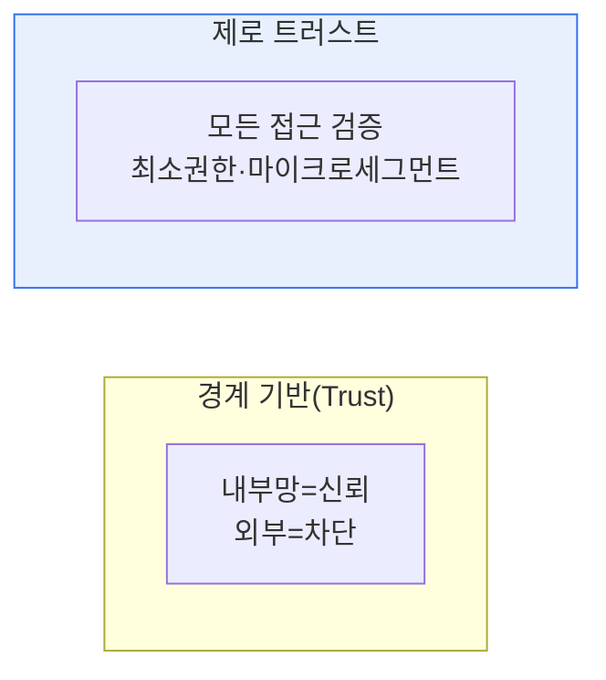

# 제로 트러스트 보안(Zero Trust Security) 모델

## 1. 개요

### 가. 정의
> "**절대 신뢰하지 말고 항상 검증하라(Never Trust, Always Verify)**"는 원칙 아래, 내부·외부를 불문하고 모든 접근 요청을 매번 인증·인가하는 보안 모델. 기본 신뢰값을 '0'으로 두는 것이 이름의 유래다.

제로 트러스트가 등장한 배경은 전통적 **경계 기반(Perimeter) 보안의 붕괴**다. 과거 보안은 성벽처럼 방화벽으로 경계를 치고 '**내부망은 안전하다**'고 가정했다. 성문(방화벽)만 통과하면 내부는 자유롭게 다닐 수 있었다. 그러나 클라우드·원격근무·모바일로 회사와 외부의 경계 자체가 사라지고, 협력사·내부자 위협이 늘며, 한번 침투한 공격자가 내부를 자유롭게 이동하는 **측면 이동(Lateral Movement)** 이 대형 사고의 주범이 되면서 "내부는 안전하다"는 전제가 무너졌다. 제로 트러스트는 이 전제를 폐기하고, 내부에 있든 밖에 있든 모든 접근을 그때그때 검증한다. 성벽을 없애는 대신 모든 방문 앞에 신원 확인 데스크를 두는 셈이다.

### 나. 필요성
자원과 사용자가 어디에나 흩어진 환경에서는 '어디에 있느냐(위치)'가 더 이상 신뢰의 근거가 될 수 없다. 신뢰의 기준이 위치에서 **아이덴티티(신원)와 컨텍스트**로 옮겨가야 하며, 제로 트러스트가 이 전환을 구현한다.

## 2. 경계 기반(Trust) 모델과 비교

두 모델의 결정적 차이는 침해가 발생했을 때의 피해 범위다. 경계 기반은 최초 경계 통과 시 한 번만 검증하므로, 내부에 침투당하면 공격자가 무방비로 측면 이동해 피해가 걷잡을 수 없이 커진다. 제로 트러스트는 자원마다 매번 검증하고 세밀하게 격리하므로, 한 곳이 뚫려도 그 지점에 피해가 국한된다(폭발 반경 최소화).

| 구분 | 경계 기반(Trust) | 제로 트러스트 |
|---|---|---|
| **전제** | 내부는 신뢰 | 아무도 신뢰 안 함 |
| **검증 시점** | 최초 1회(경계 통과) | 지속·매 요청 |
| **방어 중심** | 경계(방화벽) | 리소스·아이덴티티 |
| **침해 시** | 측면 이동으로 확산 | 폭발 반경 최소화 |

## 3. 핵심 원칙

제로 트러스트는 네 가지 원칙으로 구현된다. **명시적 검증** 은 사용자·기기·위치·시간 등 가능한 모든 컨텍스트로 매번 인증·인가하는 것이고, **최소 권한** 은 업무에 꼭 필요한 최소한의 접근만 부여하는 것이다. **침해 가정** 은 이미 뚫렸다고 전제하고 방어를 설계하는 태도이며, **마이크로 세그멘테이션** 은 네트워크·자원을 잘게 나눠 한 구역의 침해가 다른 구역으로 번지지 못하게 격리하는 것이다.

| 원칙 | 내용 |
|---|---|
| **명시적 검증** | 사용자·기기·컨텍스트를 매번 인증·인가 |
| **최소 권한** | 필요한 최소 접근만(Least Privilege) |
| **침해 가정** | 이미 뚫렸다 가정, 폭발반경 최소화 |
| **마이크로 세그멘테이션** | 자원 세분화로 측면 이동 차단 |

## 4. 구성요소와 적용 분야

제로 트러스트는 하나의 제품이 아니라 여러 기술의 조합이다. 신원 관리(IAM)·다중인증(MFA)이 검증의 축을 이루고, 정책결정지점(PDP)과 정책시행지점(PEP)이 접근 정책을 판단·집행하며, 마이크로세그멘테이션이 네트워크를 격리하고, 사용자·엔티티 행위 분석(UEBA)이 이상을 지속 감시한다. 적용 분야는 원격근무·재택, 클라우드·멀티클라우드, 협력사 접근, 공공(제로트러스트 가이드라인) 등이다.

## 5. 고려사항 및 시사점

1. **아이덴티티가 새로운 경계**다. 위치가 아니라 '누가·어떤 기기로'가 신뢰의 기준이 되므로 IAM·MFA가 제로 트러스트의 핵심 축이다.
2. **단계적 도입이 현실적**이다. 제로 트러스트는 한 번에 완성되는 제품이 아니라 성숙도 모델에 따라 점진적으로 구현하는 전략이므로, 핵심 자산부터 우선 적용한다.
3. **SASE·SDP와 결합**해 네트워크 접근을 소프트웨어로 정의하고 클라우드 엣지에서 보안을 통합하는 방향으로 진화하고 있다.

---

> **한 줄 요약**: 제로 트러스트는 *경계 기반 신뢰를 폐기하고 모든 접근을 지속 검증* 하는 모델로, 명시적 검증·최소권한·침해가정·마이크로세그멘테이션 원칙과 IAM·MFA를 축으로 측면 이동을 차단해 클라우드·원격근무 환경을 보호한다.
