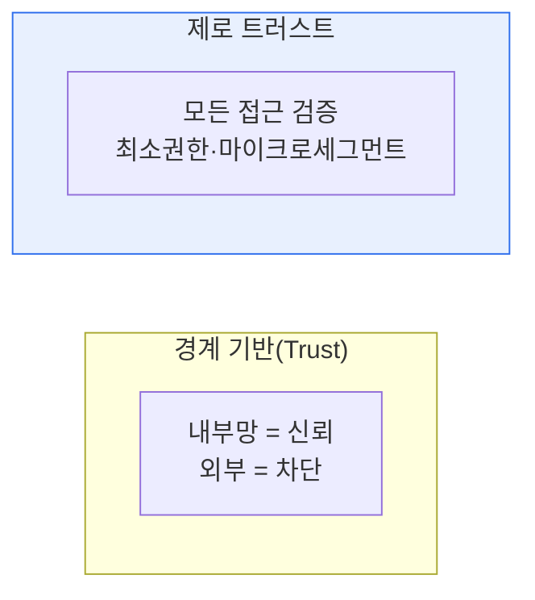

# 제로 트러스트 보안(Zero Trust Security) 모델

## 1. 개요

### 가. 정의
> "**절대 신뢰하지 말고 항상 검증하라(Never Trust, Always Verify)**"는 원칙 아래, 내부·외부를 불문하고 모든 접근 요청을 지속적으로 인증·인가하는 보안 모델.

제로 트러스트가 등장한 배경은 전통적 **경계 기반(Perimeter) 보안의 붕괴**다. 과거에는 방화벽 안(내부망)은 신뢰하고 밖은 불신했지만, 클라우드·원격근무·모바일로 경계가 사라지고, 내부자 위협·측면 이동(lateral movement) 공격이 늘면서 "내부는 안전하다"는 가정 자체가 무너졌다. 제로 트러스트는 신뢰의 기본값을 '0'으로 두고 매 접근마다 검증한다.

## 2. 트러스트 모델과 비교

| 구분 | 트러스트(경계 기반) | 제로 트러스트 |
|---|---|---|
| **전제** | 내부는 신뢰 | 아무도 신뢰 안 함 |
| **검증** | 최초 1회(경계 통과) | 지속·매 요청 |
| **방어** | 경계(방화벽) 중심 | 리소스·아이덴티티 중심 |
| **약점** | 내부 침투 시 무방비(측면이동) | 침해 확산 최소화 |

## 3. 핵심 원칙

| 원칙 | 내용 |
|---|---|
| **명시적 검증** | 사용자·기기·컨텍스트를 매번 인증·인가 |
| **최소 권한** | 필요한 최소한의 접근만(Least Privilege) |
| **침해 가정** | 이미 뚫렸다고 가정, 폭발반경 최소화 |
| **마이크로 세그멘테이션** | 자원을 세분화해 측면 이동 차단 |

## 4. 적용 분야 및 구성요소
- **구성요소**: IAM·MFA, 정책결정지점(PDP)/정책시행지점(PEP), 마이크로세그먼테이션, 지속 모니터링(UEBA)
- **적용 분야**: 원격근무·재택, 클라우드·멀티클라우드, 공급망·협력사 접근, 공공(제로트러스트 가이드라인)

## 5. 시사점
- 아이덴티티(신원)가 새로운 경계 — **IAM·MFA가 핵심 축**
- SASE·SDP와 결합해 네트워크 접근 통제 진화
- 단계적 도입(성숙도 모델) — 한 번에 완성되는 제품이 아닌 전략

---

> **한 줄 요약**: 제로 트러스트는 *경계 기반 신뢰를 폐기하고 모든 접근을 지속 검증* 하는 모델로, 명시적 검증·최소권한·침해가정·마이크로세그먼테이션 원칙으로 측면 이동을 차단해 클라우드·원격근무 환경을 보호한다.
