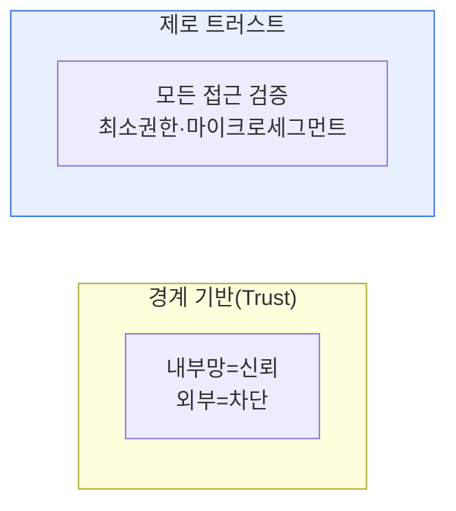
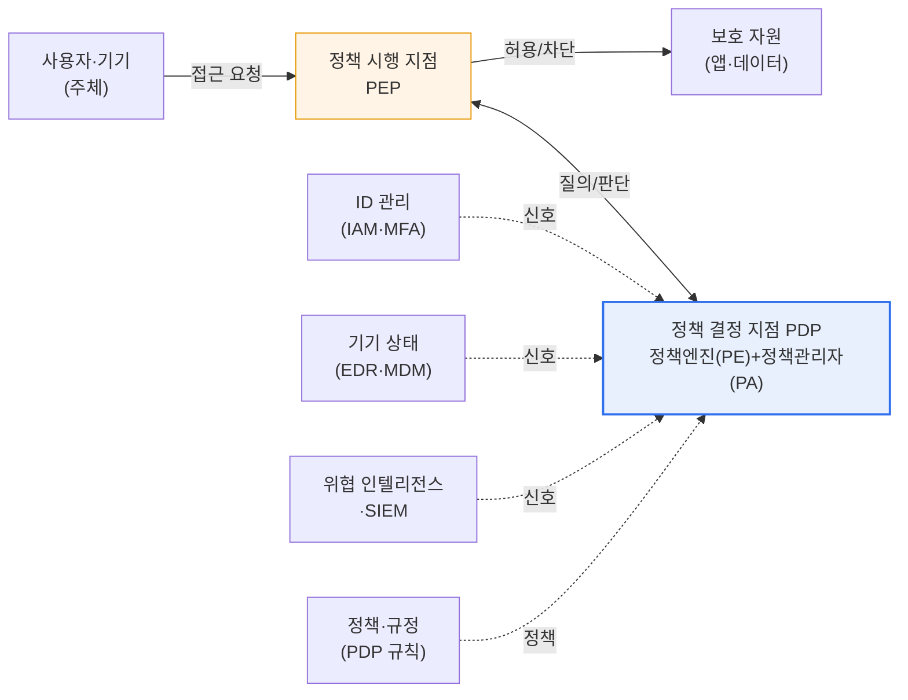

# 제로 트러스트 보안(Zero Trust Security) 모델

## 1. 개요

### 가. 정의

> "**절대 신뢰하지 말고 항상 검증하라(Never Trust, Always Verify)**"는 원칙 아래, 내부·외부를 불문하고 모든 접근 요청을 매번 인증·인가하는 보안 모델. 기본 신뢰값을 '0'으로 두는 것이 이름의 유래이며, 신뢰는 '위치'가 아니라 '검증된 아이덴티티와 컨텍스트'에서만 파생된다.

제로 트러스트는 특정 제품이나 솔루션의 이름이 아니라, 접근 통제를 설계하는 **패러다임이자 보안 철학**이다. 2010년 포레스터(Forrester)의 존 킨더백(John Kindervag)이 "신뢰는 취약점(Trust is a vulnerability)"이라는 문제의식에서 개념을 정립했고, 이후 구글의 내부 구현 사례인 **BeyondCorp** 프로젝트를 통해 대규모 기업 환경에서 실증되었다. 즉 제로 트러스트는 학술적 이상론이 아니라, 이미 글로벌 기업이 자사 네트워크에서 VPN 경계 방어를 걷어내고 검증 가능한 형태로 운영해 온 실전 모델이다.

### 나. 등장 배경 — 경계 기반 보안의 붕괴

제로 트러스트가 등장한 배경은 전통적 **경계 기반(Perimeter) 보안의 붕괴**다. 과거 보안은 성벽처럼 방화벽으로 경계를 치고 '**내부망은 안전하다**'고 가정했다. 성문(방화벽)만 통과하면 내부는 자유롭게 다닐 수 있었다. 이 모델을 흔히 'M&M 초콜릿'에 비유하는데, 겉(경계)은 단단하지만 속(내부망)은 물렁물렁해 한번 껍질이 깨지면 내부가 통째로 노출된다는 뜻이다.

그러나 세 가지 구조적 변화가 이 전제를 무너뜨렸다. 첫째, **클라우드·SaaS 전환**으로 보호해야 할 자원이 더 이상 사내 데이터센터 안에만 있지 않다. 둘째, **원격근무·모바일·BYOD**의 확산으로 사용자와 단말이 경계 밖 어디에나 흩어져, '내부/외부'를 물리적으로 구분하는 선 자체가 사라졌다. 셋째, **협력사·공급망·내부자 위협**이 늘면서 '내부에 있는 존재는 선하다'는 가정이 통계적으로도 깨졌다. 실제 대형 침해사고의 상당수는 한번 침투한 공격자가 내부를 자유롭게 옮겨다니는 **측면 이동(Lateral Movement)** 을 통해 피해를 키웠다.

제로 트러스트는 이 '내부는 안전하다'는 전제를 폐기한다. 내부에 있든 밖에 있든 모든 접근을 그때그때 검증한다. 성벽을 없애는 대신, 모든 방문 앞에 신원 확인 데스크를 두는 셈이다.

### 다. 필요성

자원과 사용자가 어디에나 흩어진 환경에서는 '어디에 있느냐(위치)'가 더 이상 신뢰의 근거가 될 수 없다. 신뢰의 기준이 **위치(Network Location)에서 아이덴티티(Identity)와 컨텍스트(Context)로** 옮겨가야 하며, 제로 트러스트가 이 전환을 구현한다. 미국은 2021년 대통령 행정명령(EO 14028)과 2022년 OMB M-22-09 지침으로 연방기관에 제로 트러스트 전환을 의무화했고, 국내에서도 과학기술정보통신부·KISA가 **「제로 트러스트 가이드라인 1.0(2023)·2.0(2024)」** 을 발간하며 공공·민간 확산을 견인하고 있다. 이는 제로 트러스트가 선택이 아니라 규제·정책 차원의 흐름이 되었음을 보여준다.

## 2. 경계 기반(Trust) 모델과의 비교

```mermaid
flowchart LR
  subgraph T["경계 기반(Trust)"]
    TT["내부망=신뢰<br/>외부=차단"]
  end
  subgraph Z["제로 트러스트"]
    ZZ["모든 접근 검증<br/>최소권한·마이크로세그먼트"]
  end
  style Z fill:#e8f0fe,stroke:#2f6fed
```

두 모델의 결정적 차이는 침해가 발생했을 때의 **피해 범위(Blast Radius)** 다. 경계 기반은 최초 경계 통과 시 한 번만 검증하므로, 내부에 침투당하면 공격자가 무방비로 측면 이동해 피해가 걷잡을 수 없이 커진다. 방화벽·VPN이 '한번 통과하면 끝'인 구조이기 때문이다. 반면 제로 트러스트는 자원마다 매번 검증하고 세밀하게 격리하므로, 한 곳이 뚫려도 그 지점에 피해가 국한된다.

이 차이가 실무적으로 중요한 이유는, 오늘날 공격의 본질이 '경계 돌파'가 아니라 '탈취한 자격증명으로의 정상적 로그인'으로 바뀌었기 때문이다. 피싱으로 계정을 탈취한 공격자는 방화벽을 뚫을 필요 없이 VPN에 정상 로그인하고, 경계 모델에서는 그 순간부터 내부자와 구별되지 않는다. 제로 트러스트는 로그인 이후에도 '이 요청이 정말 정상인가'를 지속 검증하므로, 탈취 자격증명만으로는 자원에 도달하지 못하게 만든다.

| 구분 | 경계 기반(Trust) | 제로 트러스트 |
|---|---|---|
| **전제** | 내부는 신뢰 | 아무도 신뢰 안 함 |
| **검증 시점** | 최초 1회(경계 통과) | 지속·매 요청 |
| **신뢰 근거** | 네트워크 위치(IP) | 아이덴티티·기기·컨텍스트 |
| **방어 중심** | 경계(방화벽·VPN) | 리소스·아이덴티티 |
| **접근 방식** | 네트워크 접속 후 리소스 접근 | 리소스 단위 세션별 인가 |
| **침해 시** | 측면 이동으로 확산 | 폭발 반경 최소화 |

## 3. 핵심 원칙

제로 트러스트는 흔히 네 가지 원칙으로 구현된다. 각 원칙은 독립적으로 존재하는 것이 아니라, 앞의 표에서 본 '검증 시점'과 '피해 범위'를 실제로 구현하기 위한 상호 보완적 장치다.

**가. 명시적 검증(Verify Explicitly).** 사용자·기기·위치·시간·행위 패턴 등 가능한 모든 신호(Signal)를 종합해 매 요청마다 인증·인가한다. 단순히 ID/PW 한 번 맞았다고 통과시키는 것이 아니라, '이 사용자가 평소와 다른 지역·시간·기기에서 접근하는가'라는 컨텍스트를 함께 평가한다. 이것이 적응형 인증(Adaptive Authentication)의 토대다.

**나. 최소 권한(Least Privilege).** 업무에 꼭 필요한 최소한의 접근만, 그것도 필요한 시간 동안만 부여한다. JIT(Just-In-Time)·JEA(Just-Enough-Access) 개념이 여기에 해당한다. 권한을 항상 열어두지 않고 요청 시점에 최소로 발급하면, 자격증명이 탈취되어도 공격자가 손에 쥘 수 있는 권한 자체가 작아진다.

**다. 침해 가정(Assume Breach).** 이미 뚫렸다고 전제하고 방어를 설계한다. '언젠가 반드시 침해된다'는 관점에서 폭발 반경을 최소화하고, 종단 간 암호화·지속 모니터링·로그 분석으로 침해를 빠르게 탐지·격리하는 데 집중한다. 이는 방어 실패를 '예외'가 아니라 '상수'로 취급하는 태도의 전환이다.

**라. 마이크로 세그멘테이션(Micro-segmentation).** 네트워크·자원을 잘게 나눠, 한 구역의 침해가 다른 구역으로 번지지 못하게 격리한다. 과거의 넓은 VLAN 단위 분할을 넘어 워크로드·애플리케이션·프로세스 단위로 정책을 세분화하며, 이를 통해 측면 이동 경로 자체를 차단한다.

| 원칙 | 핵심 내용 | 구현 기술(예) |
|---|---|---|
| **명시적 검증** | 사용자·기기·컨텍스트를 매번 인증·인가 | MFA, 적응형 인증, 디바이스 신뢰도 평가 |
| **최소 권한** | 필요한 최소 접근만(JIT/JEA) | RBAC/ABAC, PAM, JIT 권한 발급 |
| **침해 가정** | 이미 뚫렸다 가정, 폭발반경 최소화 | 종단 암호화, UEBA, SIEM/SOAR |
| **마이크로 세그멘테이션** | 자원 세분화로 측면 이동 차단 | SDP, 워크로드 방화벽, 서비스 메시 |

이 네 원칙은 하나의 사슬처럼 맞물린다. 명시적 검증으로 '들어오는 문'을 좁히고, 최소 권한으로 '들어온 뒤 손댈 수 있는 범위'를 좁히며, 마이크로 세그멘테이션으로 '옆으로 번지는 경로'를 끊고, 침해 가정으로 '그럼에도 뚫렸을 때의 관측·대응'을 상시화한다. 어느 하나만 도입하면 반쪽짜리가 된다. 예컨대 MFA(명시적 검증)만 적용하고 권한 설계(최소 권한)를 방치하면, 탈취된 정상 계정 하나가 여전히 광범위한 자원에 도달할 수 있다. 제로 트러스트가 '제품'이 아니라 '전략'이라고 불리는 이유가 여기에 있다.

## 4. 아키텍처와 구성요소 (NIST SP 800-207 기준)

제로 트러스트는 하나의 제품이 아니라 여러 기술의 조합이며, 그 논리 구조는 미국 표준기술연구소의 **NIST SP 800-207**이 정립한 참조 아키텍처로 설명하는 것이 표준적이다. 이 아키텍처의 심장은 **정책 엔진(PE)·정책 관리자(PA)로 구성된 정책 결정 지점(PDP)** 과, 실제 트래픽 길목에서 접근을 허용·차단하는 **정책 시행 지점(PEP)** 의 분리다.

```mermaid
flowchart LR
  U["사용자·기기<br/>(주체)"] -->|접근 요청| PEP["정책 시행 지점<br/>PEP"]
  PEP -->|허용/차단| R["보호 자원<br/>(앱·데이터)"]
  PEP <-->|질의/판단| PDP["정책 결정 지점 PDP<br/>정책엔진(PE)+정책관리자(PA)"]
  ID["ID 관리<br/>(IAM·MFA)"] -.신호.-> PDP
  DV["기기 상태<br/>(EDR·MDM)"] -.신호.-> PDP
  TI["위협 인텔리전스<br/>·SIEM"] -.신호.-> PDP
  PL["정책·규정<br/>(PDP 규칙)"] -.정책.-> PDP
  style PDP fill:#e8f0fe,stroke:#2f6fed,stroke-width:2px
  style PEP fill:#fff4e5,stroke:#e69500
```

동작 흐름은 이렇다. 주체(사용자·기기)가 자원에 접근하려 하면 요청은 반드시 **PEP**를 거친다. PEP는 스스로 판단하지 않고 **PDP**에 "이 주체가 이 자원에 지금 접근해도 되는가"를 질의한다. PDP의 정책 엔진은 IAM·MFA에서 오는 아이덴티티 신호, EDR·MDM에서 오는 기기 상태(패치·감염 여부), SIEM·위협 인텔리전스에서 오는 위험 신호, 그리고 관리자가 정의한 정책 규칙을 **종합적으로 평가(신뢰 점수 산정)** 해 허용·차단·추가인증 요구를 결정한다. 핵심은 이 판단이 세션 내내 지속된다는 점이다. 기기가 도중에 악성코드에 감염되거나 사용자의 위험 점수가 올라가면, 진행 중이던 세션도 재평가되어 차단될 수 있다.

주요 구성요소를 정리하면, **아이덴티티(IAM·MFA·SSO)** 가 검증의 축을 이루고, **PDP/PEP** 가 정책을 판단·집행하며, **마이크로세그멘테이션·SDP** 가 네트워크를 격리하고, **UEBA·SIEM/SOAR** 가 이상 행위를 지속 감시·자동 대응한다. 여기에 데이터 자체를 보호하는 **DLP·암호화**, 단말을 지키는 **EDR·MDM** 이 결합해 전체 통제면을 형성한다.

## 5. 구현 접근법과 적용 분야

제로 트러스트를 실제로 구현하는 접근은 크게 세 축으로 나뉜다. **아이덴티티 중심(SIM 기반)** 접근은 강력한 IAM·MFA·조건부 접근을 축으로 하며, 클라우드·SaaS 환경에서 가장 널리 쓰인다. **네트워크 중심(SDP·마이크로세그멘테이션)** 접근은 소프트웨어 정의 경계로 자원을 사용자에게 '보이지 않게(Dark)' 숨긴 뒤 인증된 주체에게만 동적으로 연결을 열어주는 방식이다. **SASE(Secure Access Service Edge)** 는 이 둘을 클라우드 엣지에서 통합해, SD-WAN(네트워크)과 SSE(보안: SWG·CASB·ZTNA·FWaaS)를 하나의 서비스로 결합한 진화 형태다.

적용 분야는 넓다. **원격근무·재택** 환경에서 VPN을 ZTNA(Zero Trust Network Access)로 대체해 자원 단위 접근을 제공하고, **멀티클라우드** 에서는 흩어진 워크로드 간 통신을 세그먼트 단위로 통제하며, **협력사·공급망** 접근에는 최소권한 원칙을 적용해 위험을 봉쇄한다. 공공 부문에서는 앞서 언급한 국내외 가이드라인에 따라 단계적 전환이 진행 중이다.

대표적 실증 사례가 구글의 **BeyondCorp** 다. 구글은 2011년경부터 수년에 걸쳐, 사내 애플리케이션 접근을 사내망(VPN) 여부가 아니라 '검증된 사용자 + 관리되는 기기 + 접근 정책'에 따라 허용하도록 전환했다. 그 결과 전 직원이 별도 VPN 없이 인터넷 어디서든 동일한 검증을 거쳐 사내 자원에 접근하게 되었고, 이는 "사내망에 있다는 사실이 곧 신뢰"라는 전제를 실제 대규모 조직에서 걷어낼 수 있음을 보여준 전환점이 되었다. 이후 넷플릭스의 LISA, 마이크로소프트·클라우드플레어 등 다수 기업이 유사한 아이덴티티 기반 접근 아키텍처를 공개하며 제로 트러스트는 실무 표준으로 자리 잡았다.

VPN과 ZTNA를 비교하면 차이가 뚜렷하다. VPN은 인증에 성공하면 사용자를 사내 '네트워크'에 올려놓으므로, 그 순간 사용자는 네트워크에 연결된 여러 자원에 접근할 수 있는 넓은 통로를 얻는다. 반면 ZTNA는 네트워크가 아니라 '특정 애플리케이션' 단위로 세션을 열어주며, 인가되지 않은 다른 자원은 사용자에게 아예 보이지도(존재 노출되지도) 않게 만든다. 이 '연결 대상의 최소화'가 제로 트러스트가 측면 이동을 원천 차단하는 실무적 메커니즘이다.

| 구분 | 전통적 VPN | ZTNA(제로 트러스트) |
|---|---|---|
| **접근 단위** | 네트워크(서브넷) | 애플리케이션·리소스 |
| **검증** | 접속 시 1회 | 세션 내내 지속·조건부 |
| **비인가 자원** | 네트워크상 탐색 가능 | 은닉(비노출) |
| **측면 이동** | 상대적으로 용이 | 구조적으로 차단 |

## 6. 심화 — 성숙도 모델과 도입 전략

제로 트러스트에서 가장 흔한 실패는 "제로 트러스트 솔루션 하나를 사서 켜면 끝"이라는 오해다. 실제로는 **성숙도 모델(Maturity Model)** 에 따라 장기간에 걸쳐 점진적으로 구현하는 여정이다. 미국 CISA는 **제로 트러스트 성숙도 모델(ZTMM)** 에서 다섯 기둥(Pillar) — **아이덴티티·기기·네트워크·애플리케이션·데이터** — 을 제시하고, 각 기둥을 전통적(Traditional)→초기(Initial)→발전(Advanced)→최적(Optimal) 단계로 나눠 성숙도를 진단하도록 한다. 여기에 가시성·분석, 자동화·오케스트레이션, 거버넌스라는 횡단(Cross-cutting) 역량이 다섯 기둥을 관통한다.

실무적 도입 전략의 요체는 **'보호할 대상 표면(Protect Surface)을 먼저 정의'** 하는 것이다. 킨더백이 강조했듯 방대한 공격 표면(Attack Surface) 전체를 방어하려 하기보다, 조직에서 가장 중요한 데이터·자산·애플리케이션·서비스(DAAS)를 식별하고 그 주위로 마이크로 경계를 좁혀 우선 적용한다. 이후 트랜잭션 흐름을 매핑하고, 정책을 'Who/What/When/Where/Why/How'의 키플링(Kipling) 방식으로 세밀하게 기술하며, 지속 모니터링으로 정책을 반복 개선한다. 이러한 단계적 접근은 기존 레거시(온프레미스 시스템·구형 프로토콜)와의 공존, 사용자 경험 저하 우려, MFA 피로(Fatigue) 공격 같은 현실적 제약을 관리하면서 전환하기 위한 현실적 해법이기도 하다.

또한 최근에는 **아이덴티티 위협 탐지·대응(ITDR)**, 지속적 접근 평가(Continuous Access Evaluation), 그리고 AI 기반 이상행위 분석이 결합되며 제로 트러스트의 '지속 검증'이 실시간·자동화 방향으로 고도화되고 있다. 반대로 AI 에이전트·머신 아이덴티티(비인간 계정)가 급증하면서, 사람뿐 아니라 워크로드·서비스 계정에까지 최소권한과 검증을 확장하는 것이 새로운 과제로 떠오르고 있다.

기술사 답안에서는 제로 트러스트를 '경계 보안의 대체'가 아니라 '경계 보안의 한계를 보완하는 상위 전략'으로 자리매김하는 서술이 유효하다. 방화벽·IPS 같은 기존 통제를 폐기하는 것이 아니라, 그 위에 아이덴티티·컨텍스트 기반의 동적 검증 계층을 얹어 심층 방어(Defense in Depth)를 완성하는 관점이다. 예상 출제 방향으로는 ① 경계 기반 대비 개념·원칙 서술, ② NIST SP 800-207 아키텍처(PDP/PEP) 도해, ③ SASE·ZTNA와의 관계, ④ 성숙도 모델 기반 단계적 도입 전략이 자주 결합되므로, 이 네 축을 유기적으로 엮어 답안을 구성하는 것이 고득점 전략이다.

## 7. 고려사항 및 시사점 (기술사 관점)

1. **아이덴티티가 새로운 경계(Identity is the new perimeter)다.** 위치가 아니라 '누가·어떤 기기로'가 신뢰의 기준이 되므로, 강력한 IAM·MFA·SSO와 권한 관리(PAM)가 제로 트러스트의 사실상 핵심 축이다. IAM이 부실하면 나머지 구성요소를 아무리 갖춰도 제로 트러스트는 성립하지 않는다.

2. **단계적·성숙도 기반 도입이 현실적이다.** 빅뱅 방식 전환은 거의 실패한다. 핵심 자산(Protect Surface)부터 우선 적용하고, CISA ZTMM·NIST SP 800-207을 준거로 성숙도를 진단하며 점진 확대하는 로드맵이 필요하다. 이는 예산·조직 저항·레거시 공존을 관리하는 전략이기도 하다.

3. **사용자 경험(UX)과 보안의 트레이드오프를 설계해야 한다.** 매 요청 검증이 잦은 재인증으로 이어지면 생산성 저하와 MFA 피로 공격을 부른다. 위험 기반(Risk-based)·적응형 인증으로 '평소엔 매끄럽게, 위험할 때만 강하게' 검증하는 균형이 성공의 관건이다.

4. **SASE·SDP·ZTNA와 결합해 진화한다.** 네트워크 접근을 소프트웨어로 정의하고 클라우드 엣지에서 보안을 통합하는 방향으로, 제로 트러스트는 개별 통제가 아니라 통합 보안 아키텍처로 수렴하고 있다. VPN 대체(ZTNA)는 그 가장 실용적인 진입점이다.

5. **가시성·거버넌스 없이는 성립하지 않는다.** '지속 검증'은 곧 '지속 관측'을 전제한다. 로그·텔레메트리를 수집·분석하는 SIEM/SOAR와, 정책을 일관되게 관리·감사하는 거버넌스 체계가 뒷받침되어야 신뢰 판단의 근거가 확보된다. 데이터가 없으면 검증도 없다.

## 참고자료

- NIST SP 800-207, *Zero Trust Architecture* — https://csrc.nist.gov/pubs/sp/800/207/final
- CISA, *Zero Trust Maturity Model v2.0* — https://www.cisa.gov/zero-trust-maturity-model
- KISA/과학기술정보통신부, *제로 트러스트 가이드라인* — https://www.kisa.or.kr

---

> **한 줄 요약**: 제로 트러스트는 *경계 기반 신뢰를 폐기하고 모든 접근을 아이덴티티·컨텍스트 기반으로 지속 검증* 하는 보안 패러다임으로, 명시적 검증·최소권한·침해가정·마이크로세그멘테이션 원칙과 PDP/PEP 아키텍처(NIST SP 800-207)를 축으로 측면 이동을 차단하며, 성숙도 모델(CISA ZTMM)에 따라 핵심 자산부터 단계적으로 도입해 SASE·ZTNA로 진화한다.
