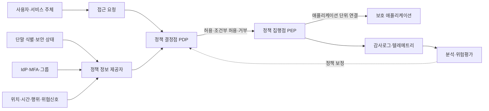
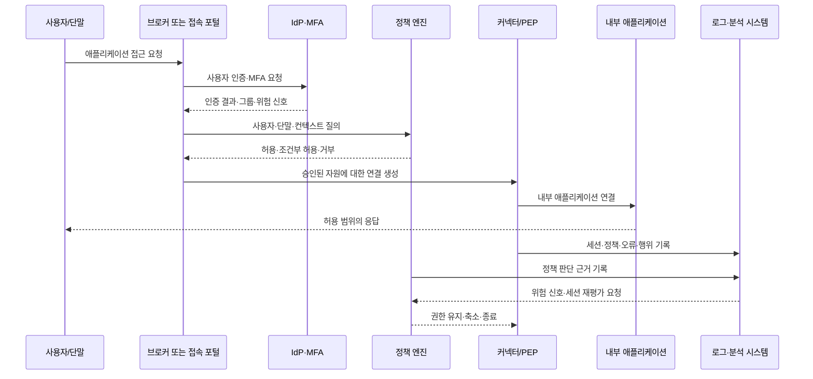

# ZTNA(Zero Trust Network Access, 제로 트러스트 네트워크 액세스)

## 1. 개요

> **ZTNA(Zero Trust Network Access)**는 사용자의 네트워크 위치나 사내망 접속 여부를 신뢰하지 않고, 사용자·단말·애플리케이션·요청 맥락을 매번 검증한 뒤 필요한 애플리케이션에만 최소권한으로 연결하는 접근 제어 아키텍처다.

전통적인 원격접속은 VPN으로 사용자를 기업 네트워크의 특정 구간에 넣은 뒤, 그 안에서 필요한 서버를 찾게 하는 방식이었다.

이 모델은 데이터센터와 본사 네트워크가 정보시스템의 중심이던 시기에는 운영하기 쉬웠다.

그러나 SaaS, 멀티클라우드, 재택근무, 협력사 접속이 확산되면서 보호 대상이 네트워크 안쪽에만 존재하지 않게 되었다.

공격자가 탈취한 계정으로 VPN에 들어오면, 인증된 접속이라는 이유만으로 내부 자원을 탐색하거나 측면 이동을 시도할 수 있다는 점도 중요한 한계다.

NIST SP 800-207은 네트워크 위치만으로 사용자나 자산에 묵시적 신뢰를 부여하지 말고, 자원에 대한 접근 전에 주체와 기기를 인증·인가해야 한다는 제로 트러스트 원칙을 제시한다([NIST SP 800-207](https://csrc.nist.gov/pubs/sp/800/207/final)).

ZTNA는 이 원칙을 원격접속과 애플리케이션 접근 경로에 구체화한 대표 수단이다.

단, ZTNA를 VPN 제품의 새로운 이름으로만 이해하면 안 된다.

VPN은 네트워크 연결을 먼저 만들고 그 위에서 접근을 통제하는 경향이 있지만, ZTNA는 보호 대상 애플리케이션을 먼저 정의하고 요청 단위로 연결을 생성한다.

따라서 ZTNA의 목표는 네트워크를 완전히 없애는 것이 아니라, 네트워크를 신뢰의 근거에서 전달 수단으로 낮추고 애플리케이션·데이터·신원 중심으로 보안 결정을 이동시키는 데 있다.

## 2. ZTNA의 원칙과 개념 구조

ZTNA의 핵심은 “누구인가”만 확인하는 단일 인증이 아니라 “어떤 주체가 어떤 상태에서 어떤 자원에 어떤 행위를 하려는가”를 종합해 판단하는 것이다.

사용자 인증이 통과되었더라도 관리되지 않은 단말, 비정상적인 위치, 위험한 행위, 업무 시간 외 요청이 결합되면 접근을 제한하거나 추가 인증을 요구할 수 있다.

반대로 동일한 사용자가 승인된 단말에서 승인된 애플리케이션을 정상적인 업무 맥락으로 요청하면 필요한 범위에서 접근을 허용할 수 있다.

다음 개념도는 접근 요청이 정책 판단과 집행 지점을 거치는 전체 흐름을 나타낸다.

### 가. 신원과 주체 검증

ZTNA에서 주체는 사람인 사용자만을 의미하지 않는다.

사람, 서비스 계정, 배치 작업, IoT 기기 등 자원에 접근을 요청하는 모든 행위자를 주체로 본다.

사용자 신원은 기업 IdP, 디렉터리, SSO, MFA를 통해 확인하고, 서비스 신원은 워크로드 인증서나 서비스 계정 토큰으로 확인한다.

인증과 인가는 분리되어야 한다.

인증은 “누구인가”를 확인하는 절차이고, 인가는 “무엇을 할 수 있는가”를 정책으로 결정하는 절차다.

예를 들어 인사팀 사용자가 인증되었다고 해서 모든 인사 데이터베이스의 관리자 권한을 갖는 것은 아니다.

직무, 프로젝트, 데이터 등급, 승인 상태를 조합해 읽기·수정·내보내기 권한을 따로 부여해야 한다.

MFA는 계정 탈취 위험을 낮추지만 단독으로 ZTNA를 완성하지 않는다.

MFA를 통과한 세션도 단말이 악성코드에 감염되었거나 사용자의 행위가 평소와 다르면 추가 검증이 필요하다.

따라서 ZTNA는 IdP의 인증 결과를 정책 엔진의 여러 입력 중 하나로 취급한다.

### 나. 단말 상태와 컨텍스트 평가

단말 검증은 운영체제·브라우저의 종류를 확인하는 수준을 넘어, 해당 기기가 조직이 관리하는지와 보안 기준을 만족하는지를 판단하는 과정이다.

예를 들어 디스크 암호화, 보안 패치 수준, EDR 실행 여부, 화면 잠금 정책, 탈옥·루팅 여부, 인증서 보유 여부를 신호로 사용할 수 있다.

기기 상태는 영구적인 속성이 아니라 시간에 따라 변하는 관측값이다.

어제 정상으로 판정된 노트북이라도 오늘 EDR이 중지되었거나 위험한 프로세스가 탐지되었다면 같은 권한을 유지해서는 안 된다.

이 때문에 정책은 “한 번 허용하면 세션이 끝날 때까지 무조건 유지”하는 정적 규칙보다, 일정 주기 또는 위험 신호 발생 시 재평가하는 방식으로 설계한다.

컨텍스트에는 사용자·단말 외에도 위치, 접속 시간, 네트워크 유형, 요청 애플리케이션, 대상 데이터 분류, 이전 행위, 위협 인텔리전스가 포함될 수 있다.

다만 신호를 많이 수집한다고 판단 품질이 자동으로 좋아지는 것은 아니다.

정확도가 낮은 위치 정보나 과도한 행동 분석은 오탐과 개인정보 침해를 늘릴 수 있으므로, 업무 목적과 최소 수집 원칙을 함께 적용해야 한다.

### 다. 최소권한과 애플리케이션 단위 연결

ZTNA는 사용자를 “사내망 전체”에 연결하지 않고, 승인된 애플리케이션의 이름·주소·포트·행위 범위에 한정해 연결한다.

사용자는 포털에서 주문관리 시스템을 선택하거나, 브라우저 기반 프록시를 통해 허용된 웹 애플리케이션에 접근한다.

네트워크 관점에서는 애플리케이션이 사용자에게 직접 공개되지 않고, 커넥터나 브로커가 양쪽 연결을 중계한다.

이 구조는 사용자에게 내부 IP 주소와 불필요한 서비스 목록을 노출하지 않아 공격자의 정찰 범위를 줄인다.

최소권한은 단순히 애플리케이션 목록을 줄이는 데서 끝나지 않는다.

같은 애플리케이션 안에서도 조회, 등록, 승인, 다운로드를 분리하고, 고위험 행위에는 재인증이나 관리자 승인을 붙일 수 있다.

예를 들어 고객정보 화면은 조회를 허용하되 대량 다운로드는 차단하거나, 승인 담당자만 결제 승인 API를 호출하게 할 수 있다.

최소권한을 지나치게 좁게 설정하면 업무 중단과 우회 접속이 발생하므로, 실제 업무 흐름을 분석해 권한을 세분화해야 한다.

## 3. 구성요소와 동작 절차

ZTNA 구현은 단일 장비가 아니라 신원·정책·접속 중계·자원 보호·관측 체계가 결합된 논리 구조다.

다음 상세 흐름은 사용자가 애플리케이션에 접근하는 순간부터 세션 종료와 감사까지를 보여준다.

### 가. 정책 결정점과 정책 집행점

정책 결정점(PDP, Policy Decision Point)은 접근 허용 여부를 계산하는 논리적 역할이다.

정책 집행점(PEP, Policy Enforcement Point)은 PDP의 결정을 실제 통신 경로에서 강제하는 역할이다.

NIST의 추상 모델에서는 정책 엔진(PE)과 정책 관리자(PA)가 정책 결정 기능을 구성하고, PEP가 요청 주체와 자원 사이의 연결을 제어한다([NIST Zero Trust Architecture](https://csrc.nist.gov/pubs/sp/800/207/final)).

제품에 따라 PDP·PE·PA가 하나의 클라우드 서비스로 보이거나, 브로커·게이트웨이·에이전트에 나뉘어 배치될 수 있다.

중요한 것은 이름이 아니라 판단과 집행이 분리되어 정책이 우회되지 않는 구조다.

PDP가 허용을 반환했지만 실제 트래픽이 다른 경로로 직접 내부 서버에 도달할 수 있다면 ZTNA의 통제가 무력화된다.

PEP는 사용자 단말의 에이전트, 역방향 프록시, 애플리케이션 게이트웨이, 서비스 메시 프록시, 방화벽 정책 등으로 구현할 수 있다.

집행 지점은 보호 자원과 가까워야 하며, 고가용성과 장애 시 기본 거부(default deny) 또는 제한적 허용(fail safe) 정책을 명확히 정해야 한다.

### 나. IdP·MFA·단말 관리 연계

IdP는 사용자 인증과 그룹·역할 정보를 제공하지만, ZTNA 정책의 단일 진실 원천이 되어서는 안 된다.

단말 관리 시스템은 기기 식별자와 준수 상태를 제공하고, EDR은 위협 탐지 상태를 제공하며, SIEM·위협 인텔리전스는 위험 신호를 제공한다.

정책 엔진은 이 정보를 수집해 요청의 위험도를 평가한다.

예를 들어 “재무 사용자이고 MFA를 통과했으며, 회사가 관리하는 암호화 노트북에서 업무 시간에 접속했다”는 조건은 읽기 권한을 허용할 수 있다.

반면 “같은 사용자지만 EDR이 중지되었고 해외 비정상 위치에서 대량 다운로드를 시도했다”면 세션을 차단하거나 관리자 승인으로 전환할 수 있다.

연계 시스템의 시간 차이와 식별자 불일치는 실제 운영에서 자주 발생한다.

사용자 ID, 사번, 이메일, 기기 ID가 시스템마다 다르면 정책이 잘못된 주체에 적용될 수 있으므로 식별자 정규화와 동기화 실패 모니터링이 필요하다.

### 다. 브로커·커넥터·애플리케이션 보호

ZTNA 브로커는 사용자와 보호 애플리케이션 사이에서 인증·정책·세션 중계를 담당한다.

커넥터는 내부망에 배치되어 외부에 인바운드 포트를 열지 않고 승인된 애플리케이션으로 아웃바운드 연결을 만들 수 있다.

이 방식은 내부 애플리케이션을 인터넷에 직접 노출하는 위험을 줄이고, 방화벽 정책을 단순화한다.

웹 애플리케이션은 역방향 프록시 방식으로 보호할 수 있고, SSH·RDP·데이터베이스처럼 비웹 프로토콜은 전용 커넥터나 에이전트 방식이 필요할 수 있다.

에이전트 방식은 세밀한 단말 식별과 네트워크 제어가 가능하지만, 관리되지 않은 단말이나 협력사 장비에 설치하기 어렵다.

에이전트리스 방식은 브라우저만으로 접근하기 쉬우나, 파일 전송·클립보드·로컬 프린터 같은 기능 통제가 제한될 수 있다.

따라서 애플리케이션의 프로토콜, 사용자 유형, 데이터 민감도에 따라 방식을 조합한다.

커넥터가 모든 내부 네트워크에 과도하게 접근할 수 있으면 ZTNA가 새로운 횡적 이동 통로가 될 수 있다.

커넥터별 대상 자원, 실행 권한, 네트워크 세그먼트, 업데이트 경로를 최소화하고 커넥터 자체도 자산으로 모니터링해야 한다.

## 4. 적용 유형과 비교

### 가. 적용 유형

첫째, 원격 사용자와 사내 웹 애플리케이션 사이에 애플리케이션 프록시를 두는 유형이다.

브라우저 요청을 프록시가 받아 인증과 정책을 검사하고, 백엔드에는 승인된 요청만 전달한다.

둘째, 단말 에이전트와 클라우드 브로커를 이용해 비웹 프로토콜까지 연결하는 유형이다.

사용자는 가상 네트워크 주소를 통해 애플리케이션에 연결하는 것처럼 보이지만, 에이전트는 승인된 호스트·포트만 통과시킨다.

셋째, 서버·서비스 간 접근에 워크로드 신원을 적용하는 유형이다.

마이크로서비스가 다른 서비스의 API를 호출할 때 서비스 인증서, 네임스페이스, 배포 정보, 요청 범위를 정책 입력으로 사용한다.

넷째, 협력사·외주 인력·비관리 단말에 임시 접근을 제공하는 유형이다.

이 경우 계정의 유효기간, 접근 시간, 화면 녹화, 파일 이동, 승인자, 계약 종료 시 자동 회수를 정책에 포함해야 한다.

### 나. VPN·ZTNA·SASE 비교

| 구분 | 전통 VPN | ZTNA | SASE 관점의 ZTNA |
|---|---|---|---|
| 기본 대상 | 네트워크 세그먼트 | 애플리케이션·자원 | 클라우드 엣지의 애플리케이션·서비스 |
| 신뢰 근거 | 인증 후 네트워크 위치 | 신원·단말·맥락·자원 정책 | 신원·맥락과 통합 보안 정책 |
| 연결 범위 | 비교적 넓은 네트워크 | 허용된 자원·세션 | 엣지에서 최적 경로와 보안 기능 결합 |
| 측면 이동 | 노출 가능성이 상대적으로 큼 | 애플리케이션 단위로 축소 | SSE·DLP·SWG와 함께 통제 |
| 운영 초점 | 터널·주소·방화벽 | 정책·신원·단말 상태 | 네트워크·보안 서비스 통합 |
| 주요 한계 | 내부 신뢰와 확장성 문제 | 정책·연계 복잡성, 레거시 호환 | 클라우드 의존·벤더 종속·데이터 주권 |

VPN과 ZTNA의 차이는 터널 암호화 여부만으로 결정되지 않는다.

현대 VPN도 MFA와 세분화 정책을 지원할 수 있으므로, “VPN은 항상 안전하지 않다”라고 단정하는 것은 부정확하다.

핵심 차이는 사용자를 네트워크에 넣는지, 보호 자원에 대한 특정 세션만 중계하는지에 있다.

ZTNA는 네트워크 주소를 숨기는 것만으로 보안이 완성되지 않으며, 인증·인가·단말 준수·로그·정책 운영이 함께 성숙해야 효과가 난다.

SASE는 ZTNA를 SWG, CASB, FWaaS, DLP, SD-WAN 등과 결합하는 서비스 아키텍처다.

따라서 ZTNA는 SASE의 한 기능으로 도입할 수도 있고, 사내 데이터센터의 독립적인 애플리케이션 접근 체계로 먼저 도입할 수도 있다.

### 다. RBAC와 ABAC의 선택

역할 기반 접근 제어(RBAC)는 직무나 조직 역할을 권한에 매핑하는 방식이라 이해하기 쉽고 관리가 단순하다.

그러나 원격근무, 프로젝트형 조직, 협력사, 단말 위험도처럼 변하는 속성을 표현하기에는 역할 수가 지나치게 많아질 수 있다.

속성 기반 접근 제어(ABAC)는 사용자·자원·환경 속성을 조합해 세밀한 조건을 표현한다.

예를 들어 `사용자 부서=재무`, `단말 준수=정상`, `데이터 등급=내부`, `위치=허용 국가`, `행위=조회`를 동시에 평가할 수 있다.

ABAC는 세밀하지만 속성 품질과 정책 설명 가능성에 의존한다.

조직은 기본적인 업무 역할은 RBAC로 관리하고, 단말 상태·시간·위험도·데이터 등급 같은 동적 조건은 ABAC로 보완하는 혼합 방식을 고려할 수 있다.

정책을 코드처럼 버전 관리하고 테스트하지 않으면 조건이 늘어날수록 충돌과 예외가 누적된다.

## 5. 도입 절차와 가상 사례

### 가. 단계별 도입 절차

1단계는 보호 대상과 업무 흐름을 식별하는 단계다.

애플리케이션 목록, 소유 부서, 데이터 등급, 접속 사용자, 프로토콜, 의존 서비스를 목록화한다.

2단계는 신원·단말 기반을 정비하는 단계다.

공유 계정을 제거하고 IdP·MFA·단말 관리·EDR의 식별자를 연결하며, 관리되지 않는 자산을 분류한다.

3단계는 저위험 애플리케이션에 관찰 모드로 정책을 적용하는 단계다.

관찰 모드에서는 실제 접근 패턴과 예상치 못한 의존성을 수집해 허용 목록을 보정한다.

4단계는 VPN 사용량이 많고 애플리케이션 경계가 분명한 업무부터 전환하는 단계다.

예를 들면 인트라넷, 개발 대시보드, 협력사 포털처럼 애플리케이션 단위로 검증하기 쉬운 대상이 적합하다.

5단계는 고위험 데이터와 관리 접속에 강화 정책을 적용하는 단계다.

관리자 셸, 생산 데이터베이스, 대량 다운로드는 별도 승인, 짧은 세션, 명령어 통제, 세션 기록을 검토한다.

6단계는 지속적인 측정과 정책 개선 단계다.

접근 성공률, 인증 실패율, 차단된 위험 세션, 정책 예외 수, 애플리케이션 장애, 평균 권한 회수 시간 등을 기준선과 비교한다.

### 나. 가상 사례: 제조기업 협력사 원격접속

가상의 제조기업 A사는 협력사 직원에게 VPN 계정을 발급하고 생산관리 서버의 여러 포트를 열어 주고 있었다.

계약이 끝난 계정이 즉시 회수되지 않거나, 협력사 단말의 보안 상태를 확인하기 어려운 문제가 있었다.

A사는 먼저 생산관리 웹 포털을 보호 대상으로 정의하고, 협력사·작업장·업무 기간을 계정 속성으로 등록했다.

협력사 직원은 IdP에서 MFA를 수행하고, 승인된 브라우저에서만 포털에 접근하도록 정책을 적용했다.

작업 기간이 지나면 계정이 자동으로 비활성화되고, 업무 범위를 벗어난 관리자 화면은 별도 승인 없이는 보이지 않는다.

비웹 방식의 설비 진단 접속은 전용 커넥터를 통해 특정 호스트와 포트로 제한했다.

정책은 `계약 상태=유효`, `작업자 역할=진단`, `단말 위험도=허용`, `접속 시간=승인된 교대시간`을 모두 만족할 때만 허용한다.

대량 파일 다운로드와 비정상적인 명령어 실행은 차단하고, 모든 세션에 작업자·단말·자원·승인자 정보를 남긴다.

이 사례의 핵심 성과는 VPN 장비를 교체했다는 사실이 아니라, 협력사라는 네트워크 외부 주체에게도 자원 단위의 최소권한·기간 제한·감사 증적을 적용했다는 점이다.

## 6. 심화 — 클라우드 네이티브 ZTNA와 성숙도

클라우드 네이티브 환경에서는 사용자뿐 아니라 서비스와 워크로드도 서로의 API를 호출한다.

NIST SP 800-207A는 멀티클라우드·다중 위치의 클라우드 네이티브 애플리케이션에서 네트워크 계층 정책과 신원 계층 정책을 함께 적용하고, API 게이트웨이·사이드카 프록시·서비스 신원 인프라를 활용하는 모델을 설명한다([NIST SP 800-207A](https://csrc.nist.gov/pubs/sp/800/207/a/final)).

이 관점에서 ZTNA는 원격 사용자 VPN 대체품을 넘어 사용자-앱, 서비스-서비스, 운영자-관리면의 접근을 통합하는 정책 체계로 확장된다.

서비스 메시의 mTLS는 서비스 간 통신 암호화와 워크로드 인증을 제공할 수 있지만, 업무 권한과 데이터 행위 정책을 자동으로 해결하지는 않는다.

따라서 네트워크 계층의 연결 허용, 애플리케이션 계층의 API 권한, 데이터 계층의 조회·반출 통제를 분리하고 연계해야 한다.

CISA Zero Trust Maturity Model 2.0은 Identity, Devices, Networks, Applications and Workloads, Data의 다섯 기둥과 Visibility and Analytics, Automation and Orchestration, Governance라는 횡단 역량을 제시한다([CISA Zero Trust Maturity Model](https://www.cisa.gov/zero-trust-maturity-model)).

조직은 모든 항목을 한 번에 최적 수준으로 만들기보다, 자산 식별과 가시성 확보에서 시작해 자동화·동적 정책·거버넌스로 점진적으로 성숙시켜야 한다.

최신 구현에서는 에이전트리스 접근, 브라우저 격리, 지속적 위험 평가, 서비스 신원, 보안 분석 자동화가 결합될 수 있다.

그러나 제품의 기능 수가 많다고 성숙도가 높은 것은 아니다.

정책이 실제로 자원 앞에서 집행되는지, 예외가 추적되는지, 신호 오류가 업무를 마비시키지 않는지, 장애 때 안전하게 복구되는지를 검증해야 한다.

## 7. 고려사항 및 시사점

- **보호 표면 우선순위**: 모든 자원을 동시에 ZTNA로 감싸기보다 개인정보·지식재산·관리면·핵심 업무 API처럼 침해 영향이 큰 보호 표면부터 식별한다.

- **정책 품질과 설명 가능성**: 접근이 거부된 이유와 허용된 근거를 운영자가 설명할 수 있어야 한다. 정책 충돌, 예외, 만료일, 승인자를 버전과 감사 로그로 관리한다.

- **가용성과 장애 대응**: IdP·브로커·커넥터·DNS·인증서가 모두 접근 경로의 의존성이 될 수 있다. 이중화, 캐시의 허용 범위, 비상계정, 장애 시 제한적 복구 절차를 사전에 시험한다.

- **레거시 호환성**: 오래된 클라이언트, 고정 IP를 요구하는 장비, 비표준 프로토콜은 애플리케이션 프록시만으로 보호하기 어렵다. 세그먼트 보안과 전용 커넥터를 과도기적으로 병행하고, 장기적으로 현대화 계획을 세운다.

- **단말과 비인간 주체**: 사용자 MFA만 강화하고 서비스 계정·API 키·자동화 토큰을 방치하면 우회 경로가 남는다. 비인간 신원의 발급·회전·폐기와 호출 범위를 함께 관리한다.

- **개인정보와 모니터링**: 위치·행동·단말 상태 수집은 보안에 유용하지만 과도한 감시는 법적·조직적 저항을 낳을 수 있다. 수집 목적, 보관 기간, 접근 권한, 마스킹, 고지와 동의 요건을 검토한다.

- **성과 측정**: 도입 대수보다 보호 애플리케이션 비율, 미관리 단말 차단률, 과도권한 감소, 세션 위험 재평가 시간, 침해사고 측면 이동 범위, 업무 지연을 함께 평가한다.

- **조직과 운영**: 네트워크팀이 터널만 관리하고 보안팀이 정책만 관리하면 책임 공백이 생긴다. 애플리케이션 소유자, IAM, 엔드포인트, 네트워크, SOC가 참여하는 정책 변경과 사고 대응 RACI를 정한다.

- **벤더 종속과 데이터 주권**: 클라우드 브로커의 리전, 로그 저장 위치, 서비스 중단 시 대체 경로, 표준 프로토콜 지원, 정책 내보내기 가능성을 계약과 기술 검증에서 확인한다.

기술사 관점에서 ZTNA는 제품 도입 문제가 아니라 “신뢰를 네트워크 위치에서 자원·신원·맥락·증거로 이동시키는 운영 모델”이다.

따라서 아키텍처 설계 시 보안성만 강조하지 말고 업무 연속성, 사용자 경험, 규제 준수, 운영 자동화, 총소유비용을 함께 최적화해야 한다.

## 참고자료

- [NIST SP 800-207, Zero Trust Architecture](https://csrc.nist.gov/pubs/sp/800/207/final)
- [NIST SP 800-207A, A Zero Trust Architecture Model for Access Control in Cloud-Native Applications](https://csrc.nist.gov/pubs/sp/800/207/a/final)
- [CISA Zero Trust Maturity Model](https://www.cisa.gov/zero-trust-maturity-model)
- [CISA Zero Trust Maturity Model Version 2.0 PDF](https://www.cisa.gov/sites/default/files/2023-04/CISA_Zero_Trust_Maturity_Model_Version_2_508c.pdf)

---

> **한 줄 요약**: ZTNA는 네트워크 위치를 믿고 내부망을 열어 주는 대신 사용자·단말·맥락·자원을 매 요청 검증해 애플리케이션 단위 최소권한을 집행하는 접근 아키텍처이며, 성공을 위해 신원·정책·커넥터·관측성·거버넌스를 함께 성숙시켜야 한다.
